```r
library(tidyverse)
library(ggpubr)
library(gridExtra)
library(ggbrace)
library(ggdist)
library(lemon)
library(colorspace)

knitr::opts_chunk$set(echo = TRUE, warning = FALSE, message = FALSE, error = FALSE)
# options(scipen = 999, encoding = "UTF-8")

# Основные параметры темы для графиков
theme_params <- function(...) {
  theme_classic(base_size = 12) +
    theme(plot.title = element_text(face = "bold", hjust = 0.5),
          axis.ticks = element_line(size = 0.4, colour = "grey50"),
          axis.line = element_line(size = 0.4, colour = "grey50"),
          ...)
}

# Параметры темы для боксплотов
theme_box <- function(...) {
  theme_classic(base_size = 12) +
    theme(plot.title = element_text(size = 12, face = "bold", hjust = 0.5),
          axis.ticks.y = element_line(size = 0.4, colour = "grey50"),
          axis.ticks.x = element_blank(),
          axis.line = element_line(size = 0.4, colour = "grey50"),
          axis.text.x = element_text(size = 12, face = "bold"),
          ...)
}

# Параметры темы для диаграмм рассеяния
theme_scat <- function(...) {
  theme_classic(base_size = 12) +
    theme(panel.grid.major = element_line(color = "grey90", size = 0.4),
          panel.grid.minor = element_line(color = "grey90", size = 0.2),
          plot.title = element_text(face = "bold", hjust = 0.5),
          axis.ticks = element_line(size = 0.4, colour = "grey50"),
          axis.line = element_line(size = 0.4, colour = "grey50"),
          ...)
}

# Вспомогательные функции
ceiling_dec <- function(x, dec = 1) {
  ceiling(x*10^dec)/10^dec
}
```

## **Задание 1**


```r
df <- read_csv("insurance_cost.csv")
```

```
## Rows: 1338 Columns: 7
## -- Column specification --------------------------------------------------------
## Delimiter: ","
## chr (3): sex, smoker, region
## dbl (4): age, bmi, children, charges
## 
## i Use `spec()` to retrieve the full column specification for this data.
## i Specify the column types or set `show_col_types = FALSE` to quiet this message.
```

```r
summary(df)
```

```
##       age            sex                 bmi           children    
##  Min.   :18.00   Length:1338        Min.   :15.96   Min.   :0.000  
##  1st Qu.:27.00   Class :character   1st Qu.:26.30   1st Qu.:0.000  
##  Median :39.00   Mode  :character   Median :30.40   Median :1.000  
##  Mean   :39.21                      Mean   :30.66   Mean   :1.095  
##  3rd Qu.:51.00                      3rd Qu.:34.69   3rd Qu.:2.000  
##  Max.   :64.00                      Max.   :53.13   Max.   :5.000  
##     smoker             region             charges     
##  Length:1338        Length:1338        Min.   : 1122  
##  Class :character   Class :character   1st Qu.: 4740  
##  Mode  :character   Mode  :character   Median : 9382  
##                                        Mean   :13270  
##                                        3rd Qu.:16640  
##                                        Max.   :63770
```

```r
df <- df %>%
  mutate_at(vars(sex, region), ~ str_to_title(.)) %>%
  mutate(smoker = factor(smoker, c("yes", "no"), c("Smoker", "Non-smoker")),
         region = factor(region, c("Northwest", "Northeast", "Southwest", "Southeast")),
         charges_log = log(charges),
         age_group = cut(age, c(21,35,50,100), 
                         paste("age:", c("21-34", "35-49", "50+")),
                         right = FALSE))
```

<br>

## **Задание 2**


```r
xbr <- 4
xmin <- min(df$age)
xmax <- xmin + ceiling((max(df$age) - min(df$age))/xbr)*xbr

ggplot() +
  geom_histogram(aes(age), df, binwidth = xbr/2, boundary = 0,
                 fill = "#A0CBE8", color = "white") +
  scale_x_continuous(expand = c(0.01,0),
                     breaks = seq(xmin, xmax, xbr),
                     limits = c(xmin, xmax)) +
  scale_y_continuous(expand = c(0,0), limits = c(0,200)) +
  labs(x = "Age, years", y = "Number of obs.", title = "Age") +
  theme_params()

xbr <- 5
xmin <- floor(min(df$bmi)/xbr)*xbr
xmax <- ceiling(max(df$bmi)/xbr)*xbr

ggplot() +
  geom_histogram(aes(bmi), df, binwidth = xbr/2, boundary = 0,
                 fill = "#FFBE7D", color = "white") +
  scale_x_continuous(expand = c(0.01,0),
                     breaks = seq(xmin, xmax, xbr),
                     limits = c(xmin, xmax)) +
  scale_y_continuous(expand = c(0,0), limits = c(0,250)) +
  labs(x = bquote("BMI, kg/"~m^2), y = "Number of obs.", title = "BMI") +
  theme_params()

xbr <- 1
xmin <- min(df$children)
xmax <- max(df$children)

ggplot() +
  geom_histogram(aes(children), df, binwidth = xbr, 
                 fill = "#8CD17D", color = "white") +
  scale_x_continuous(expand = c(0.01,0),
                     breaks = seq(xmin, xmax, xbr),
                     limits = c(xmin-0.5, xmax+0.5)) +
  scale_y_continuous(expand = c(0,0), limits = c(0,600),
                     breaks = seq(0,600,100)) +
  labs(x = "Number of children", y = "Number of obs.", title = "Children") +
  theme_params()

xbr <- 10000
xmin <- floor(min(df$charges)/xbr)*xbr
xmax <- ceiling(max(df$charges)/xbr)*xbr

ggplot() +
  geom_histogram(aes(charges), df, binwidth = xbr/2, boundary = 0,
                 fill = "#F1CE63", color = "white") +
  scale_x_continuous(expand = c(0.01,0),
                     breaks = seq(xmin, xmax, xbr),
                     labels = c(0, sprintf("%dK", seq(xbr, xmax, xbr)/1000)),
                     limits = c(xmin, xmax)) +
  scale_y_continuous(expand = c(0,0),
                     # limits = c(0,400),
                     breaks = seq(0,400,50)) +
  labs(x = "Charges", y = "Number of obs.", title = "Charges") +
  theme_params()
```

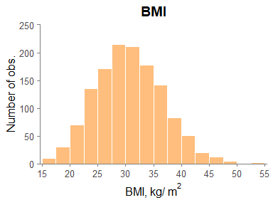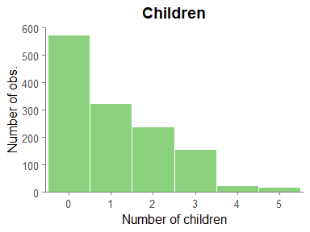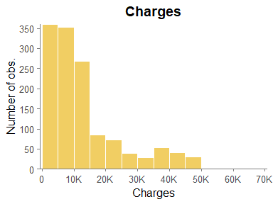

<br>

## **Задание 3**


```r
xmean <- mean(df$charges)
xmed <- median(df$charges)

xbr <- 10000
xmin <- floor(min(df$charges)/xbr)*xbr
xmax <- ceiling(max(df$charges)/xbr)*xbr

ymax <- ceiling_dec(max(density(df$charges)$y),6)
ybr <- 1e-05

xstats <- tibble(x = c(xmean, xmed),
                 y = c(ymax, ymax*0.95),
                 stat = c("Mean", "Median")) %>%
  mutate(lbl = sprintf("%s=%.0f", stat, x))

p3 <- ggplot() +
  geom_density(aes(charges), df, 
               fill = "#F1CE63", color = "grey50", alpha = 0.8) +
  geom_vline(aes(xintercept = x, color = stat), xstats, 
             size = 0.7, linetype = "dashed") +
  geom_text(aes(x = x, y = y, label = lbl, color = stat), xstats,
            vjust = 1, hjust = -0.05, size = 3, fontface = "bold") +
  scale_color_manual(values = c("#B66353", "#4A5584")) +
  scale_x_continuous(expand = c(0,0,0.01,0),
                     breaks = seq(xmin, xmax, xbr),
                     labels = c(0, sprintf("%dK", seq(xbr, xmax, xbr)/1000)),
                     limits = c(xmin, xmax)) +
  scale_y_continuous(expand = c(0,0), 
                     limits = c(0, ymax),
                     breaks = seq(0, ymax, ybr)) +
  labs(x = "Charges", y = "Density", title = "Charges") +
  theme_params(legend.position = "none",
               axis.text.y = element_text(size = 8))

p3
```

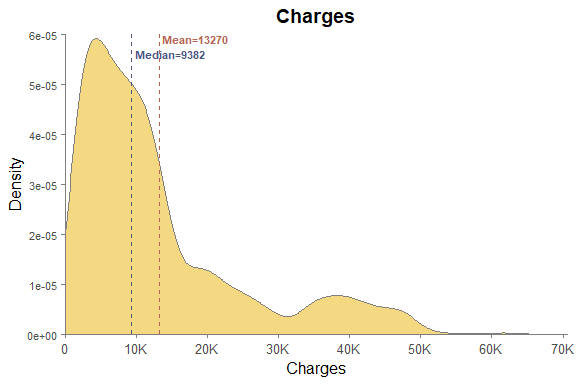<!-- -->

<br>

## **Задание 4**


```r
ybr <- 10000
ymin <- floor(min(df$charges)/ybr)*ybr
ymax <- ceiling(max(df$charges)/ybr)*ybr

p4_1 <- ggplot() +
  geom_boxplot(aes(x = sex, y = charges), df,
               width = 0.4, outlier.size = 0.8) +
  scale_y_continuous(expand = c(0,0),
                     breaks = seq(ymin, ymax, ybr),
                     labels = c(0, sprintf("%dK", seq(ybr, ymax, ybr)/1000)),
                     limits = c(ymin, ymax)) +
  labs(x = element_blank(), y = "Charges", title = "Charges by Sex") +
  theme_box()

p4_2 <- ggplot() +
  geom_boxplot(aes(x = smoker, y = charges), df,
               width = 0.4, outlier.size = 0.8) +
  scale_y_continuous(expand = c(0,0),
                     breaks = seq(ymin, ymax, ybr),
                     labels = c(0, sprintf("%dK", seq(ybr, ymax, ybr)/1000)),
                     limits = c(ymin, ymax)) +
  labs(x = element_blank(), y = "Charges", title = "Charges by Smoking status") +
  theme_box()

p4_1
p4_2
```

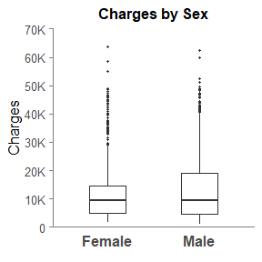


```r
p4_3 <- ggplot() +
  geom_boxplot(aes(x = region, y = charges), df,
               width = 0.4, outlier.size = 0.8) +
  scale_y_continuous(expand = c(0,0),
                     breaks = seq(ymin, ymax, ybr),
                     labels = c(0, sprintf("%dK", seq(ybr, ymax, ybr)/1000)),
                     limits = c(ymin, ymax)) +
  labs(x = element_blank(), y = "Charges", title = "Charges by Region") +
  theme_box()

p4_3
```

<!-- -->

<br>

## **Задание 5**


```r
ggarrange(ggplot() + labs(title = "Distribution of charges") + theme_void() +
            theme(plot.title = element_text(size = 14, face = "bold", hjust = 0.54)), 
          p3 + labs(title = "Charges, Overall") + 
            theme(plot.title = element_text(size = 12)), 
          ggarrange(p4_1 + labs(title = "vs. Sex") + theme(axis.text.x = element_text(size = 10)), 
                    p4_2 + labs(title = "vs. Smoking") + theme(axis.text.x = element_text(size = 10)), 
                    p4_3 + labs(title = "vs. Regions") + theme(axis.text.x = element_text(size = 10)), 
                    ncol = 3, nrow = 1,
                    widths = c(0.25,0.25,0.5)),
          ncol = 1, nrow = 3,
          heights = c(0.05,0.55,0.4))
```

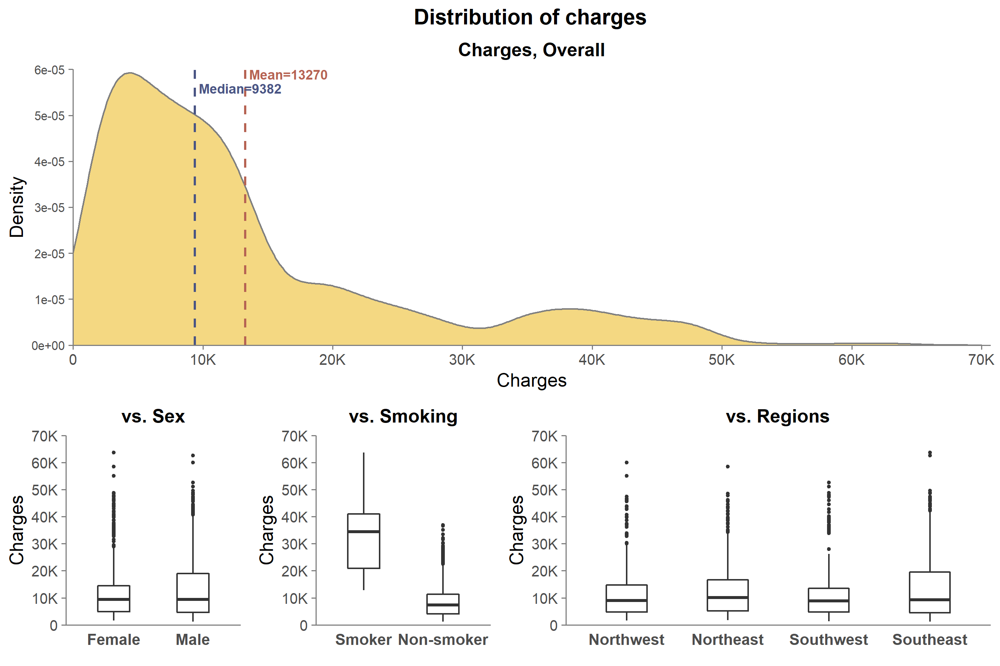<!-- -->

<br>

## **Задание 6**


```r
xbr <- 10000
xmin <- floor(min(df$charges)/xbr)*xbr
xmax <- ceiling(max(df$charges)/xbr)*xbr

ymax <- df %>% 
  group_by(region) %>% 
  summarise(maxden = max(density(charges)$y)) %>%
  .$maxden %>% 
  max %>% 
  ceiling_dec(6)
ybr <- 1e-05

xstats <- rbind(
  df %>%
    group_by(region) %>%
    summarise(x = mean(charges),
              stat = "Mean",
              y = ymax),
  df %>%
    group_by(region) %>%
    summarise(x = median(charges),
              stat = "Median",
              y = ymax*0.93)
) %>%
  mutate(lbl = sprintf("%s=%.0f", stat, x))


ggplot() +
  geom_density(aes(charges), df, 
               fill = "#F1CE63", color = "grey50", alpha = 0.8) +
  geom_vline(aes(xintercept = x, color = stat), xstats, 
             size = 0.5, linetype = "dashed") +
  geom_text(aes(x = x, y = y, label = lbl, color = stat), xstats,
            vjust = 1, hjust = -0.05, size = 3, fontface = "bold") +
  scale_color_manual(values = c("#B66353", "#4A5584")) +
  scale_x_continuous(expand = c(0,0,0.01,0),
                     breaks = seq(xmin, xmax, xbr),
                     labels = c(0, sprintf("%dK", seq(xbr, xmax, xbr)/1000)),
                     limits = c(xmin, xmax)) +
  scale_y_continuous(expand = c(0,0),
                     breaks = seq(0, ymax, ybr)) +
  labs(x = "Charges", y = "Density", title = "Charges by Region") +
  facet_rep_wrap(~ region, ncol = 2, nrow = 2, repeat.tick.labels = TRUE) +
  theme_params(legend.position = "none",
               axis.text.y = element_text(size = 8),
               strip.background = element_blank(),
               strip.text = element_text(size = 12, face = "bold"))
```

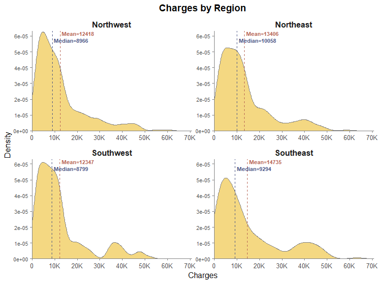<!-- -->

<br>

## **Задание 7**

_Подписи по оси Y тоже сделала 14-м шрифтом для красоты. Если бы меняла только для оси X, то использовала бы `axis.text.x` вместо `axis.text`._


```r
ybr <- 10000
ymin <- floor(min(df$charges)/ybr)*ybr
ymax <- ceiling(max(df$charges)/ybr)*ybr

p7 <- ggplot() +
  geom_point(aes(x = age, y = charges), df, 
             color = "#316395", size = 1.5, alpha = 0.5) +
  scale_x_continuous(expand = c(0.02,0)) +
  scale_y_continuous(expand = c(0,0),
                     breaks = seq(ymin, ymax, ybr),
                     labels = c(0, sprintf("%dK", seq(ybr, ymax, ybr)/1000)),
                     limits = c(0, ymax)) +
  labs(x = "Age, years", y = "Charges", title = "Charges vs. Age") +
  theme_scat(axis.text = element_text(size = 14),
             axis.title = element_text(size = 14))
p7
```

<!-- -->

<br>

## **Задание 8**

_Покажем линию для линейной регрессии вида $Charges = b_0 + b_1*Age$._


```r
p7 +
  geom_smooth(aes(x = age, y = charges), df, method = "lm", formula = "y ~ x",
              color = "#FF9900", fill = "#FF9900", alpha = 0.2, fullrange = TRUE)
```

<!-- -->

<br>

## **Задание 9**


```r
ggplot() +
  geom_point(aes(x = age, y = charges, color = smoker, fill = smoker), df, 
             shape = 21, size = 1.5) +
  geom_smooth(aes(x = age, y = charges, color = smoker, fill = smoker), df, 
              method = "lm", formula = "y ~ x", fullrange = TRUE) +
  scale_x_continuous(expand = c(0.02,0)) +
  scale_y_continuous(expand = c(0,0),
                     breaks = seq(ymin, ymax, ybr),
                     labels = c(0, sprintf("%dK", seq(ybr, ymax, ybr)/1000)),
                     limits = c(0,ymax)) +
  scale_color_manual(values = c("#E15759", "#4E79A7")) +
  scale_fill_manual(values = lighten(c("#E15759", "#4E79A7"),0.5)) +
  labs(x = "Age, years", y = "Charges", title = "Charges vs. Age, by Smoking status",
       color = element_blank(), fill = element_blank()) +
  theme_scat(legend.position = "bottom",
             axis.text = element_text(size = 14),
             axis.title = element_text(size = 14))
```

<!-- -->

<br>

## **Задание 10**


```r
xbr <- 5
xmin <- floor(min(df$bmi)/xbr)*xbr
xmax <- ceiling(max(df$bmi)/xbr)*xbr

ggplot() +
  geom_point(aes(x = bmi, y = charges, color = smoker, fill = smoker), df, 
             shape = 21, size = 1.5) +
  geom_smooth(aes(x = bmi, y = charges, color = smoker, fill = smoker), df, 
              method = "lm", formula = "y ~ x", fullrange = TRUE) +
  scale_x_continuous(expand = c(0,0,0.01,0),
                     breaks = seq(xmin, xmax, xbr),
                     limits = c(xmin, xmax)) +
  scale_y_continuous(expand = c(0,0),
                     breaks = seq(ymin, ymax, ybr),
                     labels = c(0, sprintf("%dK", seq(ybr, ymax, ybr)/1000)),
                     limits = c(0, ymax)) +
  scale_color_manual(values = c("#E15759", "#4E79A7")) +
  scale_fill_manual(values = lighten(c("#E15759", "#4E79A7"),0.5)) +
  labs(x = bquote("BMI, kg/"~m^2), y = "Charges", 
       title = "Charges vs. BMI, by Smoking status",
       color = element_blank(), fill = element_blank()) +
  theme_scat(legend.position = "bottom",
             axis.text = element_text(size = 14),
             axis.title = element_text(size = 14))
```

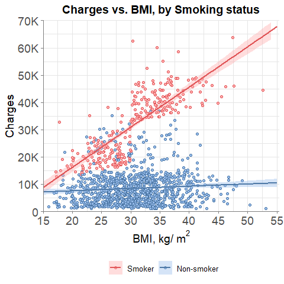<!-- -->

<br>

## **Задание 11**

_Если позволите, чтобы не дублировать виды графиков выше, я буду задавать вопросы, выходящие за рамки основной тематики датасета: некоторые из них могут не входить в спектр интересов страховой компании, но вполне могут иметь место в околомедицинских исследованиях._

**Вопрос №1: какова доля женщин с детьми и доля многодетных (3 и более детей) среди женщин?**

Количество детей для этого датасета лучше рассматривать как дискретный признак, поскольку он принимает довольно ограниченный набор значений (от 0 до 5). Если бы вопрос состоял только из одной части (доля женщин с детьми или доля многодетных женщин), то можно было просто посчитать соответствующие доли и, возможно, изобразить это в виде столбиковой диаграммы, но я попробую ответить на поставленный вопрос с помощью одного графика. Я выбрала столбиковую диаграмму, поскольку она наилучшим образом подходит для отражения распределения дискретного признака и позволит отразить нужную информацию, в том числе, с использованием текстовых подписей.


```r
df_fem <- df %>% filter(sex == "Female")

plt_df <- df_fem %>%
  group_by(children) %>%
  summarise(n = n()) %>%
  mutate(pct = n/sum(n)*100,
         lbl = sprintf("%.0f%%", pct))

plt_stat <- plt_df %>%
  mutate(y = ifelse(children == 0, pct, rev(cummax(rev(pct)))),
         pct = ifelse(children == 0, pct, rev(cumsum(rev(pct))))) %>%
  filter(children %in% c(0,1,3)) %>%
  mutate(
    gr = factor(children, labels = c("No children", "Has child(ren)", "3+ children")),
    lbl = sprintf("%s: %.0f%%", gr, pct),
    x = ifelse(children == 0, 0, 
               children + (max(plt_df$children)-children)/2),
    hj = c(0.25, 0.5, 0.5),
    vj = c(-0.5, -1.7, -1.7)
  )
  
ggplot() +
  geom_bar(aes(x = children, y = pct, fill = children), plt_df, stat = "identity") +
  geom_text(aes(x = x, y = y, label = lbl, hjust = hj, vjust = vj), plt_stat,
            fontface = "bold") +
  geom_brace(aes(c(1, max(plt_df$children)), 
                 c(plt_stat$y[plt_stat$children == 1]+0.5, 
                   plt_stat$y[plt_stat$children == 1]+2)),
             inherit.data = FALSE) +
  geom_brace(aes(c(3, max(plt_df$children)), 
                 c(plt_stat$y[plt_stat$children == 3]+0.5, 
                   plt_stat$y[plt_stat$children == 3]+2)),
             inherit.data = FALSE) +
  scale_x_continuous(breaks = seq(0, max(plt_df$children), 1)) +
  scale_y_continuous(expand = c(0,0,0.1,0)) +
  labs(x = "Number of children", y = "% of women", 
       title = "Distribution of women by number of children") +
  theme_params(legend.position = "none",
               axis.ticks.x = element_blank())
```

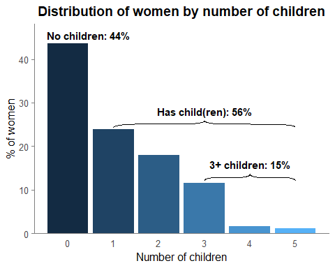<!-- -->

<br>

## **Задание 12**

**Вопрос №2: связан ли статус курильщика с наличием и количеством детей у женщин?**

Для ответа на этот вопрос я также воспользуюсь столбиковыми диаграммами, но на этот раз каждую группу женщин с одинаковым количеством детей я разобью на подгруппы курящих и некурящих, показав их доли. Соответственно, можно будет сравнить эти доли между группами и понять, различаются ли они и насколько.

Кол-во женщин с более чем тремя детьми невелико (19 чел.), поэтому корректнее их объединить с группой женщин с 3 детьми.


```r
plt_df <- df_fem %>%
  mutate(children_f = cut(children, c(0,1,3,10), 
                          c("No children", "1-2 child(ren)", "3+ children"),
                          right = FALSE)) %>%
  group_by(children_f, smoker) %>%
  summarise(n = n()) %>%
  group_by(children_f) %>%
  mutate(pct = n/sum(n)*100,
         lbl = sprintf("%.0f%%", pct),
         smoker = fct_rev(smoker))

ggplot() +
  geom_bar(aes(x = children_f, y = pct, fill = smoker), plt_df, 
           stat = "identity", position = "stack", width = 0.6) +
  geom_text(aes(x = children_f, y = pct, label = lbl, group = smoker), plt_df,
            position = "stack", vjust = 2, color = "white", fontface = "bold") +
  scale_y_continuous(expand = c(0,0)) +
  scale_fill_manual(values = c("#4E79A7", "#E15759")) +
  labs(x = element_blank(), y = element_blank(), 
       title = "Women's smoking status\nby number of children",
       fill = element_blank()) +
  theme_params(legend.position = "bottom",
               axis.text.y = element_blank(),
               axis.ticks.y = element_blank(),
               axis.line.y = element_blank(),
               axis.text.x = element_text(size = 12, face = "bold"),
               axis.ticks.x = element_blank())
```

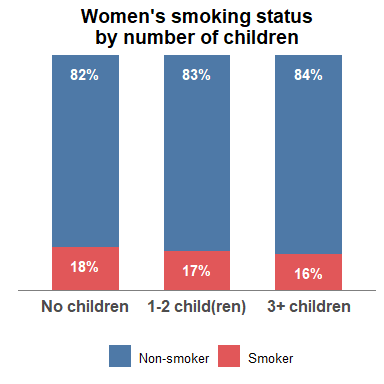<!-- -->

Видим, что доля курильщиц среди женщин практически одинаковая и, скорее всего, не зависит от количества детей. И, поскольку, доля примерно одинаковая в группах с 1-2 и 3 и более детей, то можно сказать, что и от наличия детей доля курильщиц среди женщин также не зависит.

<br>

## **Задание 13**

**Вопрос №3: связана ли величина ИМТ с количеством детей у женщин?**

Для ответа на подобный вопрос можно использовать гистограммы (и/или графики плотностей распределения), боксплоты, а также линии кумулятивного распределения женщин по ИМТ, построенные отдельно для каждого значения количества детей. Гистограммы/ плотности распределения позволят сопоставить форму распределения по ИМТ и вариативность ИМТ между группами (а при добавлении к графикам соответствующей информации - и средние значения или медианы), боксплоты - медианы, квартили, межквартильный размах (как один из показателей вариации данных), линии кумулятивного распределения - доли женщин с ИМТ ≤ или ≥ какого-либо значения (можно также будет по данным графика рассчитать доли женщин с ИМТ в нужных интервалах).

Аналогично предыдущему заданию, я объединю женщин с 3 и более детьми в одну группу в связи с относительной немногочисленностью женщин с 4 и более детьми.

Я воспользуюсь возможностями пакета `ggdist`, который позволяет строить графики плотности по группам наблюдений с заливкой площади под графиком плотности по интервалам, и дополнительно по оси Х покажу среднее значение с 95%-ным доверительным интервалом и медиану с интерквартильным размахом. 


```r
plt_df <- df_fem %>%
  mutate(children_f = cut(children, c(0,1,2,3,10), 
                          c("No children", "1 child", "2 children", "3+ children"),
                          right = FALSE))

plt_stat <- plt_df %>%
  group_by(children_f) %>%
  summarise(bmi_mean = mean(bmi),
            bmi_med = median(bmi),
            bmi_q1 = quantile(bmi, 0.25),
            bmi_q3 = quantile(bmi, 0.75),
            bmi_se = sd(bmi)/sqrt(n()),
            bmi_lb = bmi_mean - qnorm(0.975)*bmi_se,
            bmi_ub = bmi_mean + qnorm(0.975)*bmi_se)

xbr <- 5
xmin <- floor(min(plt_df$bmi)/xbr)*xbr
xmax <- ceiling(max(plt_df$bmi)/xbr)*xbr

plt_df %>%
  ggplot(aes(x = bmi, y = children_f)) +
  stat_halfeye(aes(fill = stat(cut(x, c(0,18.5,25,30,35,40,100),
                                   c("Underweight", "Normal weight", "Overweight",
                                     "Obesity I", "Obesity II", "Obesity III"),
                                   right = FALSE))), 
               alpha = 0.8, .width = 0, point_color = NA) +
  geom_errorbar(aes(xmin = bmi_q1, xmax = bmi_q3, y = children_f), plt_stat,
                color = "#990F0F", width = 0.05, size = 0.8,
                inherit.aes = FALSE) +
  geom_errorbar(aes(xmin = bmi_lb, xmax = bmi_ub, y = as.numeric(children_f)+0.1), 
                plt_stat, color = "#F79D1E", width = 0.05, size = 0.8,
                inherit.aes = FALSE) +
  geom_point(aes(x = bmi_med, y = children_f, color = "Median with IQR"), plt_stat,
             size = 2.5, shape = 23, fill = "#FFB2B2") +
  geom_point(aes(x = bmi_mean, y = as.numeric(children_f)+0.1, 
                 color = "Mean with 95% CI"), plt_stat,
             size = 3, shape = 21, fill = "#FFEB3B") +
  scale_fill_brewer(palette = "Blues") +
  scale_color_manual(values = c("#F79D1E", "#990F0F")) +
  scale_y_discrete(expand = c(0.05,0)) +
  scale_x_continuous(expand = c(0,0),
                     breaks = seq(xmin, xmax, xbr),
                     limits = c(xmin, xmax)) +
  labs(x = bquote("BMI, kg/"~m^2), y = element_blank(), 
       fill = element_blank(), color = element_blank()) +
  guides(fill = guide_legend(override.aes = list(shape = NA, color = NA)),
         color = guide_legend(override.aes = list(shape = c(21, 23),
                                                  fill = c("#FFEB3B", "#FFB2B2"),
                                                  color = c("#F79D1E", "#990F0F"),
                                                  size = c(3, 2.5)))) +
  theme_params(axis.ticks.y = element_blank(),
               axis.text.y = element_text(size = 12, face = "bold", vjust = -3))
```

<!-- -->

Видим, что форма распределения примерно одинаковая, медианы и средние значения ИМТ несильно различаются между группами женщин с разным количеством детей, площади под кривыми плотности для разных уровней ИМТ примерно одинаковые - вероятнее всего, статистические тесты не покажут нам статистически значимой зависимости ИМТ от наличия и количества детей.

<br>

## **Задание 14**


```r
df_plt <- df %>% filter(!is.na(age_group))

xbr <- 5
xmin <- floor(min(df_plt$bmi)/xbr)*xbr
xmax <- ceiling(max(df_plt$bmi)/xbr)*xbr

ybr <- 1
ymin <- floor(min(df_plt$charges_log)/ybr)*ybr
ymax <- max(df_plt$charges_log)

ggplot() +
  geom_point(aes(x = bmi, y = charges_log), df_plt, 
             size = 1.5, color = "#4A5584", alpha = 0.7) +
  geom_smooth(aes(x = bmi, y = charges_log, color = age_group, fill = age_group),
              df_plt, method = "lm", formula = "y ~ x", fullrange = TRUE) +
  scale_x_continuous(expand = c(0,0,0.01,0),
                     breaks = seq(xmin, xmax, xbr*2),
                     limits = c(xmin, xmax)) +
  scale_y_continuous(expand = c(0,0,0.01,0),
                     breaks = seq(ymin, ymax, ybr),
                     limits = c(ymin, ymax)) +
  scale_color_manual(values = c("#E15759", "#59A14F", "#4E79A7")) +
  scale_fill_manual(values = lighten(c("#E15759", "#59A14F", "#4E79A7"),0.5)) +
  facet_grid(~ age_group) +
  labs(x = bquote("BMI, kg/"~m^2), y = "ln(Charges)", 
       title = "Ln(Charges) vs. BMI, by Age group",
       color = element_blank(), fill = element_blank()) +
  theme_scat(legend.position = "bottom",
             strip.background = element_blank(),
             strip.text = element_text(size = 12),
             panel.spacing = unit(1, "lines"))
```

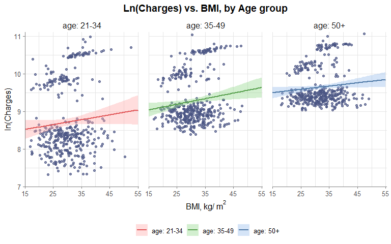<!-- -->
