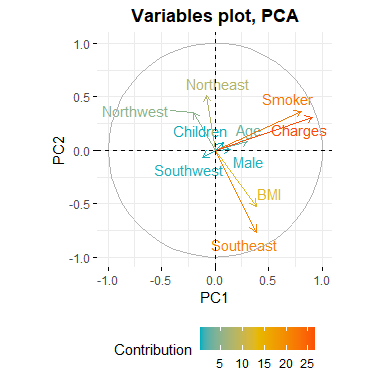
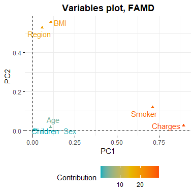
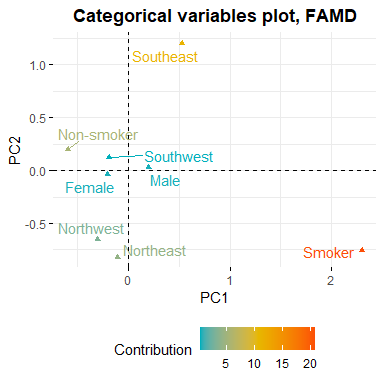

```r
library(tidyverse)
library(plotly)
library(corrplot)
library(ggcorrplot)
library(GGally)
library(caret)
library(cluster)
library(dendextend)
library(ggalluvial)
library(pheatmap)
library(FactoMineR)
library(factoextra)
library(lemon)
library(colorspace)

knitr::opts_chunk$set(echo = TRUE, warning = FALSE, message = FALSE, error = FALSE)
```

_Графики plotly так и не получилось сделать видимыми в .md файле на Github_

## **Задание 1**


```r
df <- read_csv("insurance_cost.csv")
```

```
## Rows: 1338 Columns: 7
## -- Column specification --------------------------------------------------------
## Delimiter: ","
## chr (3): sex, smoker, region
## dbl (4): age, bmi, children, charges
## 
## i Use `spec()` to retrieve the full column specification for this data.
## i Specify the column types or set `show_col_types = FALSE` to quiet this message.
```

```r
summary(df)
```

```
##       age            sex                 bmi           children    
##  Min.   :18.00   Length:1338        Min.   :15.96   Min.   :0.000  
##  1st Qu.:27.00   Class :character   1st Qu.:26.30   1st Qu.:0.000  
##  Median :39.00   Mode  :character   Median :30.40   Median :1.000  
##  Mean   :39.21                      Mean   :30.66   Mean   :1.095  
##  3rd Qu.:51.00                      3rd Qu.:34.69   3rd Qu.:2.000  
##  Max.   :64.00                      Max.   :53.13   Max.   :5.000  
##     smoker             region             charges     
##  Length:1338        Length:1338        Min.   : 1122  
##  Class :character   Class :character   1st Qu.: 4740  
##  Mode  :character   Mode  :character   Median : 9382  
##                                        Mean   :13270  
##                                        3rd Qu.:16640  
##                                        Max.   :63770
```

```r
df <- df %>%
  mutate_at(vars(sex, region), ~ str_to_title(.)) %>%
  mutate(smoker = factor(smoker, c("yes", "no"), c("Smoker", "Non-smoker")),
         region = factor(region, c("Northwest", "Northeast", "Southwest", "Southeast")))
```

<br>

## **Задание 2**


```r
xbr <- 5
xmin <- floor(min(df$bmi)/xbr)*xbr
xmax <- ceiling(max(df$bmi)/xbr)*xbr

ybr <- 10000
ymin <- floor(min(df$charges)/ybr)*ybr
ymax <- ceiling(max(df$charges)/ybr)*ybr

plot_ly(data = df %>% 
          mutate(lbl = sprintf("BMI: %.1f kg/m2<br>Charges: %.1fK",
                               bmi, charges/1000)),
        x = ~bmi, y = ~charges, 
        type = 'scatter', mode = "markers", 
        color = ~smoker,
        text = ~lbl, hoverinfo = "text",
        colors = c("#E15759", "#4E79A7"),
        marker = list(size = 10), alpha = 0.5) %>%
  layout(xaxis = list(title = "BMI, kg/m2",
                      tickvals = seq(xmin, xmax, xbr)),
         yaxis = list(title = "Charges", zeroline = FALSE,
                      range = list(ymin, ymax)),
         title = "<b>Charges vs. BMI, by Smoking status</b>")
```

```{=html}
<div id="htmlwidget-2d38bf4711a32b7a9725" style="width:768px;height:576px;" class="plotly html-widget"></div>
<script type="application/json" data-for="htmlwidget-2d38bf4711a32b7a9725">{"x":{"visdat":{"2b006d782493":["function () ","plotlyVisDat"]},"cur_data":"2b006d782493","attrs":{"2b006d782493":{"x":{},"y":{},"mode":"markers","text":{},"hoverinfo":"text","marker":{"size":10},"color":{},"colors":["#E15759","#4E79A7"],"alpha":0.5,"alpha_stroke":1,"sizes":[10,100],"spans":[1,20],"type":"scatter"}},"layout":{"margin":{"b":40,"l":60,"t":25,"r":10},"xaxis":{"domain":[0,1],"automargin":true,"title":"BMI, kg/m2","tickvals":[15,20,25,30,35,40,45,50,55]},"yaxis":{"domain":[0,1],"automargin":true,"title":"Charges","zeroline":false,"range":[0,70000]},"title":"<b>Charges vs. BMI, by Smoking status<\/b>","hovermode":"closest","showlegend":true},"source":"A","config":{"modeBarButtonsToAdd":["hoverclosest","hovercompare"],"showSendToCloud":false},"data":[{"x":[27.9,26.29,42.13,35.3,31.92,36.3,35.6,36.4,36.67,39.9,35.2,28,34.43,36.955,31.68,22.88,22.42,23.98,24.75,37.62,34.8,22.895,31.16,29.83,31.3,19.95,19.3,29.92,28.025,35.09,27.94,31.35,28.3,17.765,25.3,28.69,30.495,23.37,24.42,25.175,35.53,26.6,36.85,37.7,41.895,36.08,27.74,34.8,24.64,22.22,29.07,36.67,27.74,17.29,32.2,34.21,31.825,33.63,31.92,26.84,24.32,36.955,42.35,19.8,34.2,28.12,40.565,36.765,45.54,27.7,25.41,34.39,22.61,35.97,31.4,30.8,36.48,33.8,36.385,27.36,32.3,21.7,32.9,28.31,24.89,40.15,17.955,30.685,20.235,17.195,22.6,26.98,33.88,35.86,32.775,33.5,26.695,30,28.38,25.1,28.31,28.5,38.06,25.7,34.4,23.21,30.25,28.3,26.07,42.13,47.41,25.84,46.2,34.105,40.565,38.095,30.21,21.85,28.31,23.655,37.8,36.63,25.6,33.11,34.1,33.535,38.95,26.41,28.31,25.3,22.99,38.06,32.775,32.015,43.89,31.35,35.3,31.13,35.75,38.06,39.05,21.755,24.42,38.39,31.73,35.5,29.15,34.105,26.4,27.83,38.17,27.1,28.88,24.4,27.6,20.9,28.5,24.795,42.24,26.125,35.53,31.79,28.025,30.78,32.78,29.81,32.45,30.78,35.53,23.845,33.11,24.13,47.6,37.05,28.93,28.975,26.885,38.94,20.045,40.92,24.6,31.73,26.885,22.895,34.2,29.7,42.9,30.2,27.835,30.8,34.96,24.795,22.895,25.9,20.52,20.045,22.99,32.7,28.215,20.13,31.02,36.08,26.03,23.655,35.2,21.565,37.07,30.495,28.025,30.685,24.7,52.58,30.9,29.8,41.14,37.07,31.68,18.3,36.19,30.4,34.96,19.095,38.39,25.85,33.33,35.75,31.4,36.86,42.75,32.49,32.8,32.56,44.88,27.36,26.7,24.13,29.81,28.49,35.625,25.27,30.02,27.28,33.4,25.555,34.6,24.42,34.485,21.8,41.8,36.96,33.63,29.83,27.3,23.76,31.065,27.06,29.925,27.645,21.66,36.3,39.4,34.9,30.36,30.875,27.8,24.605,21.85,28.12,30.2,34.7,23.655,26.695,40.37,29.07],"y":[16884.924,27808.7251,39611.7577,36837.467,37701.8768,38711,35585.576,51194.55914,39774.2763,48173.361,38709.176,23568.272,37742.5757,47496.49445,34303.1672,23244.7902,14711.7438,17663.1442,16577.7795,37165.1638,39836.519,21098.55405,43578.9394,30184.9367,47291.055,22412.6485,15820.699,30942.1918,17560.37975,47055.5321,19107.7796,39556.4945,17081.08,32734.1863,18972.495,20745.9891,40720.55105,19964.7463,21223.6758,15518.18025,36950.2567,21348.706,36149.4835,48824.45,43753.33705,37133.8982,20984.0936,34779.615,19515.5416,19444.2658,17352.6803,38511.6283,29523.1656,12829.4551,47305.305,44260.7499,41097.16175,43921.1837,33750.2918,17085.2676,24869.8368,36219.40545,46151.1245,17179.522,42856.838,22331.5668,48549.17835,47896.79135,42112.2356,16297.846,21978.6769,38746.3551,24873.3849,42124.5153,34838.873,35491.64,42760.5022,47928.03,48517.56315,24393.6224,41919.097,13844.506,36085.219,18033.9679,21659.9301,38126.2465,15006.57945,42303.69215,19594.80965,14455.64405,18608.262,28950.4692,46889.2612,46599.1084,39125.33225,37079.372,26109.32905,22144.032,19521.9682,25382.297,28868.6639,35147.52848,48885.13561,17942.106,36197.699,22218.1149,32548.3405,21082.16,38245.59327,48675.5177,63770.42801,23807.2406,45863.205,39983.42595,45702.02235,58571.07448,43943.8761,15359.1045,17468.9839,25678.77845,39241.442,42969.8527,23306.547,34439.8559,40182.246,34617.84065,42983.4585,20149.3229,32787.45859,24667.419,27037.9141,42560.4304,40003.33225,45710.20785,46200.9851,46130.5265,40103.89,34806.4677,40273.6455,44400.4064,40932.4295,16657.71745,19361.9988,40419.0191,36189.1017,44585.45587,18246.4955,43254.41795,19539.243,23065.4207,36307.7983,19040.876,17748.5062,18259.216,24520.264,21195.818,18310.742,17904.52705,38792.6856,23401.30575,55135.40209,43813.8661,20773.62775,39597.4072,36021.0112,27533.9129,45008.9555,37270.1512,42111.6647,24106.91255,40974.1649,15817.9857,46113.511,46255.1125,19719.6947,27218.43725,29330.98315,44202.6536,19798.05455,48673.5588,17496.306,33732.6867,21774.32215,35069.37452,39047.285,19933.458,47462.894,38998.546,20009.63365,41999.52,41034.2214,23967.38305,16138.76205,19199.944,14571.8908,16420.49455,17361.7661,34472.841,24915.22085,18767.7377,35595.5898,42211.1382,16450.8947,21677.28345,44423.803,13747.87235,37484.4493,39725.51805,20234.85475,33475.81715,21880.82,44501.3982,39727.614,25309.489,48970.2476,39871.7043,34672.1472,19023.26,41676.0811,33907.548,44641.1974,16776.30405,41949.2441,24180.9335,36124.5737,38282.7495,34166.273,46661.4424,40904.1995,36898.73308,52590.82939,40941.2854,39722.7462,17178.6824,22478.6,23887.6627,19350.3689,18328.2381,37465.34375,21771.3423,33307.5508,18223.4512,38415.474,20296.86345,41661.602,26125.67477,60021.39897,20167.33603,47269.854,49577.6624,37607.5277,18648.4217,16232.847,26926.5144,34254.05335,17043.3414,22462.04375,24535.69855,14283.4594,47403.88,38344.566,34828.654,62592.87309,46718.16325,37829.7242,21259.37795,16115.3045,21472.4788,33900.653,36397.576,18765.87545,28101.33305,43896.3763,29141.3603],"mode":"markers","text":["BMI: 27.9 kg/m2<br>Charges: 16.9K","BMI: 26.3 kg/m2<br>Charges: 27.8K","BMI: 42.1 kg/m2<br>Charges: 39.6K","BMI: 35.3 kg/m2<br>Charges: 36.8K","BMI: 31.9 kg/m2<br>Charges: 37.7K","BMI: 36.3 kg/m2<br>Charges: 38.7K","BMI: 35.6 kg/m2<br>Charges: 35.6K","BMI: 36.4 kg/m2<br>Charges: 51.2K","BMI: 36.7 kg/m2<br>Charges: 39.8K","BMI: 39.9 kg/m2<br>Charges: 48.2K","BMI: 35.2 kg/m2<br>Charges: 38.7K","BMI: 28.0 kg/m2<br>Charges: 23.6K","BMI: 34.4 kg/m2<br>Charges: 37.7K","BMI: 37.0 kg/m2<br>Charges: 47.5K","BMI: 31.7 kg/m2<br>Charges: 34.3K","BMI: 22.9 kg/m2<br>Charges: 23.2K","BMI: 22.4 kg/m2<br>Charges: 14.7K","BMI: 24.0 kg/m2<br>Charges: 17.7K","BMI: 24.8 kg/m2<br>Charges: 16.6K","BMI: 37.6 kg/m2<br>Charges: 37.2K","BMI: 34.8 kg/m2<br>Charges: 39.8K","BMI: 22.9 kg/m2<br>Charges: 21.1K","BMI: 31.2 kg/m2<br>Charges: 43.6K","BMI: 29.8 kg/m2<br>Charges: 30.2K","BMI: 31.3 kg/m2<br>Charges: 47.3K","BMI: 19.9 kg/m2<br>Charges: 22.4K","BMI: 19.3 kg/m2<br>Charges: 15.8K","BMI: 29.9 kg/m2<br>Charges: 30.9K","BMI: 28.0 kg/m2<br>Charges: 17.6K","BMI: 35.1 kg/m2<br>Charges: 47.1K","BMI: 27.9 kg/m2<br>Charges: 19.1K","BMI: 31.4 kg/m2<br>Charges: 39.6K","BMI: 28.3 kg/m2<br>Charges: 17.1K","BMI: 17.8 kg/m2<br>Charges: 32.7K","BMI: 25.3 kg/m2<br>Charges: 19.0K","BMI: 28.7 kg/m2<br>Charges: 20.7K","BMI: 30.5 kg/m2<br>Charges: 40.7K","BMI: 23.4 kg/m2<br>Charges: 20.0K","BMI: 24.4 kg/m2<br>Charges: 21.2K","BMI: 25.2 kg/m2<br>Charges: 15.5K","BMI: 35.5 kg/m2<br>Charges: 37.0K","BMI: 26.6 kg/m2<br>Charges: 21.3K","BMI: 36.9 kg/m2<br>Charges: 36.1K","BMI: 37.7 kg/m2<br>Charges: 48.8K","BMI: 41.9 kg/m2<br>Charges: 43.8K","BMI: 36.1 kg/m2<br>Charges: 37.1K","BMI: 27.7 kg/m2<br>Charges: 21.0K","BMI: 34.8 kg/m2<br>Charges: 34.8K","BMI: 24.6 kg/m2<br>Charges: 19.5K","BMI: 22.2 kg/m2<br>Charges: 19.4K","BMI: 29.1 kg/m2<br>Charges: 17.4K","BMI: 36.7 kg/m2<br>Charges: 38.5K","BMI: 27.7 kg/m2<br>Charges: 29.5K","BMI: 17.3 kg/m2<br>Charges: 12.8K","BMI: 32.2 kg/m2<br>Charges: 47.3K","BMI: 34.2 kg/m2<br>Charges: 44.3K","BMI: 31.8 kg/m2<br>Charges: 41.1K","BMI: 33.6 kg/m2<br>Charges: 43.9K","BMI: 31.9 kg/m2<br>Charges: 33.8K","BMI: 26.8 kg/m2<br>Charges: 17.1K","BMI: 24.3 kg/m2<br>Charges: 24.9K","BMI: 37.0 kg/m2<br>Charges: 36.2K","BMI: 42.4 kg/m2<br>Charges: 46.2K","BMI: 19.8 kg/m2<br>Charges: 17.2K","BMI: 34.2 kg/m2<br>Charges: 42.9K","BMI: 28.1 kg/m2<br>Charges: 22.3K","BMI: 40.6 kg/m2<br>Charges: 48.5K","BMI: 36.8 kg/m2<br>Charges: 47.9K","BMI: 45.5 kg/m2<br>Charges: 42.1K","BMI: 27.7 kg/m2<br>Charges: 16.3K","BMI: 25.4 kg/m2<br>Charges: 22.0K","BMI: 34.4 kg/m2<br>Charges: 38.7K","BMI: 22.6 kg/m2<br>Charges: 24.9K","BMI: 36.0 kg/m2<br>Charges: 42.1K","BMI: 31.4 kg/m2<br>Charges: 34.8K","BMI: 30.8 kg/m2<br>Charges: 35.5K","BMI: 36.5 kg/m2<br>Charges: 42.8K","BMI: 33.8 kg/m2<br>Charges: 47.9K","BMI: 36.4 kg/m2<br>Charges: 48.5K","BMI: 27.4 kg/m2<br>Charges: 24.4K","BMI: 32.3 kg/m2<br>Charges: 41.9K","BMI: 21.7 kg/m2<br>Charges: 13.8K","BMI: 32.9 kg/m2<br>Charges: 36.1K","BMI: 28.3 kg/m2<br>Charges: 18.0K","BMI: 24.9 kg/m2<br>Charges: 21.7K","BMI: 40.1 kg/m2<br>Charges: 38.1K","BMI: 18.0 kg/m2<br>Charges: 15.0K","BMI: 30.7 kg/m2<br>Charges: 42.3K","BMI: 20.2 kg/m2<br>Charges: 19.6K","BMI: 17.2 kg/m2<br>Charges: 14.5K","BMI: 22.6 kg/m2<br>Charges: 18.6K","BMI: 27.0 kg/m2<br>Charges: 29.0K","BMI: 33.9 kg/m2<br>Charges: 46.9K","BMI: 35.9 kg/m2<br>Charges: 46.6K","BMI: 32.8 kg/m2<br>Charges: 39.1K","BMI: 33.5 kg/m2<br>Charges: 37.1K","BMI: 26.7 kg/m2<br>Charges: 26.1K","BMI: 30.0 kg/m2<br>Charges: 22.1K","BMI: 28.4 kg/m2<br>Charges: 19.5K","BMI: 25.1 kg/m2<br>Charges: 25.4K","BMI: 28.3 kg/m2<br>Charges: 28.9K","BMI: 28.5 kg/m2<br>Charges: 35.1K","BMI: 38.1 kg/m2<br>Charges: 48.9K","BMI: 25.7 kg/m2<br>Charges: 17.9K","BMI: 34.4 kg/m2<br>Charges: 36.2K","BMI: 23.2 kg/m2<br>Charges: 22.2K","BMI: 30.2 kg/m2<br>Charges: 32.5K","BMI: 28.3 kg/m2<br>Charges: 21.1K","BMI: 26.1 kg/m2<br>Charges: 38.2K","BMI: 42.1 kg/m2<br>Charges: 48.7K","BMI: 47.4 kg/m2<br>Charges: 63.8K","BMI: 25.8 kg/m2<br>Charges: 23.8K","BMI: 46.2 kg/m2<br>Charges: 45.9K","BMI: 34.1 kg/m2<br>Charges: 40.0K","BMI: 40.6 kg/m2<br>Charges: 45.7K","BMI: 38.1 kg/m2<br>Charges: 58.6K","BMI: 30.2 kg/m2<br>Charges: 43.9K","BMI: 21.9 kg/m2<br>Charges: 15.4K","BMI: 28.3 kg/m2<br>Charges: 17.5K","BMI: 23.7 kg/m2<br>Charges: 25.7K","BMI: 37.8 kg/m2<br>Charges: 39.2K","BMI: 36.6 kg/m2<br>Charges: 43.0K","BMI: 25.6 kg/m2<br>Charges: 23.3K","BMI: 33.1 kg/m2<br>Charges: 34.4K","BMI: 34.1 kg/m2<br>Charges: 40.2K","BMI: 33.5 kg/m2<br>Charges: 34.6K","BMI: 39.0 kg/m2<br>Charges: 43.0K","BMI: 26.4 kg/m2<br>Charges: 20.1K","BMI: 28.3 kg/m2<br>Charges: 32.8K","BMI: 25.3 kg/m2<br>Charges: 24.7K","BMI: 23.0 kg/m2<br>Charges: 27.0K","BMI: 38.1 kg/m2<br>Charges: 42.6K","BMI: 32.8 kg/m2<br>Charges: 40.0K","BMI: 32.0 kg/m2<br>Charges: 45.7K","BMI: 43.9 kg/m2<br>Charges: 46.2K","BMI: 31.4 kg/m2<br>Charges: 46.1K","BMI: 35.3 kg/m2<br>Charges: 40.1K","BMI: 31.1 kg/m2<br>Charges: 34.8K","BMI: 35.8 kg/m2<br>Charges: 40.3K","BMI: 38.1 kg/m2<br>Charges: 44.4K","BMI: 39.0 kg/m2<br>Charges: 40.9K","BMI: 21.8 kg/m2<br>Charges: 16.7K","BMI: 24.4 kg/m2<br>Charges: 19.4K","BMI: 38.4 kg/m2<br>Charges: 40.4K","BMI: 31.7 kg/m2<br>Charges: 36.2K","BMI: 35.5 kg/m2<br>Charges: 44.6K","BMI: 29.1 kg/m2<br>Charges: 18.2K","BMI: 34.1 kg/m2<br>Charges: 43.3K","BMI: 26.4 kg/m2<br>Charges: 19.5K","BMI: 27.8 kg/m2<br>Charges: 23.1K","BMI: 38.2 kg/m2<br>Charges: 36.3K","BMI: 27.1 kg/m2<br>Charges: 19.0K","BMI: 28.9 kg/m2<br>Charges: 17.7K","BMI: 24.4 kg/m2<br>Charges: 18.3K","BMI: 27.6 kg/m2<br>Charges: 24.5K","BMI: 20.9 kg/m2<br>Charges: 21.2K","BMI: 28.5 kg/m2<br>Charges: 18.3K","BMI: 24.8 kg/m2<br>Charges: 17.9K","BMI: 42.2 kg/m2<br>Charges: 38.8K","BMI: 26.1 kg/m2<br>Charges: 23.4K","BMI: 35.5 kg/m2<br>Charges: 55.1K","BMI: 31.8 kg/m2<br>Charges: 43.8K","BMI: 28.0 kg/m2<br>Charges: 20.8K","BMI: 30.8 kg/m2<br>Charges: 39.6K","BMI: 32.8 kg/m2<br>Charges: 36.0K","BMI: 29.8 kg/m2<br>Charges: 27.5K","BMI: 32.5 kg/m2<br>Charges: 45.0K","BMI: 30.8 kg/m2<br>Charges: 37.3K","BMI: 35.5 kg/m2<br>Charges: 42.1K","BMI: 23.8 kg/m2<br>Charges: 24.1K","BMI: 33.1 kg/m2<br>Charges: 41.0K","BMI: 24.1 kg/m2<br>Charges: 15.8K","BMI: 47.6 kg/m2<br>Charges: 46.1K","BMI: 37.0 kg/m2<br>Charges: 46.3K","BMI: 28.9 kg/m2<br>Charges: 19.7K","BMI: 29.0 kg/m2<br>Charges: 27.2K","BMI: 26.9 kg/m2<br>Charges: 29.3K","BMI: 38.9 kg/m2<br>Charges: 44.2K","BMI: 20.0 kg/m2<br>Charges: 19.8K","BMI: 40.9 kg/m2<br>Charges: 48.7K","BMI: 24.6 kg/m2<br>Charges: 17.5K","BMI: 31.7 kg/m2<br>Charges: 33.7K","BMI: 26.9 kg/m2<br>Charges: 21.8K","BMI: 22.9 kg/m2<br>Charges: 35.1K","BMI: 34.2 kg/m2<br>Charges: 39.0K","BMI: 29.7 kg/m2<br>Charges: 19.9K","BMI: 42.9 kg/m2<br>Charges: 47.5K","BMI: 30.2 kg/m2<br>Charges: 39.0K","BMI: 27.8 kg/m2<br>Charges: 20.0K","BMI: 30.8 kg/m2<br>Charges: 42.0K","BMI: 35.0 kg/m2<br>Charges: 41.0K","BMI: 24.8 kg/m2<br>Charges: 24.0K","BMI: 22.9 kg/m2<br>Charges: 16.1K","BMI: 25.9 kg/m2<br>Charges: 19.2K","BMI: 20.5 kg/m2<br>Charges: 14.6K","BMI: 20.0 kg/m2<br>Charges: 16.4K","BMI: 23.0 kg/m2<br>Charges: 17.4K","BMI: 32.7 kg/m2<br>Charges: 34.5K","BMI: 28.2 kg/m2<br>Charges: 24.9K","BMI: 20.1 kg/m2<br>Charges: 18.8K","BMI: 31.0 kg/m2<br>Charges: 35.6K","BMI: 36.1 kg/m2<br>Charges: 42.2K","BMI: 26.0 kg/m2<br>Charges: 16.5K","BMI: 23.7 kg/m2<br>Charges: 21.7K","BMI: 35.2 kg/m2<br>Charges: 44.4K","BMI: 21.6 kg/m2<br>Charges: 13.7K","BMI: 37.1 kg/m2<br>Charges: 37.5K","BMI: 30.5 kg/m2<br>Charges: 39.7K","BMI: 28.0 kg/m2<br>Charges: 20.2K","BMI: 30.7 kg/m2<br>Charges: 33.5K","BMI: 24.7 kg/m2<br>Charges: 21.9K","BMI: 52.6 kg/m2<br>Charges: 44.5K","BMI: 30.9 kg/m2<br>Charges: 39.7K","BMI: 29.8 kg/m2<br>Charges: 25.3K","BMI: 41.1 kg/m2<br>Charges: 49.0K","BMI: 37.1 kg/m2<br>Charges: 39.9K","BMI: 31.7 kg/m2<br>Charges: 34.7K","BMI: 18.3 kg/m2<br>Charges: 19.0K","BMI: 36.2 kg/m2<br>Charges: 41.7K","BMI: 30.4 kg/m2<br>Charges: 33.9K","BMI: 35.0 kg/m2<br>Charges: 44.6K","BMI: 19.1 kg/m2<br>Charges: 16.8K","BMI: 38.4 kg/m2<br>Charges: 41.9K","BMI: 25.9 kg/m2<br>Charges: 24.2K","BMI: 33.3 kg/m2<br>Charges: 36.1K","BMI: 35.8 kg/m2<br>Charges: 38.3K","BMI: 31.4 kg/m2<br>Charges: 34.2K","BMI: 36.9 kg/m2<br>Charges: 46.7K","BMI: 42.8 kg/m2<br>Charges: 40.9K","BMI: 32.5 kg/m2<br>Charges: 36.9K","BMI: 32.8 kg/m2<br>Charges: 52.6K","BMI: 32.6 kg/m2<br>Charges: 40.9K","BMI: 44.9 kg/m2<br>Charges: 39.7K","BMI: 27.4 kg/m2<br>Charges: 17.2K","BMI: 26.7 kg/m2<br>Charges: 22.5K","BMI: 24.1 kg/m2<br>Charges: 23.9K","BMI: 29.8 kg/m2<br>Charges: 19.4K","BMI: 28.5 kg/m2<br>Charges: 18.3K","BMI: 35.6 kg/m2<br>Charges: 37.5K","BMI: 25.3 kg/m2<br>Charges: 21.8K","BMI: 30.0 kg/m2<br>Charges: 33.3K","BMI: 27.3 kg/m2<br>Charges: 18.2K","BMI: 33.4 kg/m2<br>Charges: 38.4K","BMI: 25.6 kg/m2<br>Charges: 20.3K","BMI: 34.6 kg/m2<br>Charges: 41.7K","BMI: 24.4 kg/m2<br>Charges: 26.1K","BMI: 34.5 kg/m2<br>Charges: 60.0K","BMI: 21.8 kg/m2<br>Charges: 20.2K","BMI: 41.8 kg/m2<br>Charges: 47.3K","BMI: 37.0 kg/m2<br>Charges: 49.6K","BMI: 33.6 kg/m2<br>Charges: 37.6K","BMI: 29.8 kg/m2<br>Charges: 18.6K","BMI: 27.3 kg/m2<br>Charges: 16.2K","BMI: 23.8 kg/m2<br>Charges: 26.9K","BMI: 31.1 kg/m2<br>Charges: 34.3K","BMI: 27.1 kg/m2<br>Charges: 17.0K","BMI: 29.9 kg/m2<br>Charges: 22.5K","BMI: 27.6 kg/m2<br>Charges: 24.5K","BMI: 21.7 kg/m2<br>Charges: 14.3K","BMI: 36.3 kg/m2<br>Charges: 47.4K","BMI: 39.4 kg/m2<br>Charges: 38.3K","BMI: 34.9 kg/m2<br>Charges: 34.8K","BMI: 30.4 kg/m2<br>Charges: 62.6K","BMI: 30.9 kg/m2<br>Charges: 46.7K","BMI: 27.8 kg/m2<br>Charges: 37.8K","BMI: 24.6 kg/m2<br>Charges: 21.3K","BMI: 21.9 kg/m2<br>Charges: 16.1K","BMI: 28.1 kg/m2<br>Charges: 21.5K","BMI: 30.2 kg/m2<br>Charges: 33.9K","BMI: 34.7 kg/m2<br>Charges: 36.4K","BMI: 23.7 kg/m2<br>Charges: 18.8K","BMI: 26.7 kg/m2<br>Charges: 28.1K","BMI: 40.4 kg/m2<br>Charges: 43.9K","BMI: 29.1 kg/m2<br>Charges: 29.1K"],"hoverinfo":["text","text","text","text","text","text","text","text","text","text","text","text","text","text","text","text","text","text","text","text","text","text","text","text","text","text","text","text","text","text","text","text","text","text","text","text","text","text","text","text","text","text","text","text","text","text","text","text","text","text","text","text","text","text","text","text","text","text","text","text","text","text","text","text","text","text","text","text","text","text","text","text","text","text","text","text","text","text","text","text","text","text","text","text","text","text","text","text","text","text","text","text","text","text","text","text","text","text","text","text","text","text","text","text","text","text","text","text","text","text","text","text","text","text","text","text","text","text","text","text","text","text","text","text","text","text","text","text","text","text","text","text","text","text","text","text","text","text","text","text","text","text","text","text","text","text","text","text","text","text","text","text","text","text","text","text","text","text","text","text","text","text","text","text","text","text","text","text","text","text","text","text","text","text","text","text","text","text","text","text","text","text","text","text","text","text","text","text","text","text","text","text","text","text","text","text","text","text","text","text","text","text","text","text","text","text","text","text","text","text","text","text","text","text","text","text","text","text","text","text","text","text","text","text","text","text","text","text","text","text","text","text","text","text","text","text","text","text","text","text","text","text","text","text","text","text","text","text","text","text","text","text","text","text","text","text","text","text","text","text","text","text","text","text","text","text","text","text","text","text","text","text","text","text"],"marker":{"color":"rgba(225,87,89,0.5)","size":10,"line":{"color":"rgba(225,87,89,1)"}},"type":"scatter","name":"Smoker","textfont":{"color":"rgba(225,87,89,0.5)"},"error_y":{"color":"rgba(225,87,89,0.5)"},"error_x":{"color":"rgba(225,87,89,0.5)"},"line":{"color":"rgba(225,87,89,0.5)"},"xaxis":"x","yaxis":"y","frame":null},{"x":[33.77,33,22.705,28.88,25.74,33.44,27.74,29.83,25.84,26.22,34.4,39.82,24.6,30.78,23.845,40.3,36.005,32.4,34.1,28.025,27.72,23.085,32.775,17.385,26.315,28.6,28.31,20.425,32.965,20.8,26.6,36.63,21.78,30.8,37.05,37.3,38.665,34.77,24.53,35.625,33.63,28.69,31.825,37.335,27.36,33.66,24.7,25.935,28.9,39.1,26.315,36.19,28.5,28.1,32.01,27.4,34.01,29.59,35.53,39.805,32.965,26.885,38.285,41.23,27.2,27.74,26.98,39.49,24.795,34.77,37.62,30.8,38.28,31.6,25.46,30.115,27.5,28.4,30.875,27.94,33.63,29.7,30.8,35.72,32.205,28.595,49.06,27.17,23.37,37.1,23.75,28.975,33.915,28.785,37.4,34.7,26.505,22.04,35.9,25.555,28.785,28.05,34.1,25.175,31.9,36,22.42,32.49,29.735,38.83,37.73,37.43,28.4,24.13,29.7,37.145,25.46,39.52,27.83,39.6,29.8,29.64,28.215,37,33.155,31.825,18.905,41.47,30.3,15.96,34.8,33.345,27.835,29.2,28.9,33.155,28.595,38.28,19.95,26.41,30.69,29.92,30.9,32.2,32.11,31.57,26.2,25.74,26.6,34.43,30.59,32.8,28.6,18.05,39.33,32.11,32.23,24.035,22.3,28.88,26.4,31.8,41.23,33,30.875,28.5,26.73,30.9,37.1,26.6,23.1,29.92,23.21,33.7,33.25,30.8,33.88,38.06,41.91,31.635,25.46,36.195,27.83,17.8,27.5,24.51,26.73,38.39,38.06,22.135,26.8,35.3,30.02,38.06,35.86,20.9,28.975,30.3,25.365,40.15,24.415,25.2,38.06,32.395,30.2,25.84,29.37,37.05,27.455,27.55,26.6,20.615,24.3,31.79,21.56,27.645,32.395,31.2,26.62,48.07,26.22,26.4,33.4,29.64,28.82,26.8,22.99,28.88,27.55,37.51,33,38,33.345,27.5,33.33,34.865,33.06,26.6,24.7,35.86,33.25,32.205,32.775,27.645,37.335,25.27,29.64,40.945,27.2,34.105,23.21,36.7,31.16,28.785,35.72,34.5,25.74,27.55,27.72,27.6,30.02,27.55,36.765,41.47,29.26,35.75,33.345,29.92,27.835,23.18,25.6,27.7,35.245,38.28,27.6,43.89,29.83,41.91,20.79,32.3,30.5,26.4,21.89,30.78,32.3,24.985,32.015,30.4,21.09,22.23,33.155,33.33,30.115,31.46,33,43.34,22.135,34.4,39.05,25.365,22.61,30.21,35.625,37.43,31.445,31.35,32.3,19.855,34.4,31.02,25.6,38.17,20.6,47.52,32.965,32.3,20.4,38.38,24.31,23.6,21.12,30.03,17.48,23.9,35.15,35.64,34.1,39.16,30.59,30.2,24.31,27.265,29.165,16.815,30.4,33.1,20.235,26.9,30.5,28.595,33.11,31.73,28.9,46.75,29.45,32.68,43.01,36.52,33.1,29.64,25.65,29.6,38.6,29.6,24.13,23.4,29.735,46.53,37.4,30.14,30.495,39.6,33,36.63,38.095,25.935,25.175,28.7,33.82,24.32,24.09,32.67,30.115,29.8,33.345,35.625,36.85,32.56,41.325,37.51,31.35,39.5,34.3,31.065,21.47,28.7,31.16,32.9,25.08,25.08,43.4,27.93,23.6,28.7,23.98,39.2,26.03,28.93,30.875,31.35,23.75,25.27,28.7,32.11,33.66,22.42,30.4,35.7,35.31,30.495,31,30.875,27.36,44.22,33.915,37.73,33.88,30.59,25.8,39.425,25.46,31.73,29.7,36.19,40.48,28.025,38.9,30.2,28.05,31.35,38,31.79,36.3,30.21,35.435,46.7,28.595,30.8,28.93,21.4,31.73,41.325,23.8,33.44,34.21,35.53,19.95,32.68,30.5,44.77,32.12,30.495,40.565,30.59,31.9,29.1,37.29,43.12,36.86,34.295,27.17,26.84,30.2,23.465,25.46,30.59,45.43,23.65,20.7,28.27,20.235,35.91,30.69,29,19.57,31.13,40.26,33.725,29.48,33.25,32.6,37.525,39.16,31.635,25.3,39.05,34.1,25.175,26.98,29.37,34.8,33.155,19,33,28.595,37.1,31.4,21.3,28.785,26.03,28.88,42.46,38,36.1,29.3,35.53,22.705,39.7,38.19,24.51,38.095,33.66,42.4,33.915,34.96,35.31,30.78,26.22,23.37,28.5,32.965,42.68,39.6,31.13,36.3,35.2,42.4,33.155,35.91,28.785,46.53,23.98,31.54,33.66,28.7,29.81,31.57,31.16,29.7,31.02,21.375,40.81,36.1,23.18,17.4,20.3,24.32,18.5,26.41,26.125,41.69,24.1,27.36,36.2,32.395,23.655,34.8,40.185,32.3,33.725,39.27,34.87,44.745,41.47,26.41,29.545,32.9,28.69,30.495,27.74,35.2,23.54,30.685,40.47,22.6,28.9,22.61,24.32,36.67,33.44,40.66,36.6,37.4,35.4,27.075,28.405,40.28,36.08,21.4,30.1,27.265,32.1,34.77,23.7,24.035,26.62,26.41,30.115,27,21.755,36,30.875,28.975,37.905,22.77,33.63,27.645,22.8,37.43,34.58,35.2,26.03,25.175,31.825,32.3,29,39.7,19.475,36.1,26.7,36.48,34.2,33.33,32.3,39.805,34.32,28.88,41.14,35.97,29.26,27.7,36.955,36.86,22.515,29.92,41.8,27.6,23.18,31.92,44.22,22.895,33.1,26.18,35.97,22.3,26.51,35.815,41.42,36.575,30.14,25.84,30.8,42.94,21.01,22.515,34.43,31.46,24.225,37.1,33.7,17.67,31.13,29.81,24.32,31.825,21.85,33.1,25.84,23.845,34.39,33.82,35.97,31.5,28.31,23.465,31.35,31.1,24.7,30.495,34.2,50.38,24.1,32.775,32.3,23.75,29.6,32.23,28.1,28,33.535,19.855,25.4,29.9,37.29,43.7,23.655,24.3,36.2,29.48,24.86,30.1,21.85,28.12,27.1,33.44,28.8,29.5,34.8,27.36,22.135,26.695,30.02,39.5,33.63,29.04,24.035,32.11,44,25.555,40.26,22.515,22.515,27.265,36.85,35.1,29.355,32.585,32.34,39.8,28.31,26.695,27.5,24.605,33.99,28.2,34.21,25,33.2,31,35.815,23.2,32.11,23.4,20.1,39.16,34.21,46.53,32.5,25.8,35.3,37.18,27.5,29.735,24.225,26.18,29.48,23.21,46.09,40.185,22.61,39.93,35.8,35.8,31.255,18.335,28.405,39.49,26.79,36.67,39.615,25.9,35.2,24.795,36.765,27.1,25.365,25.745,34.32,28.16,23.56,20.235,40.5,35.42,40.15,29.15,39.995,29.92,25.46,21.375,30.59,30.115,25.8,30.115,27.645,34.675,19.8,27.835,31.6,28.27,23.275,34.1,36.85,36.29,26.885,25.8,29.6,19.19,31.73,29.26,24.985,27.74,22.8,33.33,32.3,27.6,25.46,24.605,34.2,35.815,32.68,37,23.32,45.32,34.6,18.715,31.6,17.29,27.93,38.38,23,28.88,27.265,23.085,25.8,35.245,25.08,22.515,36.955,26.41,29.83,21.47,27.645,28.9,31.79,39.49,33.82,32.01,27.94,28.595,25.6,25.3,37.29,42.655,21.66,31.9,31.445,31.255,28.88,18.335,29.59,32,26.03,33.66,21.78,27.835,19.95,31.5,30.495,28.975,31.54,47.74,22.1,29.83,32.7,33.7,31.35,33.77,30.875,33.99,28.6,38.94,36.08,29.8,31.24,29.925,26.22,30,20.35,32.3,26.315,24.51,32.67,29.64,19.95,38.17,32.395,25.08,29.9,35.86,32.8,18.6,23.87,45.9,40.28,18.335,33.82,28.12,25,22.23,30.25,37.07,32.6,24.86,32.34,32.3,32.775,31.92,21.5,34.1,30.305,36.48,35.815,27.93,22.135,23.18,30.59,41.1,34.58,42.13,38.83,28.215,28.31,26.125,40.37,24.6,35.2,34.105,41.91,29.26,32.11,27.1,27.4,34.865,41.325,29.925,30.3,27.36,23.56,32.68,28,32.775,21.755,32.395,36.575,21.755,27.93,33.55,29.355,25.8,24.32,40.375,32.11,32.3,17.86,34.8,37.1,30.875,34.1,21.47,33.3,31.255,39.14,25.08,37.29,30.21,21.945,24.97,25.3,23.94,39.82,16.815,37.18,34.43,30.305,24.605,23.3,27.83,31.065,21.66,28.215,22.705,42.13,21.28,33.11,33.33,24.3,25.7,29.4,39.82,19.8,29.3,27.72,37.9,36.385,27.645,37.715,23.18,20.52,37.1,28.05,29.9,33.345,30.5,33.3,27.5,33.915,34.485,25.52,27.61,23.7,30.4,29.735,26.79,33.33,30.03,24.32,17.29,25.9,34.32,19.95,23.21,25.745,25.175,22,26.125,26.51,27.455,25.745,20.8,27.72,32.2,26.315,26.695,42.9,28.31,20.6,53.13,39.71,26.315,31.065,38.83,25.935,33.535,32.87,30.03,24.225,38.6,25.74,33.4,44.7,30.97,31.92,36.85,25.8],"y":[1725.5523,4449.462,21984.47061,3866.8552,3756.6216,8240.5896,7281.5056,6406.4107,28923.13692,2721.3208,1826.843,11090.7178,1837.237,10797.3362,2395.17155,10602.385,13228.84695,4149.736,1137.011,6203.90175,14001.1338,14451.83515,12268.63225,2775.19215,2198.18985,4687.797,13770.0979,1625.43375,15612.19335,2302.3,3046.062,4949.7587,6272.4772,6313.759,6079.6715,20630.28351,3393.35635,3556.9223,12629.8967,2211.13075,3579.8287,8059.6791,13607.36875,5989.52365,8606.2174,4504.6624,30166.61817,4133.64165,1743.214,14235.072,6389.37785,5920.1041,6799.458,11741.726,11946.6259,7726.854,11356.6609,3947.4131,1532.4697,2755.02095,6571.02435,4441.21315,7935.29115,11033.6617,11073.176,8026.6666,11082.5772,2026.9741,10942.13205,5729.0053,3766.8838,12105.32,10226.2842,6186.127,3645.0894,21344.8467,5003.853,2331.519,3877.30425,2867.1196,10825.2537,11881.358,4646.759,2404.7338,11488.31695,30259.99556,11381.3254,8601.3293,6686.4313,7740.337,1705.6245,2257.47525,10115.00885,3385.39915,9634.538,6082.405,12815.44495,13616.3586,11163.568,1632.56445,2457.21115,2155.6815,1261.442,2045.68525,27322.73386,2166.732,27375.90478,3490.5491,18157.876,5138.2567,9877.6077,10959.6947,1842.519,5125.2157,7789.635,6334.34355,7077.1894,6948.7008,19749.38338,10450.552,5152.134,5028.1466,10407.08585,4830.63,6128.79745,2719.27975,4827.90495,13405.3903,8116.68,1694.7964,5246.047,2855.43755,6455.86265,10436.096,8823.279,8538.28845,11735.87905,1631.8212,4005.4225,7419.4779,7731.4271,3981.9768,5325.651,6775.961,4922.9159,12557.6053,4883.866,2137.6536,12044.342,1137.4697,1639.5631,5649.715,8516.829,9644.2525,14901.5167,2130.6759,8871.1517,13012.20865,7147.105,4337.7352,11743.299,13880.949,6610.1097,1980.07,8162.71625,3537.703,5002.7827,8520.026,7371.772,10355.641,2483.736,3392.9768,25081.76784,5012.471,10564.8845,5253.524,11987.1682,2689.4954,24227.33724,7358.17565,9225.2564,7443.64305,14001.2867,1727.785,12333.828,6710.1919,1615.7667,4463.2051,7152.6714,5354.07465,35160.13457,7196.867,24476.47851,12648.7034,1986.9334,1832.094,4040.55825,4260.744,13047.33235,5400.9805,11520.09985,11837.16,20462.99766,14590.63205,7441.053,9282.4806,1719.4363,7265.7025,9617.66245,2523.1695,9715.841,2803.69785,2150.469,12928.7911,9855.1314,4237.12655,11879.10405,9625.92,7742.1098,9432.9253,14256.1928,25992.82104,3172.018,20277.80751,2156.7518,3906.127,1704.5681,9249.4952,6746.7425,12265.5069,4349.462,12646.207,19442.3535,20177.67113,4151.0287,11944.59435,7749.1564,8444.474,1737.376,8124.4084,9722.7695,8835.26495,10435.06525,7421.19455,4667.60765,4894.7533,24671.66334,11566.30055,2866.091,6600.20595,3561.8889,9144.565,13429.0354,11658.37915,19144.57652,13822.803,12142.5786,13937.6665,8232.6388,18955.22017,13352.0998,13217.0945,13981.85035,10977.2063,6184.2994,4889.9995,8334.45755,5478.0368,1635.73365,11830.6072,8932.084,3554.203,12404.8791,14133.03775,24603.04837,8944.1151,9620.3307,1837.2819,1607.5101,10043.249,4751.07,2597.779,3180.5101,9778.3472,13430.265,8017.06115,8116.26885,3481.868,13415.0381,12029.2867,7639.41745,1391.5287,16455.70785,27000.98473,20781.48892,5846.9176,8302.53565,1261.859,11856.4115,30284.64294,3176.8159,4618.0799,10736.87075,2138.0707,8964.06055,9290.1395,9411.005,7526.70645,8522.003,16586.49771,14988.432,1631.6683,9264.797,8083.9198,14692.66935,10269.46,3260.199,11396.9002,4185.0979,8539.671,6652.5288,4074.4537,1621.3402,5080.096,2134.9015,7345.7266,9140.951,14418.2804,2727.3951,8968.33,9788.8659,6555.07035,7323.734819,3167.45585,18804.7524,23082.95533,4906.40965,5969.723,12638.195,4243.59005,13919.8229,2254.7967,5926.846,12592.5345,2897.3235,4738.2682,1149.3959,28287.89766,7345.084,12730.9996,11454.0215,5910.944,4762.329,7512.267,4032.2407,1969.614,1769.53165,4686.3887,21797.0004,11881.9696,11840.77505,10601.412,7682.67,10381.4787,15230.32405,11165.41765,1632.03625,13224.693,12643.3778,23288.9284,2201.0971,2497.0383,2203.47185,1744.465,20878.78443,2534.39375,1534.3045,1824.2854,15555.18875,9304.7019,1622.1885,9880.068,9563.029,4347.02335,12475.3513,1253.936,10461.9794,1748.774,24513.09126,2196.4732,12574.049,1967.0227,4931.647,8027.968,8211.1002,13470.86,6837.3687,5974.3847,6796.86325,2643.2685,3077.0955,3044.2133,11455.28,11763.0009,2498.4144,9361.3268,1256.299,11362.755,27724.28875,8413.46305,5240.765,3857.75925,25656.57526,3994.1778,9866.30485,5397.6167,11482.63485,24059.68019,9861.025,8342.90875,1708.0014,14043.4767,12925.886,19214.70553,13831.1152,6067.12675,5972.378,8825.086,8233.0975,27346.04207,6196.448,3056.3881,13887.204,10231.4999,3268.84665,11538.421,3213.62205,13390.559,3972.9247,12957.118,11187.6567,17878.90068,3847.674,8334.5896,3935.1799,1646.4297,9193.8385,10923.9332,2494.022,9058.7303,2801.2588,2128.43105,6373.55735,7256.7231,11552.904,3761.292,2219.4451,4753.6368,31620.00106,13224.05705,12222.8983,1664.9996,9724.53,3206.49135,12913.9924,1639.5631,6356.2707,17626.23951,1242.816,4779.6023,3861.20965,13635.6379,5976.8311,11842.442,8428.0693,2566.4707,5709.1644,8823.98575,7640.3092,5594.8455,7441.501,33471.97189,1633.0444,9174.13565,11070.535,16085.1275,9283.562,3558.62025,4435.0942,8547.6913,6571.544,2207.69745,6753.038,1880.07,11658.11505,10713.644,3659.346,9182.17,12129.61415,3736.4647,6748.5912,11326.71487,11365.952,10085.846,1977.815,3366.6697,7173.35995,9391.346,14410.9321,2709.1119,24915.04626,12949.1554,6666.243,13143.86485,4466.6214,18806.14547,10141.1362,6123.5688,8252.2843,1712.227,12430.95335,9800.8882,10579.711,8280.6227,8527.532,12244.531,3410.324,4058.71245,26392.26029,14394.39815,6435.6237,22192.43711,5148.5526,1136.3994,8703.456,6500.2359,4837.5823,3943.5954,4399.731,6185.3208,7222.78625,12485.8009,12363.547,10156.7832,2585.269,1242.26,9863.4718,4766.022,11244.3769,7729.64575,5438.7491,26236.57997,2104.1134,8068.185,2362.22905,2352.96845,3577.999,3201.24515,29186.48236,10976.24575,3500.6123,2020.5523,9541.69555,9504.3103,5385.3379,8930.93455,5375.038,10264.4421,6113.23105,5469.0066,1727.54,10107.2206,8310.83915,1984.4533,2457.502,12146.971,9566.9909,13112.6048,10848.1343,12231.6136,9875.6804,11264.541,12979.358,1263.249,10106.13425,6664.68595,2217.6012,6781.3542,10065.413,4234.927,9447.25035,14007.222,9583.8933,3484.331,8604.48365,3757.8448,8827.2099,9910.35985,11737.84884,1627.28245,8556.907,3062.50825,1906.35825,14210.53595,11833.7823,17128.42608,5031.26955,7985.815,5428.7277,3925.7582,2416.955,3070.8087,9095.06825,11842.62375,8062.764,7050.642,14319.031,6933.24225,27941.28758,11150.78,12797.20962,7261.741,10560.4917,6986.697,7448.40395,5934.3798,9869.8102,1146.7966,9386.1613,4350.5144,6414.178,12741.16745,1917.3184,5209.57885,13457.9608,5662.225,1252.407,2731.9122,7209.4918,4266.1658,4719.52405,11848.141,7046.7222,14313.8463,2103.08,1815.8759,7731.85785,28476.73499,2136.88225,1131.5066,3309.7926,9414.92,6360.9936,11013.7119,4428.88785,5584.3057,1877.9294,2842.76075,3597.596,7445.918,2680.9493,1621.8827,8219.2039,12523.6048,16069.08475,6117.4945,13393.756,5266.3656,4719.73655,11743.9341,5377.4578,7160.3303,4402.233,11657.7189,6402.29135,12622.1795,1526.312,12323.936,10072.05505,9872.701,2438.0552,2974.126,10601.63225,14119.62,11729.6795,1875.344,18218.16139,10965.446,7151.092,12269.68865,5458.04645,8782.469,6600.361,1141.4451,11576.13,13129.60345,4391.652,8457.818,3392.3652,5966.8874,6849.026,8891.1395,2690.1138,26140.3603,6653.7886,6282.235,6311.952,3443.064,2789.0574,2585.85065,4877.98105,5272.1758,1682.597,11945.1327,7243.8136,10422.91665,13555.0049,13063.883,2221.56445,1634.5734,2117.33885,8688.85885,4661.28635,8125.7845,12644.589,4564.19145,4846.92015,7633.7206,15170.069,2639.0429,14382.70905,7626.993,5257.50795,2473.3341,13041.921,5245.2269,13451.122,13462.52,5488.262,4320.41085,6250.435,25333.33284,2913.569,12032.326,13470.8044,6289.7549,2927.0647,6238.298,10096.97,7348.142,4673.3922,12233.828,32108.66282,8965.79575,2304.0022,9487.6442,1121.8739,9549.5651,2217.46915,1628.4709,12982.8747,11674.13,7160.094,6358.77645,11534.87265,4527.18295,3875.7341,12609.88702,28468.91901,2730.10785,3353.284,14474.675,9500.57305,26467.09737,4746.344,7518.02535,3279.86855,8596.8278,10702.6424,4992.3764,2527.81865,1759.338,2322.6218,7804.1605,2902.9065,9704.66805,4889.0368,25517.11363,4500.33925,16796.41194,4915.05985,7624.63,8410.04685,28340.18885,4518.82625,3378.91,7144.86265,10118.424,5484.4673,7986.47525,7418.522,13887.9685,6551.7501,5267.81815,1972.95,21232.18226,8627.5411,4433.3877,4438.2634,23241.47453,9957.7216,8269.044,36580.28216,8765.249,5383.536,12124.9924,2709.24395,3987.926,12495.29085,26018.95052,8798.593,1711.0268,8569.8618,2020.177,21595.38229,9850.432,6877.9801,4137.5227,12950.0712,12094.478,2250.8352,22493.65964,1704.70015,3161.454,11394.06555,7325.0482,3594.17085,8023.13545,14394.5579,9288.0267,3353.4703,10594.50155,8277.523,17929.30337,2480.9791,4462.7218,1981.5819,11554.2236,6548.19505,5708.867,7045.499,8978.1851,5757.41345,14349.8544,10928.849,13974.45555,1909.52745,12096.6512,13204.28565,4562.8421,8551.347,2102.2647,15161.5344,11884.04858,4454.40265,5855.9025,4076.497,15019.76005,10796.35025,11353.2276,9748.9106,10577.087,11286.5387,3591.48,11299.343,4561.1885,1674.6323,23045.56616,3227.1211,11253.421,3471.4096,11363.2832,20420.60465,10338.9316,8988.15875,10493.9458,2904.088,8605.3615,11512.405,5312.16985,2396.0959,10807.4863,9222.4026,5693.4305,8347.1643,18903.49141,14254.6082,10214.636,5836.5204,14358.36437,1728.897,8582.3023,3693.428,20709.02034,9991.03765,19673.33573,11085.5868,7623.518,3176.2877,3704.3545,9048.0273,7954.517,27117.99378,6338.0756,9630.397,11289.10925,2261.5688,10791.96,5979.731,2203.73595,12235.8392,5630.45785,11015.1747,7228.21565,14426.07385,2459.7201,3989.841,7727.2532,5124.1887,18963.17192,2200.83085,7153.5539,5227.98875,10982.5013,4529.477,4670.64,6112.35295,11093.6229,6457.8434,4433.9159,2154.361,6496.886,2899.48935,7650.77375,2850.68375,2632.992,9447.3824,8603.8234,13844.7972,13126.67745,5327.40025,13725.47184,13019.16105,8671.19125,4134.08245,18838.70366,5699.8375,6393.60345,4934.705,6198.7518,8733.22925,2055.3249,9964.06,5116.5004,36910.60803,12347.172,5373.36425,23563.01618,1702.4553,10806.839,3956.07145,12890.05765,5415.6612,4058.1161,7537.1639,4718.20355,6593.5083,8442.667,6858.4796,4795.6568,6640.54485,7162.0122,10594.2257,11938.25595,12479.70895,11345.519,8515.7587,2699.56835,14449.8544,12224.35085,6985.50695,3238.4357,4296.2712,3171.6149,1135.9407,5615.369,9101.798,6059.173,1633.9618,1241.565,15828.82173,4415.1588,6474.013,11436.73815,11305.93455,30063.58055,10197.7722,4544.2348,3277.161,6770.1925,7337.748,10370.91255,10704.47,1880.487,8615.3,3292.52985,3021.80915,14478.33015,4747.0529,10959.33,2741.948,4357.04365,4189.1131,8283.6807,1720.3537,8534.6718,3732.6251,5472.449,7147.4728,7133.9025,1515.3449,9301.89355,11931.12525,1964.78,1708.92575,4340.4409,5261.46945,2710.82855,3208.787,2464.6188,6875.961,6940.90985,4571.41305,4536.259,11272.33139,1731.677,1163.4627,19496.71917,7201.70085,5425.02335,12981.3457,4239.89265,13143.33665,7050.0213,9377.9047,22395.74424,10325.206,12629.1656,10795.93733,11411.685,10600.5483,2205.9808,1629.8335,2007.945],"mode":"markers","text":["BMI: 33.8 kg/m2<br>Charges: 1.7K","BMI: 33.0 kg/m2<br>Charges: 4.4K","BMI: 22.7 kg/m2<br>Charges: 22.0K","BMI: 28.9 kg/m2<br>Charges: 3.9K","BMI: 25.7 kg/m2<br>Charges: 3.8K","BMI: 33.4 kg/m2<br>Charges: 8.2K","BMI: 27.7 kg/m2<br>Charges: 7.3K","BMI: 29.8 kg/m2<br>Charges: 6.4K","BMI: 25.8 kg/m2<br>Charges: 28.9K","BMI: 26.2 kg/m2<br>Charges: 2.7K","BMI: 34.4 kg/m2<br>Charges: 1.8K","BMI: 39.8 kg/m2<br>Charges: 11.1K","BMI: 24.6 kg/m2<br>Charges: 1.8K","BMI: 30.8 kg/m2<br>Charges: 10.8K","BMI: 23.8 kg/m2<br>Charges: 2.4K","BMI: 40.3 kg/m2<br>Charges: 10.6K","BMI: 36.0 kg/m2<br>Charges: 13.2K","BMI: 32.4 kg/m2<br>Charges: 4.1K","BMI: 34.1 kg/m2<br>Charges: 1.1K","BMI: 28.0 kg/m2<br>Charges: 6.2K","BMI: 27.7 kg/m2<br>Charges: 14.0K","BMI: 23.1 kg/m2<br>Charges: 14.5K","BMI: 32.8 kg/m2<br>Charges: 12.3K","BMI: 17.4 kg/m2<br>Charges: 2.8K","BMI: 26.3 kg/m2<br>Charges: 2.2K","BMI: 28.6 kg/m2<br>Charges: 4.7K","BMI: 28.3 kg/m2<br>Charges: 13.8K","BMI: 20.4 kg/m2<br>Charges: 1.6K","BMI: 33.0 kg/m2<br>Charges: 15.6K","BMI: 20.8 kg/m2<br>Charges: 2.3K","BMI: 26.6 kg/m2<br>Charges: 3.0K","BMI: 36.6 kg/m2<br>Charges: 4.9K","BMI: 21.8 kg/m2<br>Charges: 6.3K","BMI: 30.8 kg/m2<br>Charges: 6.3K","BMI: 37.0 kg/m2<br>Charges: 6.1K","BMI: 37.3 kg/m2<br>Charges: 20.6K","BMI: 38.7 kg/m2<br>Charges: 3.4K","BMI: 34.8 kg/m2<br>Charges: 3.6K","BMI: 24.5 kg/m2<br>Charges: 12.6K","BMI: 35.6 kg/m2<br>Charges: 2.2K","BMI: 33.6 kg/m2<br>Charges: 3.6K","BMI: 28.7 kg/m2<br>Charges: 8.1K","BMI: 31.8 kg/m2<br>Charges: 13.6K","BMI: 37.3 kg/m2<br>Charges: 6.0K","BMI: 27.4 kg/m2<br>Charges: 8.6K","BMI: 33.7 kg/m2<br>Charges: 4.5K","BMI: 24.7 kg/m2<br>Charges: 30.2K","BMI: 25.9 kg/m2<br>Charges: 4.1K","BMI: 28.9 kg/m2<br>Charges: 1.7K","BMI: 39.1 kg/m2<br>Charges: 14.2K","BMI: 26.3 kg/m2<br>Charges: 6.4K","BMI: 36.2 kg/m2<br>Charges: 5.9K","BMI: 28.5 kg/m2<br>Charges: 6.8K","BMI: 28.1 kg/m2<br>Charges: 11.7K","BMI: 32.0 kg/m2<br>Charges: 11.9K","BMI: 27.4 kg/m2<br>Charges: 7.7K","BMI: 34.0 kg/m2<br>Charges: 11.4K","BMI: 29.6 kg/m2<br>Charges: 3.9K","BMI: 35.5 kg/m2<br>Charges: 1.5K","BMI: 39.8 kg/m2<br>Charges: 2.8K","BMI: 33.0 kg/m2<br>Charges: 6.6K","BMI: 26.9 kg/m2<br>Charges: 4.4K","BMI: 38.3 kg/m2<br>Charges: 7.9K","BMI: 41.2 kg/m2<br>Charges: 11.0K","BMI: 27.2 kg/m2<br>Charges: 11.1K","BMI: 27.7 kg/m2<br>Charges: 8.0K","BMI: 27.0 kg/m2<br>Charges: 11.1K","BMI: 39.5 kg/m2<br>Charges: 2.0K","BMI: 24.8 kg/m2<br>Charges: 10.9K","BMI: 34.8 kg/m2<br>Charges: 5.7K","BMI: 37.6 kg/m2<br>Charges: 3.8K","BMI: 30.8 kg/m2<br>Charges: 12.1K","BMI: 38.3 kg/m2<br>Charges: 10.2K","BMI: 31.6 kg/m2<br>Charges: 6.2K","BMI: 25.5 kg/m2<br>Charges: 3.6K","BMI: 30.1 kg/m2<br>Charges: 21.3K","BMI: 27.5 kg/m2<br>Charges: 5.0K","BMI: 28.4 kg/m2<br>Charges: 2.3K","BMI: 30.9 kg/m2<br>Charges: 3.9K","BMI: 27.9 kg/m2<br>Charges: 2.9K","BMI: 33.6 kg/m2<br>Charges: 10.8K","BMI: 29.7 kg/m2<br>Charges: 11.9K","BMI: 30.8 kg/m2<br>Charges: 4.6K","BMI: 35.7 kg/m2<br>Charges: 2.4K","BMI: 32.2 kg/m2<br>Charges: 11.5K","BMI: 28.6 kg/m2<br>Charges: 30.3K","BMI: 49.1 kg/m2<br>Charges: 11.4K","BMI: 27.2 kg/m2<br>Charges: 8.6K","BMI: 23.4 kg/m2<br>Charges: 6.7K","BMI: 37.1 kg/m2<br>Charges: 7.7K","BMI: 23.8 kg/m2<br>Charges: 1.7K","BMI: 29.0 kg/m2<br>Charges: 2.3K","BMI: 33.9 kg/m2<br>Charges: 10.1K","BMI: 28.8 kg/m2<br>Charges: 3.4K","BMI: 37.4 kg/m2<br>Charges: 9.6K","BMI: 34.7 kg/m2<br>Charges: 6.1K","BMI: 26.5 kg/m2<br>Charges: 12.8K","BMI: 22.0 kg/m2<br>Charges: 13.6K","BMI: 35.9 kg/m2<br>Charges: 11.2K","BMI: 25.6 kg/m2<br>Charges: 1.6K","BMI: 28.8 kg/m2<br>Charges: 2.5K","BMI: 28.1 kg/m2<br>Charges: 2.2K","BMI: 34.1 kg/m2<br>Charges: 1.3K","BMI: 25.2 kg/m2<br>Charges: 2.0K","BMI: 31.9 kg/m2<br>Charges: 27.3K","BMI: 36.0 kg/m2<br>Charges: 2.2K","BMI: 22.4 kg/m2<br>Charges: 27.4K","BMI: 32.5 kg/m2<br>Charges: 3.5K","BMI: 29.7 kg/m2<br>Charges: 18.2K","BMI: 38.8 kg/m2<br>Charges: 5.1K","BMI: 37.7 kg/m2<br>Charges: 9.9K","BMI: 37.4 kg/m2<br>Charges: 11.0K","BMI: 28.4 kg/m2<br>Charges: 1.8K","BMI: 24.1 kg/m2<br>Charges: 5.1K","BMI: 29.7 kg/m2<br>Charges: 7.8K","BMI: 37.1 kg/m2<br>Charges: 6.3K","BMI: 25.5 kg/m2<br>Charges: 7.1K","BMI: 39.5 kg/m2<br>Charges: 6.9K","BMI: 27.8 kg/m2<br>Charges: 19.7K","BMI: 39.6 kg/m2<br>Charges: 10.5K","BMI: 29.8 kg/m2<br>Charges: 5.2K","BMI: 29.6 kg/m2<br>Charges: 5.0K","BMI: 28.2 kg/m2<br>Charges: 10.4K","BMI: 37.0 kg/m2<br>Charges: 4.8K","BMI: 33.2 kg/m2<br>Charges: 6.1K","BMI: 31.8 kg/m2<br>Charges: 2.7K","BMI: 18.9 kg/m2<br>Charges: 4.8K","BMI: 41.5 kg/m2<br>Charges: 13.4K","BMI: 30.3 kg/m2<br>Charges: 8.1K","BMI: 16.0 kg/m2<br>Charges: 1.7K","BMI: 34.8 kg/m2<br>Charges: 5.2K","BMI: 33.3 kg/m2<br>Charges: 2.9K","BMI: 27.8 kg/m2<br>Charges: 6.5K","BMI: 29.2 kg/m2<br>Charges: 10.4K","BMI: 28.9 kg/m2<br>Charges: 8.8K","BMI: 33.2 kg/m2<br>Charges: 8.5K","BMI: 28.6 kg/m2<br>Charges: 11.7K","BMI: 38.3 kg/m2<br>Charges: 1.6K","BMI: 19.9 kg/m2<br>Charges: 4.0K","BMI: 26.4 kg/m2<br>Charges: 7.4K","BMI: 30.7 kg/m2<br>Charges: 7.7K","BMI: 29.9 kg/m2<br>Charges: 4.0K","BMI: 30.9 kg/m2<br>Charges: 5.3K","BMI: 32.2 kg/m2<br>Charges: 6.8K","BMI: 32.1 kg/m2<br>Charges: 4.9K","BMI: 31.6 kg/m2<br>Charges: 12.6K","BMI: 26.2 kg/m2<br>Charges: 4.9K","BMI: 25.7 kg/m2<br>Charges: 2.1K","BMI: 26.6 kg/m2<br>Charges: 12.0K","BMI: 34.4 kg/m2<br>Charges: 1.1K","BMI: 30.6 kg/m2<br>Charges: 1.6K","BMI: 32.8 kg/m2<br>Charges: 5.6K","BMI: 28.6 kg/m2<br>Charges: 8.5K","BMI: 18.1 kg/m2<br>Charges: 9.6K","BMI: 39.3 kg/m2<br>Charges: 14.9K","BMI: 32.1 kg/m2<br>Charges: 2.1K","BMI: 32.2 kg/m2<br>Charges: 8.9K","BMI: 24.0 kg/m2<br>Charges: 13.0K","BMI: 22.3 kg/m2<br>Charges: 7.1K","BMI: 28.9 kg/m2<br>Charges: 4.3K","BMI: 26.4 kg/m2<br>Charges: 11.7K","BMI: 31.8 kg/m2<br>Charges: 13.9K","BMI: 41.2 kg/m2<br>Charges: 6.6K","BMI: 33.0 kg/m2<br>Charges: 2.0K","BMI: 30.9 kg/m2<br>Charges: 8.2K","BMI: 28.5 kg/m2<br>Charges: 3.5K","BMI: 26.7 kg/m2<br>Charges: 5.0K","BMI: 30.9 kg/m2<br>Charges: 8.5K","BMI: 37.1 kg/m2<br>Charges: 7.4K","BMI: 26.6 kg/m2<br>Charges: 10.4K","BMI: 23.1 kg/m2<br>Charges: 2.5K","BMI: 29.9 kg/m2<br>Charges: 3.4K","BMI: 23.2 kg/m2<br>Charges: 25.1K","BMI: 33.7 kg/m2<br>Charges: 5.0K","BMI: 33.2 kg/m2<br>Charges: 10.6K","BMI: 30.8 kg/m2<br>Charges: 5.3K","BMI: 33.9 kg/m2<br>Charges: 12.0K","BMI: 38.1 kg/m2<br>Charges: 2.7K","BMI: 41.9 kg/m2<br>Charges: 24.2K","BMI: 31.6 kg/m2<br>Charges: 7.4K","BMI: 25.5 kg/m2<br>Charges: 9.2K","BMI: 36.2 kg/m2<br>Charges: 7.4K","BMI: 27.8 kg/m2<br>Charges: 14.0K","BMI: 17.8 kg/m2<br>Charges: 1.7K","BMI: 27.5 kg/m2<br>Charges: 12.3K","BMI: 24.5 kg/m2<br>Charges: 6.7K","BMI: 26.7 kg/m2<br>Charges: 1.6K","BMI: 38.4 kg/m2<br>Charges: 4.5K","BMI: 38.1 kg/m2<br>Charges: 7.2K","BMI: 22.1 kg/m2<br>Charges: 5.4K","BMI: 26.8 kg/m2<br>Charges: 35.2K","BMI: 35.3 kg/m2<br>Charges: 7.2K","BMI: 30.0 kg/m2<br>Charges: 24.5K","BMI: 38.1 kg/m2<br>Charges: 12.6K","BMI: 35.9 kg/m2<br>Charges: 2.0K","BMI: 20.9 kg/m2<br>Charges: 1.8K","BMI: 29.0 kg/m2<br>Charges: 4.0K","BMI: 30.3 kg/m2<br>Charges: 4.3K","BMI: 25.4 kg/m2<br>Charges: 13.0K","BMI: 40.1 kg/m2<br>Charges: 5.4K","BMI: 24.4 kg/m2<br>Charges: 11.5K","BMI: 25.2 kg/m2<br>Charges: 11.8K","BMI: 38.1 kg/m2<br>Charges: 20.5K","BMI: 32.4 kg/m2<br>Charges: 14.6K","BMI: 30.2 kg/m2<br>Charges: 7.4K","BMI: 25.8 kg/m2<br>Charges: 9.3K","BMI: 29.4 kg/m2<br>Charges: 1.7K","BMI: 37.0 kg/m2<br>Charges: 7.3K","BMI: 27.5 kg/m2<br>Charges: 9.6K","BMI: 27.6 kg/m2<br>Charges: 2.5K","BMI: 26.6 kg/m2<br>Charges: 9.7K","BMI: 20.6 kg/m2<br>Charges: 2.8K","BMI: 24.3 kg/m2<br>Charges: 2.2K","BMI: 31.8 kg/m2<br>Charges: 12.9K","BMI: 21.6 kg/m2<br>Charges: 9.9K","BMI: 27.6 kg/m2<br>Charges: 4.2K","BMI: 32.4 kg/m2<br>Charges: 11.9K","BMI: 31.2 kg/m2<br>Charges: 9.6K","BMI: 26.6 kg/m2<br>Charges: 7.7K","BMI: 48.1 kg/m2<br>Charges: 9.4K","BMI: 26.2 kg/m2<br>Charges: 14.3K","BMI: 26.4 kg/m2<br>Charges: 26.0K","BMI: 33.4 kg/m2<br>Charges: 3.2K","BMI: 29.6 kg/m2<br>Charges: 20.3K","BMI: 28.8 kg/m2<br>Charges: 2.2K","BMI: 26.8 kg/m2<br>Charges: 3.9K","BMI: 23.0 kg/m2<br>Charges: 1.7K","BMI: 28.9 kg/m2<br>Charges: 9.2K","BMI: 27.6 kg/m2<br>Charges: 6.7K","BMI: 37.5 kg/m2<br>Charges: 12.3K","BMI: 33.0 kg/m2<br>Charges: 4.3K","BMI: 38.0 kg/m2<br>Charges: 12.6K","BMI: 33.3 kg/m2<br>Charges: 19.4K","BMI: 27.5 kg/m2<br>Charges: 20.2K","BMI: 33.3 kg/m2<br>Charges: 4.2K","BMI: 34.9 kg/m2<br>Charges: 11.9K","BMI: 33.1 kg/m2<br>Charges: 7.7K","BMI: 26.6 kg/m2<br>Charges: 8.4K","BMI: 24.7 kg/m2<br>Charges: 1.7K","BMI: 35.9 kg/m2<br>Charges: 8.1K","BMI: 33.2 kg/m2<br>Charges: 9.7K","BMI: 32.2 kg/m2<br>Charges: 8.8K","BMI: 32.8 kg/m2<br>Charges: 10.4K","BMI: 27.6 kg/m2<br>Charges: 7.4K","BMI: 37.3 kg/m2<br>Charges: 4.7K","BMI: 25.3 kg/m2<br>Charges: 4.9K","BMI: 29.6 kg/m2<br>Charges: 24.7K","BMI: 40.9 kg/m2<br>Charges: 11.6K","BMI: 27.2 kg/m2<br>Charges: 2.9K","BMI: 34.1 kg/m2<br>Charges: 6.6K","BMI: 23.2 kg/m2<br>Charges: 3.6K","BMI: 36.7 kg/m2<br>Charges: 9.1K","BMI: 31.2 kg/m2<br>Charges: 13.4K","BMI: 28.8 kg/m2<br>Charges: 11.7K","BMI: 35.7 kg/m2<br>Charges: 19.1K","BMI: 34.5 kg/m2<br>Charges: 13.8K","BMI: 25.7 kg/m2<br>Charges: 12.1K","BMI: 27.6 kg/m2<br>Charges: 13.9K","BMI: 27.7 kg/m2<br>Charges: 8.2K","BMI: 27.6 kg/m2<br>Charges: 19.0K","BMI: 30.0 kg/m2<br>Charges: 13.4K","BMI: 27.6 kg/m2<br>Charges: 13.2K","BMI: 36.8 kg/m2<br>Charges: 14.0K","BMI: 41.5 kg/m2<br>Charges: 11.0K","BMI: 29.3 kg/m2<br>Charges: 6.2K","BMI: 35.8 kg/m2<br>Charges: 4.9K","BMI: 33.3 kg/m2<br>Charges: 8.3K","BMI: 29.9 kg/m2<br>Charges: 5.5K","BMI: 27.8 kg/m2<br>Charges: 1.6K","BMI: 23.2 kg/m2<br>Charges: 11.8K","BMI: 25.6 kg/m2<br>Charges: 8.9K","BMI: 27.7 kg/m2<br>Charges: 3.6K","BMI: 35.2 kg/m2<br>Charges: 12.4K","BMI: 38.3 kg/m2<br>Charges: 14.1K","BMI: 27.6 kg/m2<br>Charges: 24.6K","BMI: 43.9 kg/m2<br>Charges: 8.9K","BMI: 29.8 kg/m2<br>Charges: 9.6K","BMI: 41.9 kg/m2<br>Charges: 1.8K","BMI: 20.8 kg/m2<br>Charges: 1.6K","BMI: 32.3 kg/m2<br>Charges: 10.0K","BMI: 30.5 kg/m2<br>Charges: 4.8K","BMI: 26.4 kg/m2<br>Charges: 2.6K","BMI: 21.9 kg/m2<br>Charges: 3.2K","BMI: 30.8 kg/m2<br>Charges: 9.8K","BMI: 32.3 kg/m2<br>Charges: 13.4K","BMI: 25.0 kg/m2<br>Charges: 8.0K","BMI: 32.0 kg/m2<br>Charges: 8.1K","BMI: 30.4 kg/m2<br>Charges: 3.5K","BMI: 21.1 kg/m2<br>Charges: 13.4K","BMI: 22.2 kg/m2<br>Charges: 12.0K","BMI: 33.2 kg/m2<br>Charges: 7.6K","BMI: 33.3 kg/m2<br>Charges: 1.4K","BMI: 30.1 kg/m2<br>Charges: 16.5K","BMI: 31.5 kg/m2<br>Charges: 27.0K","BMI: 33.0 kg/m2<br>Charges: 20.8K","BMI: 43.3 kg/m2<br>Charges: 5.8K","BMI: 22.1 kg/m2<br>Charges: 8.3K","BMI: 34.4 kg/m2<br>Charges: 1.3K","BMI: 39.0 kg/m2<br>Charges: 11.9K","BMI: 25.4 kg/m2<br>Charges: 30.3K","BMI: 22.6 kg/m2<br>Charges: 3.2K","BMI: 30.2 kg/m2<br>Charges: 4.6K","BMI: 35.6 kg/m2<br>Charges: 10.7K","BMI: 37.4 kg/m2<br>Charges: 2.1K","BMI: 31.4 kg/m2<br>Charges: 9.0K","BMI: 31.4 kg/m2<br>Charges: 9.3K","BMI: 32.3 kg/m2<br>Charges: 9.4K","BMI: 19.9 kg/m2<br>Charges: 7.5K","BMI: 34.4 kg/m2<br>Charges: 8.5K","BMI: 31.0 kg/m2<br>Charges: 16.6K","BMI: 25.6 kg/m2<br>Charges: 15.0K","BMI: 38.2 kg/m2<br>Charges: 1.6K","BMI: 20.6 kg/m2<br>Charges: 9.3K","BMI: 47.5 kg/m2<br>Charges: 8.1K","BMI: 33.0 kg/m2<br>Charges: 14.7K","BMI: 32.3 kg/m2<br>Charges: 10.3K","BMI: 20.4 kg/m2<br>Charges: 3.3K","BMI: 38.4 kg/m2<br>Charges: 11.4K","BMI: 24.3 kg/m2<br>Charges: 4.2K","BMI: 23.6 kg/m2<br>Charges: 8.5K","BMI: 21.1 kg/m2<br>Charges: 6.7K","BMI: 30.0 kg/m2<br>Charges: 4.1K","BMI: 17.5 kg/m2<br>Charges: 1.6K","BMI: 23.9 kg/m2<br>Charges: 5.1K","BMI: 35.1 kg/m2<br>Charges: 2.1K","BMI: 35.6 kg/m2<br>Charges: 7.3K","BMI: 34.1 kg/m2<br>Charges: 9.1K","BMI: 39.2 kg/m2<br>Charges: 14.4K","BMI: 30.6 kg/m2<br>Charges: 2.7K","BMI: 30.2 kg/m2<br>Charges: 9.0K","BMI: 24.3 kg/m2<br>Charges: 9.8K","BMI: 27.3 kg/m2<br>Charges: 6.6K","BMI: 29.2 kg/m2<br>Charges: 7.3K","BMI: 16.8 kg/m2<br>Charges: 3.2K","BMI: 30.4 kg/m2<br>Charges: 18.8K","BMI: 33.1 kg/m2<br>Charges: 23.1K","BMI: 20.2 kg/m2<br>Charges: 4.9K","BMI: 26.9 kg/m2<br>Charges: 6.0K","BMI: 30.5 kg/m2<br>Charges: 12.6K","BMI: 28.6 kg/m2<br>Charges: 4.2K","BMI: 33.1 kg/m2<br>Charges: 13.9K","BMI: 31.7 kg/m2<br>Charges: 2.3K","BMI: 28.9 kg/m2<br>Charges: 5.9K","BMI: 46.8 kg/m2<br>Charges: 12.6K","BMI: 29.4 kg/m2<br>Charges: 2.9K","BMI: 32.7 kg/m2<br>Charges: 4.7K","BMI: 43.0 kg/m2<br>Charges: 1.1K","BMI: 36.5 kg/m2<br>Charges: 28.3K","BMI: 33.1 kg/m2<br>Charges: 7.3K","BMI: 29.6 kg/m2<br>Charges: 12.7K","BMI: 25.6 kg/m2<br>Charges: 11.5K","BMI: 29.6 kg/m2<br>Charges: 5.9K","BMI: 38.6 kg/m2<br>Charges: 4.8K","BMI: 29.6 kg/m2<br>Charges: 7.5K","BMI: 24.1 kg/m2<br>Charges: 4.0K","BMI: 23.4 kg/m2<br>Charges: 2.0K","BMI: 29.7 kg/m2<br>Charges: 1.8K","BMI: 46.5 kg/m2<br>Charges: 4.7K","BMI: 37.4 kg/m2<br>Charges: 21.8K","BMI: 30.1 kg/m2<br>Charges: 11.9K","BMI: 30.5 kg/m2<br>Charges: 11.8K","BMI: 39.6 kg/m2<br>Charges: 10.6K","BMI: 33.0 kg/m2<br>Charges: 7.7K","BMI: 36.6 kg/m2<br>Charges: 10.4K","BMI: 38.1 kg/m2<br>Charges: 15.2K","BMI: 25.9 kg/m2<br>Charges: 11.2K","BMI: 25.2 kg/m2<br>Charges: 1.6K","BMI: 28.7 kg/m2<br>Charges: 13.2K","BMI: 33.8 kg/m2<br>Charges: 12.6K","BMI: 24.3 kg/m2<br>Charges: 23.3K","BMI: 24.1 kg/m2<br>Charges: 2.2K","BMI: 32.7 kg/m2<br>Charges: 2.5K","BMI: 30.1 kg/m2<br>Charges: 2.2K","BMI: 29.8 kg/m2<br>Charges: 1.7K","BMI: 33.3 kg/m2<br>Charges: 20.9K","BMI: 35.6 kg/m2<br>Charges: 2.5K","BMI: 36.9 kg/m2<br>Charges: 1.5K","BMI: 32.6 kg/m2<br>Charges: 1.8K","BMI: 41.3 kg/m2<br>Charges: 15.6K","BMI: 37.5 kg/m2<br>Charges: 9.3K","BMI: 31.4 kg/m2<br>Charges: 1.6K","BMI: 39.5 kg/m2<br>Charges: 9.9K","BMI: 34.3 kg/m2<br>Charges: 9.6K","BMI: 31.1 kg/m2<br>Charges: 4.3K","BMI: 21.5 kg/m2<br>Charges: 12.5K","BMI: 28.7 kg/m2<br>Charges: 1.3K","BMI: 31.2 kg/m2<br>Charges: 10.5K","BMI: 32.9 kg/m2<br>Charges: 1.7K","BMI: 25.1 kg/m2<br>Charges: 24.5K","BMI: 25.1 kg/m2<br>Charges: 2.2K","BMI: 43.4 kg/m2<br>Charges: 12.6K","BMI: 27.9 kg/m2<br>Charges: 2.0K","BMI: 23.6 kg/m2<br>Charges: 4.9K","BMI: 28.7 kg/m2<br>Charges: 8.0K","BMI: 24.0 kg/m2<br>Charges: 8.2K","BMI: 39.2 kg/m2<br>Charges: 13.5K","BMI: 26.0 kg/m2<br>Charges: 6.8K","BMI: 28.9 kg/m2<br>Charges: 6.0K","BMI: 30.9 kg/m2<br>Charges: 6.8K","BMI: 31.4 kg/m2<br>Charges: 2.6K","BMI: 23.8 kg/m2<br>Charges: 3.1K","BMI: 25.3 kg/m2<br>Charges: 3.0K","BMI: 28.7 kg/m2<br>Charges: 11.5K","BMI: 32.1 kg/m2<br>Charges: 11.8K","BMI: 33.7 kg/m2<br>Charges: 2.5K","BMI: 22.4 kg/m2<br>Charges: 9.4K","BMI: 30.4 kg/m2<br>Charges: 1.3K","BMI: 35.7 kg/m2<br>Charges: 11.4K","BMI: 35.3 kg/m2<br>Charges: 27.7K","BMI: 30.5 kg/m2<br>Charges: 8.4K","BMI: 31.0 kg/m2<br>Charges: 5.2K","BMI: 30.9 kg/m2<br>Charges: 3.9K","BMI: 27.4 kg/m2<br>Charges: 25.7K","BMI: 44.2 kg/m2<br>Charges: 4.0K","BMI: 33.9 kg/m2<br>Charges: 9.9K","BMI: 37.7 kg/m2<br>Charges: 5.4K","BMI: 33.9 kg/m2<br>Charges: 11.5K","BMI: 30.6 kg/m2<br>Charges: 24.1K","BMI: 25.8 kg/m2<br>Charges: 9.9K","BMI: 39.4 kg/m2<br>Charges: 8.3K","BMI: 25.5 kg/m2<br>Charges: 1.7K","BMI: 31.7 kg/m2<br>Charges: 14.0K","BMI: 29.7 kg/m2<br>Charges: 12.9K","BMI: 36.2 kg/m2<br>Charges: 19.2K","BMI: 40.5 kg/m2<br>Charges: 13.8K","BMI: 28.0 kg/m2<br>Charges: 6.1K","BMI: 38.9 kg/m2<br>Charges: 6.0K","BMI: 30.2 kg/m2<br>Charges: 8.8K","BMI: 28.1 kg/m2<br>Charges: 8.2K","BMI: 31.4 kg/m2<br>Charges: 27.3K","BMI: 38.0 kg/m2<br>Charges: 6.2K","BMI: 31.8 kg/m2<br>Charges: 3.1K","BMI: 36.3 kg/m2<br>Charges: 13.9K","BMI: 30.2 kg/m2<br>Charges: 10.2K","BMI: 35.4 kg/m2<br>Charges: 3.3K","BMI: 46.7 kg/m2<br>Charges: 11.5K","BMI: 28.6 kg/m2<br>Charges: 3.2K","BMI: 30.8 kg/m2<br>Charges: 13.4K","BMI: 28.9 kg/m2<br>Charges: 4.0K","BMI: 21.4 kg/m2<br>Charges: 13.0K","BMI: 31.7 kg/m2<br>Charges: 11.2K","BMI: 41.3 kg/m2<br>Charges: 17.9K","BMI: 23.8 kg/m2<br>Charges: 3.8K","BMI: 33.4 kg/m2<br>Charges: 8.3K","BMI: 34.2 kg/m2<br>Charges: 3.9K","BMI: 35.5 kg/m2<br>Charges: 1.6K","BMI: 19.9 kg/m2<br>Charges: 9.2K","BMI: 32.7 kg/m2<br>Charges: 10.9K","BMI: 30.5 kg/m2<br>Charges: 2.5K","BMI: 44.8 kg/m2<br>Charges: 9.1K","BMI: 32.1 kg/m2<br>Charges: 2.8K","BMI: 30.5 kg/m2<br>Charges: 2.1K","BMI: 40.6 kg/m2<br>Charges: 6.4K","BMI: 30.6 kg/m2<br>Charges: 7.3K","BMI: 31.9 kg/m2<br>Charges: 11.6K","BMI: 29.1 kg/m2<br>Charges: 3.8K","BMI: 37.3 kg/m2<br>Charges: 2.2K","BMI: 43.1 kg/m2<br>Charges: 4.8K","BMI: 36.9 kg/m2<br>Charges: 31.6K","BMI: 34.3 kg/m2<br>Charges: 13.2K","BMI: 27.2 kg/m2<br>Charges: 12.2K","BMI: 26.8 kg/m2<br>Charges: 1.7K","BMI: 30.2 kg/m2<br>Charges: 9.7K","BMI: 23.5 kg/m2<br>Charges: 3.2K","BMI: 25.5 kg/m2<br>Charges: 12.9K","BMI: 30.6 kg/m2<br>Charges: 1.6K","BMI: 45.4 kg/m2<br>Charges: 6.4K","BMI: 23.6 kg/m2<br>Charges: 17.6K","BMI: 20.7 kg/m2<br>Charges: 1.2K","BMI: 28.3 kg/m2<br>Charges: 4.8K","BMI: 20.2 kg/m2<br>Charges: 3.9K","BMI: 35.9 kg/m2<br>Charges: 13.6K","BMI: 30.7 kg/m2<br>Charges: 6.0K","BMI: 29.0 kg/m2<br>Charges: 11.8K","BMI: 19.6 kg/m2<br>Charges: 8.4K","BMI: 31.1 kg/m2<br>Charges: 2.6K","BMI: 40.3 kg/m2<br>Charges: 5.7K","BMI: 33.7 kg/m2<br>Charges: 8.8K","BMI: 29.5 kg/m2<br>Charges: 7.6K","BMI: 33.2 kg/m2<br>Charges: 5.6K","BMI: 32.6 kg/m2<br>Charges: 7.4K","BMI: 37.5 kg/m2<br>Charges: 33.5K","BMI: 39.2 kg/m2<br>Charges: 1.6K","BMI: 31.6 kg/m2<br>Charges: 9.2K","BMI: 25.3 kg/m2<br>Charges: 11.1K","BMI: 39.0 kg/m2<br>Charges: 16.1K","BMI: 34.1 kg/m2<br>Charges: 9.3K","BMI: 25.2 kg/m2<br>Charges: 3.6K","BMI: 27.0 kg/m2<br>Charges: 4.4K","BMI: 29.4 kg/m2<br>Charges: 8.5K","BMI: 34.8 kg/m2<br>Charges: 6.6K","BMI: 33.2 kg/m2<br>Charges: 2.2K","BMI: 19.0 kg/m2<br>Charges: 6.8K","BMI: 33.0 kg/m2<br>Charges: 1.9K","BMI: 28.6 kg/m2<br>Charges: 11.7K","BMI: 37.1 kg/m2<br>Charges: 10.7K","BMI: 31.4 kg/m2<br>Charges: 3.7K","BMI: 21.3 kg/m2<br>Charges: 9.2K","BMI: 28.8 kg/m2<br>Charges: 12.1K","BMI: 26.0 kg/m2<br>Charges: 3.7K","BMI: 28.9 kg/m2<br>Charges: 6.7K","BMI: 42.5 kg/m2<br>Charges: 11.3K","BMI: 38.0 kg/m2<br>Charges: 11.4K","BMI: 36.1 kg/m2<br>Charges: 10.1K","BMI: 29.3 kg/m2<br>Charges: 2.0K","BMI: 35.5 kg/m2<br>Charges: 3.4K","BMI: 22.7 kg/m2<br>Charges: 7.2K","BMI: 39.7 kg/m2<br>Charges: 9.4K","BMI: 38.2 kg/m2<br>Charges: 14.4K","BMI: 24.5 kg/m2<br>Charges: 2.7K","BMI: 38.1 kg/m2<br>Charges: 24.9K","BMI: 33.7 kg/m2<br>Charges: 12.9K","BMI: 42.4 kg/m2<br>Charges: 6.7K","BMI: 33.9 kg/m2<br>Charges: 13.1K","BMI: 35.0 kg/m2<br>Charges: 4.5K","BMI: 35.3 kg/m2<br>Charges: 18.8K","BMI: 30.8 kg/m2<br>Charges: 10.1K","BMI: 26.2 kg/m2<br>Charges: 6.1K","BMI: 23.4 kg/m2<br>Charges: 8.3K","BMI: 28.5 kg/m2<br>Charges: 1.7K","BMI: 33.0 kg/m2<br>Charges: 12.4K","BMI: 42.7 kg/m2<br>Charges: 9.8K","BMI: 39.6 kg/m2<br>Charges: 10.6K","BMI: 31.1 kg/m2<br>Charges: 8.3K","BMI: 36.3 kg/m2<br>Charges: 8.5K","BMI: 35.2 kg/m2<br>Charges: 12.2K","BMI: 42.4 kg/m2<br>Charges: 3.4K","BMI: 33.2 kg/m2<br>Charges: 4.1K","BMI: 35.9 kg/m2<br>Charges: 26.4K","BMI: 28.8 kg/m2<br>Charges: 14.4K","BMI: 46.5 kg/m2<br>Charges: 6.4K","BMI: 24.0 kg/m2<br>Charges: 22.2K","BMI: 31.5 kg/m2<br>Charges: 5.1K","BMI: 33.7 kg/m2<br>Charges: 1.1K","BMI: 28.7 kg/m2<br>Charges: 8.7K","BMI: 29.8 kg/m2<br>Charges: 6.5K","BMI: 31.6 kg/m2<br>Charges: 4.8K","BMI: 31.2 kg/m2<br>Charges: 3.9K","BMI: 29.7 kg/m2<br>Charges: 4.4K","BMI: 31.0 kg/m2<br>Charges: 6.2K","BMI: 21.4 kg/m2<br>Charges: 7.2K","BMI: 40.8 kg/m2<br>Charges: 12.5K","BMI: 36.1 kg/m2<br>Charges: 12.4K","BMI: 23.2 kg/m2<br>Charges: 10.2K","BMI: 17.4 kg/m2<br>Charges: 2.6K","BMI: 20.3 kg/m2<br>Charges: 1.2K","BMI: 24.3 kg/m2<br>Charges: 9.9K","BMI: 18.5 kg/m2<br>Charges: 4.8K","BMI: 26.4 kg/m2<br>Charges: 11.2K","BMI: 26.1 kg/m2<br>Charges: 7.7K","BMI: 41.7 kg/m2<br>Charges: 5.4K","BMI: 24.1 kg/m2<br>Charges: 26.2K","BMI: 27.4 kg/m2<br>Charges: 2.1K","BMI: 36.2 kg/m2<br>Charges: 8.1K","BMI: 32.4 kg/m2<br>Charges: 2.4K","BMI: 23.7 kg/m2<br>Charges: 2.4K","BMI: 34.8 kg/m2<br>Charges: 3.6K","BMI: 40.2 kg/m2<br>Charges: 3.2K","BMI: 32.3 kg/m2<br>Charges: 29.2K","BMI: 33.7 kg/m2<br>Charges: 11.0K","BMI: 39.3 kg/m2<br>Charges: 3.5K","BMI: 34.9 kg/m2<br>Charges: 2.0K","BMI: 44.7 kg/m2<br>Charges: 9.5K","BMI: 41.5 kg/m2<br>Charges: 9.5K","BMI: 26.4 kg/m2<br>Charges: 5.4K","BMI: 29.5 kg/m2<br>Charges: 8.9K","BMI: 32.9 kg/m2<br>Charges: 5.4K","BMI: 28.7 kg/m2<br>Charges: 10.3K","BMI: 30.5 kg/m2<br>Charges: 6.1K","BMI: 27.7 kg/m2<br>Charges: 5.5K","BMI: 35.2 kg/m2<br>Charges: 1.7K","BMI: 23.5 kg/m2<br>Charges: 10.1K","BMI: 30.7 kg/m2<br>Charges: 8.3K","BMI: 40.5 kg/m2<br>Charges: 2.0K","BMI: 22.6 kg/m2<br>Charges: 2.5K","BMI: 28.9 kg/m2<br>Charges: 12.1K","BMI: 22.6 kg/m2<br>Charges: 9.6K","BMI: 24.3 kg/m2<br>Charges: 13.1K","BMI: 36.7 kg/m2<br>Charges: 10.8K","BMI: 33.4 kg/m2<br>Charges: 12.2K","BMI: 40.7 kg/m2<br>Charges: 9.9K","BMI: 36.6 kg/m2<br>Charges: 11.3K","BMI: 37.4 kg/m2<br>Charges: 13.0K","BMI: 35.4 kg/m2<br>Charges: 1.3K","BMI: 27.1 kg/m2<br>Charges: 10.1K","BMI: 28.4 kg/m2<br>Charges: 6.7K","BMI: 40.3 kg/m2<br>Charges: 2.2K","BMI: 36.1 kg/m2<br>Charges: 6.8K","BMI: 21.4 kg/m2<br>Charges: 10.1K","BMI: 30.1 kg/m2<br>Charges: 4.2K","BMI: 27.3 kg/m2<br>Charges: 9.4K","BMI: 32.1 kg/m2<br>Charges: 14.0K","BMI: 34.8 kg/m2<br>Charges: 9.6K","BMI: 23.7 kg/m2<br>Charges: 3.5K","BMI: 24.0 kg/m2<br>Charges: 8.6K","BMI: 26.6 kg/m2<br>Charges: 3.8K","BMI: 26.4 kg/m2<br>Charges: 8.8K","BMI: 30.1 kg/m2<br>Charges: 9.9K","BMI: 27.0 kg/m2<br>Charges: 11.7K","BMI: 21.8 kg/m2<br>Charges: 1.6K","BMI: 36.0 kg/m2<br>Charges: 8.6K","BMI: 30.9 kg/m2<br>Charges: 3.1K","BMI: 29.0 kg/m2<br>Charges: 1.9K","BMI: 37.9 kg/m2<br>Charges: 14.2K","BMI: 22.8 kg/m2<br>Charges: 11.8K","BMI: 33.6 kg/m2<br>Charges: 17.1K","BMI: 27.6 kg/m2<br>Charges: 5.0K","BMI: 22.8 kg/m2<br>Charges: 8.0K","BMI: 37.4 kg/m2<br>Charges: 5.4K","BMI: 34.6 kg/m2<br>Charges: 3.9K","BMI: 35.2 kg/m2<br>Charges: 2.4K","BMI: 26.0 kg/m2<br>Charges: 3.1K","BMI: 25.2 kg/m2<br>Charges: 9.1K","BMI: 31.8 kg/m2<br>Charges: 11.8K","BMI: 32.3 kg/m2<br>Charges: 8.1K","BMI: 29.0 kg/m2<br>Charges: 7.1K","BMI: 39.7 kg/m2<br>Charges: 14.3K","BMI: 19.5 kg/m2<br>Charges: 6.9K","BMI: 36.1 kg/m2<br>Charges: 27.9K","BMI: 26.7 kg/m2<br>Charges: 11.2K","BMI: 36.5 kg/m2<br>Charges: 12.8K","BMI: 34.2 kg/m2<br>Charges: 7.3K","BMI: 33.3 kg/m2<br>Charges: 10.6K","BMI: 32.3 kg/m2<br>Charges: 7.0K","BMI: 39.8 kg/m2<br>Charges: 7.4K","BMI: 34.3 kg/m2<br>Charges: 5.9K","BMI: 28.9 kg/m2<br>Charges: 9.9K","BMI: 41.1 kg/m2<br>Charges: 1.1K","BMI: 36.0 kg/m2<br>Charges: 9.4K","BMI: 29.3 kg/m2<br>Charges: 4.4K","BMI: 27.7 kg/m2<br>Charges: 6.4K","BMI: 37.0 kg/m2<br>Charges: 12.7K","BMI: 36.9 kg/m2<br>Charges: 1.9K","BMI: 22.5 kg/m2<br>Charges: 5.2K","BMI: 29.9 kg/m2<br>Charges: 13.5K","BMI: 41.8 kg/m2<br>Charges: 5.7K","BMI: 27.6 kg/m2<br>Charges: 1.3K","BMI: 23.2 kg/m2<br>Charges: 2.7K","BMI: 31.9 kg/m2<br>Charges: 7.2K","BMI: 44.2 kg/m2<br>Charges: 4.3K","BMI: 22.9 kg/m2<br>Charges: 4.7K","BMI: 33.1 kg/m2<br>Charges: 11.8K","BMI: 26.2 kg/m2<br>Charges: 7.0K","BMI: 36.0 kg/m2<br>Charges: 14.3K","BMI: 22.3 kg/m2<br>Charges: 2.1K","BMI: 26.5 kg/m2<br>Charges: 1.8K","BMI: 35.8 kg/m2<br>Charges: 7.7K","BMI: 41.4 kg/m2<br>Charges: 28.5K","BMI: 36.6 kg/m2<br>Charges: 2.1K","BMI: 30.1 kg/m2<br>Charges: 1.1K","BMI: 25.8 kg/m2<br>Charges: 3.3K","BMI: 30.8 kg/m2<br>Charges: 9.4K","BMI: 42.9 kg/m2<br>Charges: 6.4K","BMI: 21.0 kg/m2<br>Charges: 11.0K","BMI: 22.5 kg/m2<br>Charges: 4.4K","BMI: 34.4 kg/m2<br>Charges: 5.6K","BMI: 31.5 kg/m2<br>Charges: 1.9K","BMI: 24.2 kg/m2<br>Charges: 2.8K","BMI: 37.1 kg/m2<br>Charges: 3.6K","BMI: 33.7 kg/m2<br>Charges: 7.4K","BMI: 17.7 kg/m2<br>Charges: 2.7K","BMI: 31.1 kg/m2<br>Charges: 1.6K","BMI: 29.8 kg/m2<br>Charges: 8.2K","BMI: 24.3 kg/m2<br>Charges: 12.5K","BMI: 31.8 kg/m2<br>Charges: 16.1K","BMI: 21.9 kg/m2<br>Charges: 6.1K","BMI: 33.1 kg/m2<br>Charges: 13.4K","BMI: 25.8 kg/m2<br>Charges: 5.3K","BMI: 23.8 kg/m2<br>Charges: 4.7K","BMI: 34.4 kg/m2<br>Charges: 11.7K","BMI: 33.8 kg/m2<br>Charges: 5.4K","BMI: 36.0 kg/m2<br>Charges: 7.2K","BMI: 31.5 kg/m2<br>Charges: 4.4K","BMI: 28.3 kg/m2<br>Charges: 11.7K","BMI: 23.5 kg/m2<br>Charges: 6.4K","BMI: 31.4 kg/m2<br>Charges: 12.6K","BMI: 31.1 kg/m2<br>Charges: 1.5K","BMI: 24.7 kg/m2<br>Charges: 12.3K","BMI: 30.5 kg/m2<br>Charges: 10.1K","BMI: 34.2 kg/m2<br>Charges: 9.9K","BMI: 50.4 kg/m2<br>Charges: 2.4K","BMI: 24.1 kg/m2<br>Charges: 3.0K","BMI: 32.8 kg/m2<br>Charges: 10.6K","BMI: 32.3 kg/m2<br>Charges: 14.1K","BMI: 23.8 kg/m2<br>Charges: 11.7K","BMI: 29.6 kg/m2<br>Charges: 1.9K","BMI: 32.2 kg/m2<br>Charges: 18.2K","BMI: 28.1 kg/m2<br>Charges: 11.0K","BMI: 28.0 kg/m2<br>Charges: 7.2K","BMI: 33.5 kg/m2<br>Charges: 12.3K","BMI: 19.9 kg/m2<br>Charges: 5.5K","BMI: 25.4 kg/m2<br>Charges: 8.8K","BMI: 29.9 kg/m2<br>Charges: 6.6K","BMI: 37.3 kg/m2<br>Charges: 1.1K","BMI: 43.7 kg/m2<br>Charges: 11.6K","BMI: 23.7 kg/m2<br>Charges: 13.1K","BMI: 24.3 kg/m2<br>Charges: 4.4K","BMI: 36.2 kg/m2<br>Charges: 8.5K","BMI: 29.5 kg/m2<br>Charges: 3.4K","BMI: 24.9 kg/m2<br>Charges: 6.0K","BMI: 30.1 kg/m2<br>Charges: 6.8K","BMI: 21.9 kg/m2<br>Charges: 8.9K","BMI: 28.1 kg/m2<br>Charges: 2.7K","BMI: 27.1 kg/m2<br>Charges: 26.1K","BMI: 33.4 kg/m2<br>Charges: 6.7K","BMI: 28.8 kg/m2<br>Charges: 6.3K","BMI: 29.5 kg/m2<br>Charges: 6.3K","BMI: 34.8 kg/m2<br>Charges: 3.4K","BMI: 27.4 kg/m2<br>Charges: 2.8K","BMI: 22.1 kg/m2<br>Charges: 2.6K","BMI: 26.7 kg/m2<br>Charges: 4.9K","BMI: 30.0 kg/m2<br>Charges: 5.3K","BMI: 39.5 kg/m2<br>Charges: 1.7K","BMI: 33.6 kg/m2<br>Charges: 11.9K","BMI: 29.0 kg/m2<br>Charges: 7.2K","BMI: 24.0 kg/m2<br>Charges: 10.4K","BMI: 32.1 kg/m2<br>Charges: 13.6K","BMI: 44.0 kg/m2<br>Charges: 13.1K","BMI: 25.6 kg/m2<br>Charges: 2.2K","BMI: 40.3 kg/m2<br>Charges: 1.6K","BMI: 22.5 kg/m2<br>Charges: 2.1K","BMI: 22.5 kg/m2<br>Charges: 8.7K","BMI: 27.3 kg/m2<br>Charges: 4.7K","BMI: 36.9 kg/m2<br>Charges: 8.1K","BMI: 35.1 kg/m2<br>Charges: 12.6K","BMI: 29.4 kg/m2<br>Charges: 4.6K","BMI: 32.6 kg/m2<br>Charges: 4.8K","BMI: 32.3 kg/m2<br>Charges: 7.6K","BMI: 39.8 kg/m2<br>Charges: 15.2K","BMI: 28.3 kg/m2<br>Charges: 2.6K","BMI: 26.7 kg/m2<br>Charges: 14.4K","BMI: 27.5 kg/m2<br>Charges: 7.6K","BMI: 24.6 kg/m2<br>Charges: 5.3K","BMI: 34.0 kg/m2<br>Charges: 2.5K","BMI: 28.2 kg/m2<br>Charges: 13.0K","BMI: 34.2 kg/m2<br>Charges: 5.2K","BMI: 25.0 kg/m2<br>Charges: 13.5K","BMI: 33.2 kg/m2<br>Charges: 13.5K","BMI: 31.0 kg/m2<br>Charges: 5.5K","BMI: 35.8 kg/m2<br>Charges: 4.3K","BMI: 23.2 kg/m2<br>Charges: 6.3K","BMI: 32.1 kg/m2<br>Charges: 25.3K","BMI: 23.4 kg/m2<br>Charges: 2.9K","BMI: 20.1 kg/m2<br>Charges: 12.0K","BMI: 39.2 kg/m2<br>Charges: 13.5K","BMI: 34.2 kg/m2<br>Charges: 6.3K","BMI: 46.5 kg/m2<br>Charges: 2.9K","BMI: 32.5 kg/m2<br>Charges: 6.2K","BMI: 25.8 kg/m2<br>Charges: 10.1K","BMI: 35.3 kg/m2<br>Charges: 7.3K","BMI: 37.2 kg/m2<br>Charges: 4.7K","BMI: 27.5 kg/m2<br>Charges: 12.2K","BMI: 29.7 kg/m2<br>Charges: 32.1K","BMI: 24.2 kg/m2<br>Charges: 9.0K","BMI: 26.2 kg/m2<br>Charges: 2.3K","BMI: 29.5 kg/m2<br>Charges: 9.5K","BMI: 23.2 kg/m2<br>Charges: 1.1K","BMI: 46.1 kg/m2<br>Charges: 9.5K","BMI: 40.2 kg/m2<br>Charges: 2.2K","BMI: 22.6 kg/m2<br>Charges: 1.6K","BMI: 39.9 kg/m2<br>Charges: 13.0K","BMI: 35.8 kg/m2<br>Charges: 11.7K","BMI: 35.8 kg/m2<br>Charges: 7.2K","BMI: 31.3 kg/m2<br>Charges: 6.4K","BMI: 18.3 kg/m2<br>Charges: 11.5K","BMI: 28.4 kg/m2<br>Charges: 4.5K","BMI: 39.5 kg/m2<br>Charges: 3.9K","BMI: 26.8 kg/m2<br>Charges: 12.6K","BMI: 36.7 kg/m2<br>Charges: 28.5K","BMI: 39.6 kg/m2<br>Charges: 2.7K","BMI: 25.9 kg/m2<br>Charges: 3.4K","BMI: 35.2 kg/m2<br>Charges: 14.5K","BMI: 24.8 kg/m2<br>Charges: 9.5K","BMI: 36.8 kg/m2<br>Charges: 26.5K","BMI: 27.1 kg/m2<br>Charges: 4.7K","BMI: 25.4 kg/m2<br>Charges: 7.5K","BMI: 25.7 kg/m2<br>Charges: 3.3K","BMI: 34.3 kg/m2<br>Charges: 8.6K","BMI: 28.2 kg/m2<br>Charges: 10.7K","BMI: 23.6 kg/m2<br>Charges: 5.0K","BMI: 20.2 kg/m2<br>Charges: 2.5K","BMI: 40.5 kg/m2<br>Charges: 1.8K","BMI: 35.4 kg/m2<br>Charges: 2.3K","BMI: 40.1 kg/m2<br>Charges: 7.8K","BMI: 29.1 kg/m2<br>Charges: 2.9K","BMI: 40.0 kg/m2<br>Charges: 9.7K","BMI: 29.9 kg/m2<br>Charges: 4.9K","BMI: 25.5 kg/m2<br>Charges: 25.5K","BMI: 21.4 kg/m2<br>Charges: 4.5K","BMI: 30.6 kg/m2<br>Charges: 16.8K","BMI: 30.1 kg/m2<br>Charges: 4.9K","BMI: 25.8 kg/m2<br>Charges: 7.6K","BMI: 30.1 kg/m2<br>Charges: 8.4K","BMI: 27.6 kg/m2<br>Charges: 28.3K","BMI: 34.7 kg/m2<br>Charges: 4.5K","BMI: 19.8 kg/m2<br>Charges: 3.4K","BMI: 27.8 kg/m2<br>Charges: 7.1K","BMI: 31.6 kg/m2<br>Charges: 10.1K","BMI: 28.3 kg/m2<br>Charges: 5.5K","BMI: 23.3 kg/m2<br>Charges: 8.0K","BMI: 34.1 kg/m2<br>Charges: 7.4K","BMI: 36.9 kg/m2<br>Charges: 13.9K","BMI: 36.3 kg/m2<br>Charges: 6.6K","BMI: 26.9 kg/m2<br>Charges: 5.3K","BMI: 25.8 kg/m2<br>Charges: 2.0K","BMI: 29.6 kg/m2<br>Charges: 21.2K","BMI: 19.2 kg/m2<br>Charges: 8.6K","BMI: 31.7 kg/m2<br>Charges: 4.4K","BMI: 29.3 kg/m2<br>Charges: 4.4K","BMI: 25.0 kg/m2<br>Charges: 23.2K","BMI: 27.7 kg/m2<br>Charges: 10.0K","BMI: 22.8 kg/m2<br>Charges: 8.3K","BMI: 33.3 kg/m2<br>Charges: 36.6K","BMI: 32.3 kg/m2<br>Charges: 8.8K","BMI: 27.6 kg/m2<br>Charges: 5.4K","BMI: 25.5 kg/m2<br>Charges: 12.1K","BMI: 24.6 kg/m2<br>Charges: 2.7K","BMI: 34.2 kg/m2<br>Charges: 4.0K","BMI: 35.8 kg/m2<br>Charges: 12.5K","BMI: 32.7 kg/m2<br>Charges: 26.0K","BMI: 37.0 kg/m2<br>Charges: 8.8K","BMI: 23.3 kg/m2<br>Charges: 1.7K","BMI: 45.3 kg/m2<br>Charges: 8.6K","BMI: 34.6 kg/m2<br>Charges: 2.0K","BMI: 18.7 kg/m2<br>Charges: 21.6K","BMI: 31.6 kg/m2<br>Charges: 9.9K","BMI: 17.3 kg/m2<br>Charges: 6.9K","BMI: 27.9 kg/m2<br>Charges: 4.1K","BMI: 38.4 kg/m2<br>Charges: 13.0K","BMI: 23.0 kg/m2<br>Charges: 12.1K","BMI: 28.9 kg/m2<br>Charges: 2.3K","BMI: 27.3 kg/m2<br>Charges: 22.5K","BMI: 23.1 kg/m2<br>Charges: 1.7K","BMI: 25.8 kg/m2<br>Charges: 3.2K","BMI: 35.2 kg/m2<br>Charges: 11.4K","BMI: 25.1 kg/m2<br>Charges: 7.3K","BMI: 22.5 kg/m2<br>Charges: 3.6K","BMI: 37.0 kg/m2<br>Charges: 8.0K","BMI: 26.4 kg/m2<br>Charges: 14.4K","BMI: 29.8 kg/m2<br>Charges: 9.3K","BMI: 21.5 kg/m2<br>Charges: 3.4K","BMI: 27.6 kg/m2<br>Charges: 10.6K","BMI: 28.9 kg/m2<br>Charges: 8.3K","BMI: 31.8 kg/m2<br>Charges: 17.9K","BMI: 39.5 kg/m2<br>Charges: 2.5K","BMI: 33.8 kg/m2<br>Charges: 4.5K","BMI: 32.0 kg/m2<br>Charges: 2.0K","BMI: 27.9 kg/m2<br>Charges: 11.6K","BMI: 28.6 kg/m2<br>Charges: 6.5K","BMI: 25.6 kg/m2<br>Charges: 5.7K","BMI: 25.3 kg/m2<br>Charges: 7.0K","BMI: 37.3 kg/m2<br>Charges: 9.0K","BMI: 42.7 kg/m2<br>Charges: 5.8K","BMI: 21.7 kg/m2<br>Charges: 14.3K","BMI: 31.9 kg/m2<br>Charges: 10.9K","BMI: 31.4 kg/m2<br>Charges: 14.0K","BMI: 31.3 kg/m2<br>Charges: 1.9K","BMI: 28.9 kg/m2<br>Charges: 12.1K","BMI: 18.3 kg/m2<br>Charges: 13.2K","BMI: 29.6 kg/m2<br>Charges: 4.6K","BMI: 32.0 kg/m2<br>Charges: 8.6K","BMI: 26.0 kg/m2<br>Charges: 2.1K","BMI: 33.7 kg/m2<br>Charges: 15.2K","BMI: 21.8 kg/m2<br>Charges: 11.9K","BMI: 27.8 kg/m2<br>Charges: 4.5K","BMI: 19.9 kg/m2<br>Charges: 5.9K","BMI: 31.5 kg/m2<br>Charges: 4.1K","BMI: 30.5 kg/m2<br>Charges: 15.0K","BMI: 29.0 kg/m2<br>Charges: 10.8K","BMI: 31.5 kg/m2<br>Charges: 11.4K","BMI: 47.7 kg/m2<br>Charges: 9.7K","BMI: 22.1 kg/m2<br>Charges: 10.6K","BMI: 29.8 kg/m2<br>Charges: 11.3K","BMI: 32.7 kg/m2<br>Charges: 3.6K","BMI: 33.7 kg/m2<br>Charges: 11.3K","BMI: 31.4 kg/m2<br>Charges: 4.6K","BMI: 33.8 kg/m2<br>Charges: 1.7K","BMI: 30.9 kg/m2<br>Charges: 23.0K","BMI: 34.0 kg/m2<br>Charges: 3.2K","BMI: 28.6 kg/m2<br>Charges: 11.3K","BMI: 38.9 kg/m2<br>Charges: 3.5K","BMI: 36.1 kg/m2<br>Charges: 11.4K","BMI: 29.8 kg/m2<br>Charges: 20.4K","BMI: 31.2 kg/m2<br>Charges: 10.3K","BMI: 29.9 kg/m2<br>Charges: 9.0K","BMI: 26.2 kg/m2<br>Charges: 10.5K","BMI: 30.0 kg/m2<br>Charges: 2.9K","BMI: 20.4 kg/m2<br>Charges: 8.6K","BMI: 32.3 kg/m2<br>Charges: 11.5K","BMI: 26.3 kg/m2<br>Charges: 5.3K","BMI: 24.5 kg/m2<br>Charges: 2.4K","BMI: 32.7 kg/m2<br>Charges: 10.8K","BMI: 29.6 kg/m2<br>Charges: 9.2K","BMI: 19.9 kg/m2<br>Charges: 5.7K","BMI: 38.2 kg/m2<br>Charges: 8.3K","BMI: 32.4 kg/m2<br>Charges: 18.9K","BMI: 25.1 kg/m2<br>Charges: 14.3K","BMI: 29.9 kg/m2<br>Charges: 10.2K","BMI: 35.9 kg/m2<br>Charges: 5.8K","BMI: 32.8 kg/m2<br>Charges: 14.4K","BMI: 18.6 kg/m2<br>Charges: 1.7K","BMI: 23.9 kg/m2<br>Charges: 8.6K","BMI: 45.9 kg/m2<br>Charges: 3.7K","BMI: 40.3 kg/m2<br>Charges: 20.7K","BMI: 18.3 kg/m2<br>Charges: 10.0K","BMI: 33.8 kg/m2<br>Charges: 19.7K","BMI: 28.1 kg/m2<br>Charges: 11.1K","BMI: 25.0 kg/m2<br>Charges: 7.6K","BMI: 22.2 kg/m2<br>Charges: 3.2K","BMI: 30.2 kg/m2<br>Charges: 3.7K","BMI: 37.1 kg/m2<br>Charges: 9.0K","BMI: 32.6 kg/m2<br>Charges: 8.0K","BMI: 24.9 kg/m2<br>Charges: 27.1K","BMI: 32.3 kg/m2<br>Charges: 6.3K","BMI: 32.3 kg/m2<br>Charges: 9.6K","BMI: 32.8 kg/m2<br>Charges: 11.3K","BMI: 31.9 kg/m2<br>Charges: 2.3K","BMI: 21.5 kg/m2<br>Charges: 10.8K","BMI: 34.1 kg/m2<br>Charges: 6.0K","BMI: 30.3 kg/m2<br>Charges: 2.2K","BMI: 36.5 kg/m2<br>Charges: 12.2K","BMI: 35.8 kg/m2<br>Charges: 5.6K","BMI: 27.9 kg/m2<br>Charges: 11.0K","BMI: 22.1 kg/m2<br>Charges: 7.2K","BMI: 23.2 kg/m2<br>Charges: 14.4K","BMI: 30.6 kg/m2<br>Charges: 2.5K","BMI: 41.1 kg/m2<br>Charges: 4.0K","BMI: 34.6 kg/m2<br>Charges: 7.7K","BMI: 42.1 kg/m2<br>Charges: 5.1K","BMI: 38.8 kg/m2<br>Charges: 19.0K","BMI: 28.2 kg/m2<br>Charges: 2.2K","BMI: 28.3 kg/m2<br>Charges: 7.2K","BMI: 26.1 kg/m2<br>Charges: 5.2K","BMI: 40.4 kg/m2<br>Charges: 11.0K","BMI: 24.6 kg/m2<br>Charges: 4.5K","BMI: 35.2 kg/m2<br>Charges: 4.7K","BMI: 34.1 kg/m2<br>Charges: 6.1K","BMI: 41.9 kg/m2<br>Charges: 11.1K","BMI: 29.3 kg/m2<br>Charges: 6.5K","BMI: 32.1 kg/m2<br>Charges: 4.4K","BMI: 27.1 kg/m2<br>Charges: 2.2K","BMI: 27.4 kg/m2<br>Charges: 6.5K","BMI: 34.9 kg/m2<br>Charges: 2.9K","BMI: 41.3 kg/m2<br>Charges: 7.7K","BMI: 29.9 kg/m2<br>Charges: 2.9K","BMI: 30.3 kg/m2<br>Charges: 2.6K","BMI: 27.4 kg/m2<br>Charges: 9.4K","BMI: 23.6 kg/m2<br>Charges: 8.6K","BMI: 32.7 kg/m2<br>Charges: 13.8K","BMI: 28.0 kg/m2<br>Charges: 13.1K","BMI: 32.8 kg/m2<br>Charges: 5.3K","BMI: 21.8 kg/m2<br>Charges: 13.7K","BMI: 32.4 kg/m2<br>Charges: 13.0K","BMI: 36.6 kg/m2<br>Charges: 8.7K","BMI: 21.8 kg/m2<br>Charges: 4.1K","BMI: 27.9 kg/m2<br>Charges: 18.8K","BMI: 33.5 kg/m2<br>Charges: 5.7K","BMI: 29.4 kg/m2<br>Charges: 6.4K","BMI: 25.8 kg/m2<br>Charges: 4.9K","BMI: 24.3 kg/m2<br>Charges: 6.2K","BMI: 40.4 kg/m2<br>Charges: 8.7K","BMI: 32.1 kg/m2<br>Charges: 2.1K","BMI: 32.3 kg/m2<br>Charges: 10.0K","BMI: 17.9 kg/m2<br>Charges: 5.1K","BMI: 34.8 kg/m2<br>Charges: 36.9K","BMI: 37.1 kg/m2<br>Charges: 12.3K","BMI: 30.9 kg/m2<br>Charges: 5.4K","BMI: 34.1 kg/m2<br>Charges: 23.6K","BMI: 21.5 kg/m2<br>Charges: 1.7K","BMI: 33.3 kg/m2<br>Charges: 10.8K","BMI: 31.3 kg/m2<br>Charges: 4.0K","BMI: 39.1 kg/m2<br>Charges: 12.9K","BMI: 25.1 kg/m2<br>Charges: 5.4K","BMI: 37.3 kg/m2<br>Charges: 4.1K","BMI: 30.2 kg/m2<br>Charges: 7.5K","BMI: 21.9 kg/m2<br>Charges: 4.7K","BMI: 25.0 kg/m2<br>Charges: 6.6K","BMI: 25.3 kg/m2<br>Charges: 8.4K","BMI: 23.9 kg/m2<br>Charges: 6.9K","BMI: 39.8 kg/m2<br>Charges: 4.8K","BMI: 16.8 kg/m2<br>Charges: 6.6K","BMI: 37.2 kg/m2<br>Charges: 7.2K","BMI: 34.4 kg/m2<br>Charges: 10.6K","BMI: 30.3 kg/m2<br>Charges: 11.9K","BMI: 24.6 kg/m2<br>Charges: 12.5K","BMI: 23.3 kg/m2<br>Charges: 11.3K","BMI: 27.8 kg/m2<br>Charges: 8.5K","BMI: 31.1 kg/m2<br>Charges: 2.7K","BMI: 21.7 kg/m2<br>Charges: 14.4K","BMI: 28.2 kg/m2<br>Charges: 12.2K","BMI: 22.7 kg/m2<br>Charges: 7.0K","BMI: 42.1 kg/m2<br>Charges: 3.2K","BMI: 21.3 kg/m2<br>Charges: 4.3K","BMI: 33.1 kg/m2<br>Charges: 3.2K","BMI: 33.3 kg/m2<br>Charges: 1.1K","BMI: 24.3 kg/m2<br>Charges: 5.6K","BMI: 25.7 kg/m2<br>Charges: 9.1K","BMI: 29.4 kg/m2<br>Charges: 6.1K","BMI: 39.8 kg/m2<br>Charges: 1.6K","BMI: 19.8 kg/m2<br>Charges: 1.2K","BMI: 29.3 kg/m2<br>Charges: 15.8K","BMI: 27.7 kg/m2<br>Charges: 4.4K","BMI: 37.9 kg/m2<br>Charges: 6.5K","BMI: 36.4 kg/m2<br>Charges: 11.4K","BMI: 27.6 kg/m2<br>Charges: 11.3K","BMI: 37.7 kg/m2<br>Charges: 30.1K","BMI: 23.2 kg/m2<br>Charges: 10.2K","BMI: 20.5 kg/m2<br>Charges: 4.5K","BMI: 37.1 kg/m2<br>Charges: 3.3K","BMI: 28.1 kg/m2<br>Charges: 6.8K","BMI: 29.9 kg/m2<br>Charges: 7.3K","BMI: 33.3 kg/m2<br>Charges: 10.4K","BMI: 30.5 kg/m2<br>Charges: 10.7K","BMI: 33.3 kg/m2<br>Charges: 1.9K","BMI: 27.5 kg/m2<br>Charges: 8.6K","BMI: 33.9 kg/m2<br>Charges: 3.3K","BMI: 34.5 kg/m2<br>Charges: 3.0K","BMI: 25.5 kg/m2<br>Charges: 14.5K","BMI: 27.6 kg/m2<br>Charges: 4.7K","BMI: 23.7 kg/m2<br>Charges: 11.0K","BMI: 30.4 kg/m2<br>Charges: 2.7K","BMI: 29.7 kg/m2<br>Charges: 4.4K","BMI: 26.8 kg/m2<br>Charges: 4.2K","BMI: 33.3 kg/m2<br>Charges: 8.3K","BMI: 30.0 kg/m2<br>Charges: 1.7K","BMI: 24.3 kg/m2<br>Charges: 8.5K","BMI: 17.3 kg/m2<br>Charges: 3.7K","BMI: 25.9 kg/m2<br>Charges: 5.5K","BMI: 34.3 kg/m2<br>Charges: 7.1K","BMI: 19.9 kg/m2<br>Charges: 7.1K","BMI: 23.2 kg/m2<br>Charges: 1.5K","BMI: 25.7 kg/m2<br>Charges: 9.3K","BMI: 25.2 kg/m2<br>Charges: 11.9K","BMI: 22.0 kg/m2<br>Charges: 2.0K","BMI: 26.1 kg/m2<br>Charges: 1.7K","BMI: 26.5 kg/m2<br>Charges: 4.3K","BMI: 27.5 kg/m2<br>Charges: 5.3K","BMI: 25.7 kg/m2<br>Charges: 2.7K","BMI: 20.8 kg/m2<br>Charges: 3.2K","BMI: 27.7 kg/m2<br>Charges: 2.5K","BMI: 32.2 kg/m2<br>Charges: 6.9K","BMI: 26.3 kg/m2<br>Charges: 6.9K","BMI: 26.7 kg/m2<br>Charges: 4.6K","BMI: 42.9 kg/m2<br>Charges: 4.5K","BMI: 28.3 kg/m2<br>Charges: 11.3K","BMI: 20.6 kg/m2<br>Charges: 1.7K","BMI: 53.1 kg/m2<br>Charges: 1.2K","BMI: 39.7 kg/m2<br>Charges: 19.5K","BMI: 26.3 kg/m2<br>Charges: 7.2K","BMI: 31.1 kg/m2<br>Charges: 5.4K","BMI: 38.8 kg/m2<br>Charges: 13.0K","BMI: 25.9 kg/m2<br>Charges: 4.2K","BMI: 33.5 kg/m2<br>Charges: 13.1K","BMI: 32.9 kg/m2<br>Charges: 7.1K","BMI: 30.0 kg/m2<br>Charges: 9.4K","BMI: 24.2 kg/m2<br>Charges: 22.4K","BMI: 38.6 kg/m2<br>Charges: 10.3K","BMI: 25.7 kg/m2<br>Charges: 12.6K","BMI: 33.4 kg/m2<br>Charges: 10.8K","BMI: 44.7 kg/m2<br>Charges: 11.4K","BMI: 31.0 kg/m2<br>Charges: 10.6K","BMI: 31.9 kg/m2<br>Charges: 2.2K","BMI: 36.9 kg/m2<br>Charges: 1.6K","BMI: 25.8 kg/m2<br>Charges: 2.0K"],"hoverinfo":["text","text","text","text","text","text","text","text","text","text","text","text","text","text","text","text","text","text","text","text","text","text","text","text","text","text","text","text","text","text","text","text","text","text","text","text","text","text","text","text","text","text","text","text","text","text","text","text","text","text","text","text","text","text","text","text","text","text","text","text","text","text","text","text","text","text","text","text","text","text","text","text","text","text","text","text","text","text","text","text","text","text","text","text","text","text","text","text","text","text","text","text","text","text","text","text","text","text","text","text","text","text","text","text","text","text","text","text","text","text","text","text","text","text","text","text","text","text","text","text","text","text","text","text","text","text","text","text","text","text","text","text","text","text","text","text","text","text","text","text","text","text","text","text","text","text","text","text","text","text","text","text","text","text","text","text","text","text","text","text","text","text","text","text","text","text","text","text","text","text","text","text","text","text","text","text","text","text","text","text","text","text","text","text","text","text","text","text","text","text","text","text","text","text","text","text","text","text","text","text","text","text","text","text","text","text","text","text","text","text","text","text","text","text","text","text","text","text","text","text","text","text","text","text","text","text","text","text","text","text","text","text","text","text","text","text","text","text","text","text","text","text","text","text","text","text","text","text","text","text","text","text","text","text","text","text","text","text","text","text","text","text","text","text","text","text","text","text","text","text","text","text","text","text","text","text","text","text","text","text","text","text","text","text","text","text","text","text","text","text","text","text","text","text","text","text","text","text","text","text","text","text","text","text","text","text","text","text","text","text","text","text","text","text","text","text","text","text","text","text","text","text","text","text","text","text","text","text","text","text","text","text","text","text","text","text","text","text","text","text","text","text","text","text","text","text","text","text","text","text","text","text","text","text","text","text","text","text","text","text","text","text","text","text","text","text","text","text","text","text","text","text","text","text","text","text","text","text","text","text","text","text","text","text","text","text","text","text","text","text","text","text","text","text","text","text","text","text","text","text","text","text","text","text","text","text","text","text","text","text","text","text","text","text","text","text","text","text","text","text","text","text","text","text","text","text","text","text","text","text","text","text","text","text","text","text","text","text","text","text","text","text","text","text","text","text","text","text","text","text","text","text","text","text","text","text","text","text","text","text","text","text","text","text","text","text","text","text","text","text","text","text","text","text","text","text","text","text","text","text","text","text","text","text","text","text","text","text","text","text","text","text","text","text","text","text","text","text","text","text","text","text","text","text","text","text","text","text","text","text","text","text","text","text","text","text","text","text","text","text","text","text","text","text","text","text","text","text","text","text","text","text","text","text","text","text","text","text","text","text","text","text","text","text","text","text","text","text","text","text","text","text","text","text","text","text","text","text","text","text","text","text","text","text","text","text","text","text","text","text","text","text","text","text","text","text","text","text","text","text","text","text","text","text","text","text","text","text","text","text","text","text","text","text","text","text","text","text","text","text","text","text","text","text","text","text","text","text","text","text","text","text","text","text","text","text","text","text","text","text","text","text","text","text","text","text","text","text","text","text","text","text","text","text","text","text","text","text","text","text","text","text","text","text","text","text","text","text","text","text","text","text","text","text","text","text","text","text","text","text","text","text","text","text","text","text","text","text","text","text","text","text","text","text","text","text","text","text","text","text","text","text","text","text","text","text","text","text","text","text","text","text","text","text","text","text","text","text","text","text","text","text","text","text","text","text","text","text","text","text","text","text","text","text","text","text","text","text","text","text","text","text","text","text","text","text","text","text","text","text","text","text","text","text","text","text","text","text","text","text","text","text","text","text","text","text","text","text","text","text","text","text","text","text","text","text","text","text","text","text","text","text","text","text","text","text","text","text","text","text","text","text","text","text","text","text","text","text","text","text","text","text","text","text","text","text","text","text","text","text","text","text","text","text","text","text","text","text","text","text","text","text","text","text","text","text","text","text","text","text","text","text","text","text","text","text","text","text","text","text","text","text","text","text","text","text","text","text","text","text","text","text","text","text","text","text","text","text","text","text","text","text","text","text","text","text","text","text","text","text","text","text","text","text","text","text","text","text","text","text","text","text","text","text","text","text","text","text","text","text","text","text","text","text","text","text","text","text","text","text","text","text","text","text","text","text","text","text","text","text","text","text","text","text","text","text","text","text","text","text","text","text","text","text","text","text","text","text","text","text","text","text","text","text","text","text","text","text","text","text","text","text","text","text","text","text","text","text","text","text","text","text","text","text","text","text","text","text","text","text","text","text","text","text","text","text","text","text","text","text","text","text","text","text","text","text","text","text","text","text","text","text","text","text","text","text","text","text","text","text","text","text","text","text","text","text","text","text","text","text","text","text","text","text","text","text","text","text","text","text","text","text","text","text","text","text","text","text","text","text","text","text","text","text","text","text","text","text","text","text","text","text","text","text","text","text","text","text","text","text","text","text","text","text","text","text","text","text","text","text","text","text","text","text","text","text","text","text","text","text","text","text","text","text","text","text","text","text","text","text","text","text","text","text","text","text","text","text","text","text","text","text","text","text"],"marker":{"color":"rgba(78,121,167,0.5)","size":10,"line":{"color":"rgba(78,121,167,1)"}},"type":"scatter","name":"Non-smoker","textfont":{"color":"rgba(78,121,167,0.5)"},"error_y":{"color":"rgba(78,121,167,0.5)"},"error_x":{"color":"rgba(78,121,167,0.5)"},"line":{"color":"rgba(78,121,167,0.5)"},"xaxis":"x","yaxis":"y","frame":null}],"highlight":{"on":"plotly_click","persistent":false,"dynamic":false,"selectize":false,"opacityDim":0.2,"selected":{"opacity":1},"debounce":0},"shinyEvents":["plotly_hover","plotly_click","plotly_selected","plotly_relayout","plotly_brushed","plotly_brushing","plotly_clickannotation","plotly_doubleclick","plotly_deselect","plotly_afterplot","plotly_sunburstclick"],"base_url":"https://plot.ly"},"evals":[],"jsHooks":[]}</script>
```

<br>

## **Задание 3**


```r
p3 <- ggplot() +
  geom_point(aes(x = bmi, y = charges, text = lbl, color = smoker), 
             df %>% 
               mutate(lbl = sprintf("BMI: %.1f kg/m2<br>Charges: %.1fK",
                                    bmi, charges/1000)), 
             size = 2.3, alpha = 0.5) +
  scale_x_continuous(expand = c(0,0,0.01,0),
                     breaks = seq(xmin, xmax, xbr),
                     limits = c(xmin-2, xmax)) +
  scale_y_continuous(expand = c(0,0),
                     breaks = seq(ymin, ymax, ybr),
                     labels = scales::label_number(scale_cut = scales::cut_long_scale()),
                     limits = c(0, ymax)) +
  scale_color_manual(values = c("#E15759", "#4E79A7")) +
  labs(x = "BMI, kg/m2", y = "Charges", 
       title = "Charges vs. BMI, by Smoking status",
       color = "", fill = "") +
  theme_classic(base_size = 12) +
  theme(panel.grid.major = element_line(color = "grey90", size = 0.4),
        panel.grid.minor = element_blank(),
        plot.title = element_text(face = "bold", hjust = 0.3, size = 12),
        axis.title = element_text(size = 11),
        axis.ticks = element_blank(),
        axis.line = element_blank())

ggplotly(p3, tooltip = "text")
```

```{=html}
<div id="htmlwidget-f08fc53525aa722e56dc" style="width:768px;height:576px;" class="plotly html-widget"></div>
<script type="application/json" data-for="htmlwidget-f08fc53525aa722e56dc">{"x":{"data":[{"x":[27.9,26.29,42.13,35.3,31.92,36.3,35.6,36.4,36.67,39.9,35.2,28,34.43,36.955,31.68,22.88,22.42,23.98,24.75,37.62,34.8,22.895,31.16,29.83,31.3,19.95,19.3,29.92,28.025,35.09,27.94,31.35,28.3,17.765,25.3,28.69,30.495,23.37,24.42,25.175,35.53,26.6,36.85,37.7,41.895,36.08,27.74,34.8,24.64,22.22,29.07,36.67,27.74,17.29,32.2,34.21,31.825,33.63,31.92,26.84,24.32,36.955,42.35,19.8,34.2,28.12,40.565,36.765,45.54,27.7,25.41,34.39,22.61,35.97,31.4,30.8,36.48,33.8,36.385,27.36,32.3,21.7,32.9,28.31,24.89,40.15,17.955,30.685,20.235,17.195,22.6,26.98,33.88,35.86,32.775,33.5,26.695,30,28.38,25.1,28.31,28.5,38.06,25.7,34.4,23.21,30.25,28.3,26.07,42.13,47.41,25.84,46.2,34.105,40.565,38.095,30.21,21.85,28.31,23.655,37.8,36.63,25.6,33.11,34.1,33.535,38.95,26.41,28.31,25.3,22.99,38.06,32.775,32.015,43.89,31.35,35.3,31.13,35.75,38.06,39.05,21.755,24.42,38.39,31.73,35.5,29.15,34.105,26.4,27.83,38.17,27.1,28.88,24.4,27.6,20.9,28.5,24.795,42.24,26.125,35.53,31.79,28.025,30.78,32.78,29.81,32.45,30.78,35.53,23.845,33.11,24.13,47.6,37.05,28.93,28.975,26.885,38.94,20.045,40.92,24.6,31.73,26.885,22.895,34.2,29.7,42.9,30.2,27.835,30.8,34.96,24.795,22.895,25.9,20.52,20.045,22.99,32.7,28.215,20.13,31.02,36.08,26.03,23.655,35.2,21.565,37.07,30.495,28.025,30.685,24.7,52.58,30.9,29.8,41.14,37.07,31.68,18.3,36.19,30.4,34.96,19.095,38.39,25.85,33.33,35.75,31.4,36.86,42.75,32.49,32.8,32.56,44.88,27.36,26.7,24.13,29.81,28.49,35.625,25.27,30.02,27.28,33.4,25.555,34.6,24.42,34.485,21.8,41.8,36.96,33.63,29.83,27.3,23.76,31.065,27.06,29.925,27.645,21.66,36.3,39.4,34.9,30.36,30.875,27.8,24.605,21.85,28.12,30.2,34.7,23.655,26.695,40.37,29.07],"y":[16884.924,27808.7251,39611.7577,36837.467,37701.8768,38711,35585.576,51194.55914,39774.2763,48173.361,38709.176,23568.272,37742.5757,47496.49445,34303.1672,23244.7902,14711.7438,17663.1442,16577.7795,37165.1638,39836.519,21098.55405,43578.9394,30184.9367,47291.055,22412.6485,15820.699,30942.1918,17560.37975,47055.5321,19107.7796,39556.4945,17081.08,32734.1863,18972.495,20745.9891,40720.55105,19964.7463,21223.6758,15518.18025,36950.2567,21348.706,36149.4835,48824.45,43753.33705,37133.8982,20984.0936,34779.615,19515.5416,19444.2658,17352.6803,38511.6283,29523.1656,12829.4551,47305.305,44260.7499,41097.16175,43921.1837,33750.2918,17085.2676,24869.8368,36219.40545,46151.1245,17179.522,42856.838,22331.5668,48549.17835,47896.79135,42112.2356,16297.846,21978.6769,38746.3551,24873.3849,42124.5153,34838.873,35491.64,42760.5022,47928.03,48517.56315,24393.6224,41919.097,13844.506,36085.219,18033.9679,21659.9301,38126.2465,15006.57945,42303.69215,19594.80965,14455.64405,18608.262,28950.4692,46889.2612,46599.1084,39125.33225,37079.372,26109.32905,22144.032,19521.9682,25382.297,28868.6639,35147.52848,48885.13561,17942.106,36197.699,22218.1149,32548.3405,21082.16,38245.59327,48675.5177,63770.42801,23807.2406,45863.205,39983.42595,45702.02235,58571.07448,43943.8761,15359.1045,17468.9839,25678.77845,39241.442,42969.8527,23306.547,34439.8559,40182.246,34617.84065,42983.4585,20149.3229,32787.45859,24667.419,27037.9141,42560.4304,40003.33225,45710.20785,46200.9851,46130.5265,40103.89,34806.4677,40273.6455,44400.4064,40932.4295,16657.71745,19361.9988,40419.0191,36189.1017,44585.45587,18246.4955,43254.41795,19539.243,23065.4207,36307.7983,19040.876,17748.5062,18259.216,24520.264,21195.818,18310.742,17904.52705,38792.6856,23401.30575,55135.40209,43813.8661,20773.62775,39597.4072,36021.0112,27533.9129,45008.9555,37270.1512,42111.6647,24106.91255,40974.1649,15817.9857,46113.511,46255.1125,19719.6947,27218.43725,29330.98315,44202.6536,19798.05455,48673.5588,17496.306,33732.6867,21774.32215,35069.37452,39047.285,19933.458,47462.894,38998.546,20009.63365,41999.52,41034.2214,23967.38305,16138.76205,19199.944,14571.8908,16420.49455,17361.7661,34472.841,24915.22085,18767.7377,35595.5898,42211.1382,16450.8947,21677.28345,44423.803,13747.87235,37484.4493,39725.51805,20234.85475,33475.81715,21880.82,44501.3982,39727.614,25309.489,48970.2476,39871.7043,34672.1472,19023.26,41676.0811,33907.548,44641.1974,16776.30405,41949.2441,24180.9335,36124.5737,38282.7495,34166.273,46661.4424,40904.1995,36898.73308,52590.82939,40941.2854,39722.7462,17178.6824,22478.6,23887.6627,19350.3689,18328.2381,37465.34375,21771.3423,33307.5508,18223.4512,38415.474,20296.86345,41661.602,26125.67477,60021.39897,20167.33603,47269.854,49577.6624,37607.5277,18648.4217,16232.847,26926.5144,34254.05335,17043.3414,22462.04375,24535.69855,14283.4594,47403.88,38344.566,34828.654,62592.87309,46718.16325,37829.7242,21259.37795,16115.3045,21472.4788,33900.653,36397.576,18765.87545,28101.33305,43896.3763,29141.3603],"text":["BMI: 27.9 kg/m2<br>Charges: 16.9K","BMI: 26.3 kg/m2<br>Charges: 27.8K","BMI: 42.1 kg/m2<br>Charges: 39.6K","BMI: 35.3 kg/m2<br>Charges: 36.8K","BMI: 31.9 kg/m2<br>Charges: 37.7K","BMI: 36.3 kg/m2<br>Charges: 38.7K","BMI: 35.6 kg/m2<br>Charges: 35.6K","BMI: 36.4 kg/m2<br>Charges: 51.2K","BMI: 36.7 kg/m2<br>Charges: 39.8K","BMI: 39.9 kg/m2<br>Charges: 48.2K","BMI: 35.2 kg/m2<br>Charges: 38.7K","BMI: 28.0 kg/m2<br>Charges: 23.6K","BMI: 34.4 kg/m2<br>Charges: 37.7K","BMI: 37.0 kg/m2<br>Charges: 47.5K","BMI: 31.7 kg/m2<br>Charges: 34.3K","BMI: 22.9 kg/m2<br>Charges: 23.2K","BMI: 22.4 kg/m2<br>Charges: 14.7K","BMI: 24.0 kg/m2<br>Charges: 17.7K","BMI: 24.8 kg/m2<br>Charges: 16.6K","BMI: 37.6 kg/m2<br>Charges: 37.2K","BMI: 34.8 kg/m2<br>Charges: 39.8K","BMI: 22.9 kg/m2<br>Charges: 21.1K","BMI: 31.2 kg/m2<br>Charges: 43.6K","BMI: 29.8 kg/m2<br>Charges: 30.2K","BMI: 31.3 kg/m2<br>Charges: 47.3K","BMI: 19.9 kg/m2<br>Charges: 22.4K","BMI: 19.3 kg/m2<br>Charges: 15.8K","BMI: 29.9 kg/m2<br>Charges: 30.9K","BMI: 28.0 kg/m2<br>Charges: 17.6K","BMI: 35.1 kg/m2<br>Charges: 47.1K","BMI: 27.9 kg/m2<br>Charges: 19.1K","BMI: 31.4 kg/m2<br>Charges: 39.6K","BMI: 28.3 kg/m2<br>Charges: 17.1K","BMI: 17.8 kg/m2<br>Charges: 32.7K","BMI: 25.3 kg/m2<br>Charges: 19.0K","BMI: 28.7 kg/m2<br>Charges: 20.7K","BMI: 30.5 kg/m2<br>Charges: 40.7K","BMI: 23.4 kg/m2<br>Charges: 20.0K","BMI: 24.4 kg/m2<br>Charges: 21.2K","BMI: 25.2 kg/m2<br>Charges: 15.5K","BMI: 35.5 kg/m2<br>Charges: 37.0K","BMI: 26.6 kg/m2<br>Charges: 21.3K","BMI: 36.9 kg/m2<br>Charges: 36.1K","BMI: 37.7 kg/m2<br>Charges: 48.8K","BMI: 41.9 kg/m2<br>Charges: 43.8K","BMI: 36.1 kg/m2<br>Charges: 37.1K","BMI: 27.7 kg/m2<br>Charges: 21.0K","BMI: 34.8 kg/m2<br>Charges: 34.8K","BMI: 24.6 kg/m2<br>Charges: 19.5K","BMI: 22.2 kg/m2<br>Charges: 19.4K","BMI: 29.1 kg/m2<br>Charges: 17.4K","BMI: 36.7 kg/m2<br>Charges: 38.5K","BMI: 27.7 kg/m2<br>Charges: 29.5K","BMI: 17.3 kg/m2<br>Charges: 12.8K","BMI: 32.2 kg/m2<br>Charges: 47.3K","BMI: 34.2 kg/m2<br>Charges: 44.3K","BMI: 31.8 kg/m2<br>Charges: 41.1K","BMI: 33.6 kg/m2<br>Charges: 43.9K","BMI: 31.9 kg/m2<br>Charges: 33.8K","BMI: 26.8 kg/m2<br>Charges: 17.1K","BMI: 24.3 kg/m2<br>Charges: 24.9K","BMI: 37.0 kg/m2<br>Charges: 36.2K","BMI: 42.4 kg/m2<br>Charges: 46.2K","BMI: 19.8 kg/m2<br>Charges: 17.2K","BMI: 34.2 kg/m2<br>Charges: 42.9K","BMI: 28.1 kg/m2<br>Charges: 22.3K","BMI: 40.6 kg/m2<br>Charges: 48.5K","BMI: 36.8 kg/m2<br>Charges: 47.9K","BMI: 45.5 kg/m2<br>Charges: 42.1K","BMI: 27.7 kg/m2<br>Charges: 16.3K","BMI: 25.4 kg/m2<br>Charges: 22.0K","BMI: 34.4 kg/m2<br>Charges: 38.7K","BMI: 22.6 kg/m2<br>Charges: 24.9K","BMI: 36.0 kg/m2<br>Charges: 42.1K","BMI: 31.4 kg/m2<br>Charges: 34.8K","BMI: 30.8 kg/m2<br>Charges: 35.5K","BMI: 36.5 kg/m2<br>Charges: 42.8K","BMI: 33.8 kg/m2<br>Charges: 47.9K","BMI: 36.4 kg/m2<br>Charges: 48.5K","BMI: 27.4 kg/m2<br>Charges: 24.4K","BMI: 32.3 kg/m2<br>Charges: 41.9K","BMI: 21.7 kg/m2<br>Charges: 13.8K","BMI: 32.9 kg/m2<br>Charges: 36.1K","BMI: 28.3 kg/m2<br>Charges: 18.0K","BMI: 24.9 kg/m2<br>Charges: 21.7K","BMI: 40.1 kg/m2<br>Charges: 38.1K","BMI: 18.0 kg/m2<br>Charges: 15.0K","BMI: 30.7 kg/m2<br>Charges: 42.3K","BMI: 20.2 kg/m2<br>Charges: 19.6K","BMI: 17.2 kg/m2<br>Charges: 14.5K","BMI: 22.6 kg/m2<br>Charges: 18.6K","BMI: 27.0 kg/m2<br>Charges: 29.0K","BMI: 33.9 kg/m2<br>Charges: 46.9K","BMI: 35.9 kg/m2<br>Charges: 46.6K","BMI: 32.8 kg/m2<br>Charges: 39.1K","BMI: 33.5 kg/m2<br>Charges: 37.1K","BMI: 26.7 kg/m2<br>Charges: 26.1K","BMI: 30.0 kg/m2<br>Charges: 22.1K","BMI: 28.4 kg/m2<br>Charges: 19.5K","BMI: 25.1 kg/m2<br>Charges: 25.4K","BMI: 28.3 kg/m2<br>Charges: 28.9K","BMI: 28.5 kg/m2<br>Charges: 35.1K","BMI: 38.1 kg/m2<br>Charges: 48.9K","BMI: 25.7 kg/m2<br>Charges: 17.9K","BMI: 34.4 kg/m2<br>Charges: 36.2K","BMI: 23.2 kg/m2<br>Charges: 22.2K","BMI: 30.2 kg/m2<br>Charges: 32.5K","BMI: 28.3 kg/m2<br>Charges: 21.1K","BMI: 26.1 kg/m2<br>Charges: 38.2K","BMI: 42.1 kg/m2<br>Charges: 48.7K","BMI: 47.4 kg/m2<br>Charges: 63.8K","BMI: 25.8 kg/m2<br>Charges: 23.8K","BMI: 46.2 kg/m2<br>Charges: 45.9K","BMI: 34.1 kg/m2<br>Charges: 40.0K","BMI: 40.6 kg/m2<br>Charges: 45.7K","BMI: 38.1 kg/m2<br>Charges: 58.6K","BMI: 30.2 kg/m2<br>Charges: 43.9K","BMI: 21.9 kg/m2<br>Charges: 15.4K","BMI: 28.3 kg/m2<br>Charges: 17.5K","BMI: 23.7 kg/m2<br>Charges: 25.7K","BMI: 37.8 kg/m2<br>Charges: 39.2K","BMI: 36.6 kg/m2<br>Charges: 43.0K","BMI: 25.6 kg/m2<br>Charges: 23.3K","BMI: 33.1 kg/m2<br>Charges: 34.4K","BMI: 34.1 kg/m2<br>Charges: 40.2K","BMI: 33.5 kg/m2<br>Charges: 34.6K","BMI: 39.0 kg/m2<br>Charges: 43.0K","BMI: 26.4 kg/m2<br>Charges: 20.1K","BMI: 28.3 kg/m2<br>Charges: 32.8K","BMI: 25.3 kg/m2<br>Charges: 24.7K","BMI: 23.0 kg/m2<br>Charges: 27.0K","BMI: 38.1 kg/m2<br>Charges: 42.6K","BMI: 32.8 kg/m2<br>Charges: 40.0K","BMI: 32.0 kg/m2<br>Charges: 45.7K","BMI: 43.9 kg/m2<br>Charges: 46.2K","BMI: 31.4 kg/m2<br>Charges: 46.1K","BMI: 35.3 kg/m2<br>Charges: 40.1K","BMI: 31.1 kg/m2<br>Charges: 34.8K","BMI: 35.8 kg/m2<br>Charges: 40.3K","BMI: 38.1 kg/m2<br>Charges: 44.4K","BMI: 39.0 kg/m2<br>Charges: 40.9K","BMI: 21.8 kg/m2<br>Charges: 16.7K","BMI: 24.4 kg/m2<br>Charges: 19.4K","BMI: 38.4 kg/m2<br>Charges: 40.4K","BMI: 31.7 kg/m2<br>Charges: 36.2K","BMI: 35.5 kg/m2<br>Charges: 44.6K","BMI: 29.1 kg/m2<br>Charges: 18.2K","BMI: 34.1 kg/m2<br>Charges: 43.3K","BMI: 26.4 kg/m2<br>Charges: 19.5K","BMI: 27.8 kg/m2<br>Charges: 23.1K","BMI: 38.2 kg/m2<br>Charges: 36.3K","BMI: 27.1 kg/m2<br>Charges: 19.0K","BMI: 28.9 kg/m2<br>Charges: 17.7K","BMI: 24.4 kg/m2<br>Charges: 18.3K","BMI: 27.6 kg/m2<br>Charges: 24.5K","BMI: 20.9 kg/m2<br>Charges: 21.2K","BMI: 28.5 kg/m2<br>Charges: 18.3K","BMI: 24.8 kg/m2<br>Charges: 17.9K","BMI: 42.2 kg/m2<br>Charges: 38.8K","BMI: 26.1 kg/m2<br>Charges: 23.4K","BMI: 35.5 kg/m2<br>Charges: 55.1K","BMI: 31.8 kg/m2<br>Charges: 43.8K","BMI: 28.0 kg/m2<br>Charges: 20.8K","BMI: 30.8 kg/m2<br>Charges: 39.6K","BMI: 32.8 kg/m2<br>Charges: 36.0K","BMI: 29.8 kg/m2<br>Charges: 27.5K","BMI: 32.5 kg/m2<br>Charges: 45.0K","BMI: 30.8 kg/m2<br>Charges: 37.3K","BMI: 35.5 kg/m2<br>Charges: 42.1K","BMI: 23.8 kg/m2<br>Charges: 24.1K","BMI: 33.1 kg/m2<br>Charges: 41.0K","BMI: 24.1 kg/m2<br>Charges: 15.8K","BMI: 47.6 kg/m2<br>Charges: 46.1K","BMI: 37.0 kg/m2<br>Charges: 46.3K","BMI: 28.9 kg/m2<br>Charges: 19.7K","BMI: 29.0 kg/m2<br>Charges: 27.2K","BMI: 26.9 kg/m2<br>Charges: 29.3K","BMI: 38.9 kg/m2<br>Charges: 44.2K","BMI: 20.0 kg/m2<br>Charges: 19.8K","BMI: 40.9 kg/m2<br>Charges: 48.7K","BMI: 24.6 kg/m2<br>Charges: 17.5K","BMI: 31.7 kg/m2<br>Charges: 33.7K","BMI: 26.9 kg/m2<br>Charges: 21.8K","BMI: 22.9 kg/m2<br>Charges: 35.1K","BMI: 34.2 kg/m2<br>Charges: 39.0K","BMI: 29.7 kg/m2<br>Charges: 19.9K","BMI: 42.9 kg/m2<br>Charges: 47.5K","BMI: 30.2 kg/m2<br>Charges: 39.0K","BMI: 27.8 kg/m2<br>Charges: 20.0K","BMI: 30.8 kg/m2<br>Charges: 42.0K","BMI: 35.0 kg/m2<br>Charges: 41.0K","BMI: 24.8 kg/m2<br>Charges: 24.0K","BMI: 22.9 kg/m2<br>Charges: 16.1K","BMI: 25.9 kg/m2<br>Charges: 19.2K","BMI: 20.5 kg/m2<br>Charges: 14.6K","BMI: 20.0 kg/m2<br>Charges: 16.4K","BMI: 23.0 kg/m2<br>Charges: 17.4K","BMI: 32.7 kg/m2<br>Charges: 34.5K","BMI: 28.2 kg/m2<br>Charges: 24.9K","BMI: 20.1 kg/m2<br>Charges: 18.8K","BMI: 31.0 kg/m2<br>Charges: 35.6K","BMI: 36.1 kg/m2<br>Charges: 42.2K","BMI: 26.0 kg/m2<br>Charges: 16.5K","BMI: 23.7 kg/m2<br>Charges: 21.7K","BMI: 35.2 kg/m2<br>Charges: 44.4K","BMI: 21.6 kg/m2<br>Charges: 13.7K","BMI: 37.1 kg/m2<br>Charges: 37.5K","BMI: 30.5 kg/m2<br>Charges: 39.7K","BMI: 28.0 kg/m2<br>Charges: 20.2K","BMI: 30.7 kg/m2<br>Charges: 33.5K","BMI: 24.7 kg/m2<br>Charges: 21.9K","BMI: 52.6 kg/m2<br>Charges: 44.5K","BMI: 30.9 kg/m2<br>Charges: 39.7K","BMI: 29.8 kg/m2<br>Charges: 25.3K","BMI: 41.1 kg/m2<br>Charges: 49.0K","BMI: 37.1 kg/m2<br>Charges: 39.9K","BMI: 31.7 kg/m2<br>Charges: 34.7K","BMI: 18.3 kg/m2<br>Charges: 19.0K","BMI: 36.2 kg/m2<br>Charges: 41.7K","BMI: 30.4 kg/m2<br>Charges: 33.9K","BMI: 35.0 kg/m2<br>Charges: 44.6K","BMI: 19.1 kg/m2<br>Charges: 16.8K","BMI: 38.4 kg/m2<br>Charges: 41.9K","BMI: 25.9 kg/m2<br>Charges: 24.2K","BMI: 33.3 kg/m2<br>Charges: 36.1K","BMI: 35.8 kg/m2<br>Charges: 38.3K","BMI: 31.4 kg/m2<br>Charges: 34.2K","BMI: 36.9 kg/m2<br>Charges: 46.7K","BMI: 42.8 kg/m2<br>Charges: 40.9K","BMI: 32.5 kg/m2<br>Charges: 36.9K","BMI: 32.8 kg/m2<br>Charges: 52.6K","BMI: 32.6 kg/m2<br>Charges: 40.9K","BMI: 44.9 kg/m2<br>Charges: 39.7K","BMI: 27.4 kg/m2<br>Charges: 17.2K","BMI: 26.7 kg/m2<br>Charges: 22.5K","BMI: 24.1 kg/m2<br>Charges: 23.9K","BMI: 29.8 kg/m2<br>Charges: 19.4K","BMI: 28.5 kg/m2<br>Charges: 18.3K","BMI: 35.6 kg/m2<br>Charges: 37.5K","BMI: 25.3 kg/m2<br>Charges: 21.8K","BMI: 30.0 kg/m2<br>Charges: 33.3K","BMI: 27.3 kg/m2<br>Charges: 18.2K","BMI: 33.4 kg/m2<br>Charges: 38.4K","BMI: 25.6 kg/m2<br>Charges: 20.3K","BMI: 34.6 kg/m2<br>Charges: 41.7K","BMI: 24.4 kg/m2<br>Charges: 26.1K","BMI: 34.5 kg/m2<br>Charges: 60.0K","BMI: 21.8 kg/m2<br>Charges: 20.2K","BMI: 41.8 kg/m2<br>Charges: 47.3K","BMI: 37.0 kg/m2<br>Charges: 49.6K","BMI: 33.6 kg/m2<br>Charges: 37.6K","BMI: 29.8 kg/m2<br>Charges: 18.6K","BMI: 27.3 kg/m2<br>Charges: 16.2K","BMI: 23.8 kg/m2<br>Charges: 26.9K","BMI: 31.1 kg/m2<br>Charges: 34.3K","BMI: 27.1 kg/m2<br>Charges: 17.0K","BMI: 29.9 kg/m2<br>Charges: 22.5K","BMI: 27.6 kg/m2<br>Charges: 24.5K","BMI: 21.7 kg/m2<br>Charges: 14.3K","BMI: 36.3 kg/m2<br>Charges: 47.4K","BMI: 39.4 kg/m2<br>Charges: 38.3K","BMI: 34.9 kg/m2<br>Charges: 34.8K","BMI: 30.4 kg/m2<br>Charges: 62.6K","BMI: 30.9 kg/m2<br>Charges: 46.7K","BMI: 27.8 kg/m2<br>Charges: 37.8K","BMI: 24.6 kg/m2<br>Charges: 21.3K","BMI: 21.9 kg/m2<br>Charges: 16.1K","BMI: 28.1 kg/m2<br>Charges: 21.5K","BMI: 30.2 kg/m2<br>Charges: 33.9K","BMI: 34.7 kg/m2<br>Charges: 36.4K","BMI: 23.7 kg/m2<br>Charges: 18.8K","BMI: 26.7 kg/m2<br>Charges: 28.1K","BMI: 40.4 kg/m2<br>Charges: 43.9K","BMI: 29.1 kg/m2<br>Charges: 29.1K"],"type":"scatter","mode":"markers","marker":{"autocolorscale":false,"color":"rgba(225,87,89,1)","opacity":0.5,"size":8.69291338582677,"symbol":"circle","line":{"width":1.88976377952756,"color":"rgba(225,87,89,1)"}},"hoveron":"points","name":"Smoker","legendgroup":"Smoker","showlegend":true,"xaxis":"x","yaxis":"y","hoverinfo":"text","frame":null},{"x":[33.77,33,22.705,28.88,25.74,33.44,27.74,29.83,25.84,26.22,34.4,39.82,24.6,30.78,23.845,40.3,36.005,32.4,34.1,28.025,27.72,23.085,32.775,17.385,26.315,28.6,28.31,20.425,32.965,20.8,26.6,36.63,21.78,30.8,37.05,37.3,38.665,34.77,24.53,35.625,33.63,28.69,31.825,37.335,27.36,33.66,24.7,25.935,28.9,39.1,26.315,36.19,28.5,28.1,32.01,27.4,34.01,29.59,35.53,39.805,32.965,26.885,38.285,41.23,27.2,27.74,26.98,39.49,24.795,34.77,37.62,30.8,38.28,31.6,25.46,30.115,27.5,28.4,30.875,27.94,33.63,29.7,30.8,35.72,32.205,28.595,49.06,27.17,23.37,37.1,23.75,28.975,33.915,28.785,37.4,34.7,26.505,22.04,35.9,25.555,28.785,28.05,34.1,25.175,31.9,36,22.42,32.49,29.735,38.83,37.73,37.43,28.4,24.13,29.7,37.145,25.46,39.52,27.83,39.6,29.8,29.64,28.215,37,33.155,31.825,18.905,41.47,30.3,15.96,34.8,33.345,27.835,29.2,28.9,33.155,28.595,38.28,19.95,26.41,30.69,29.92,30.9,32.2,32.11,31.57,26.2,25.74,26.6,34.43,30.59,32.8,28.6,18.05,39.33,32.11,32.23,24.035,22.3,28.88,26.4,31.8,41.23,33,30.875,28.5,26.73,30.9,37.1,26.6,23.1,29.92,23.21,33.7,33.25,30.8,33.88,38.06,41.91,31.635,25.46,36.195,27.83,17.8,27.5,24.51,26.73,38.39,38.06,22.135,26.8,35.3,30.02,38.06,35.86,20.9,28.975,30.3,25.365,40.15,24.415,25.2,38.06,32.395,30.2,25.84,29.37,37.05,27.455,27.55,26.6,20.615,24.3,31.79,21.56,27.645,32.395,31.2,26.62,48.07,26.22,26.4,33.4,29.64,28.82,26.8,22.99,28.88,27.55,37.51,33,38,33.345,27.5,33.33,34.865,33.06,26.6,24.7,35.86,33.25,32.205,32.775,27.645,37.335,25.27,29.64,40.945,27.2,34.105,23.21,36.7,31.16,28.785,35.72,34.5,25.74,27.55,27.72,27.6,30.02,27.55,36.765,41.47,29.26,35.75,33.345,29.92,27.835,23.18,25.6,27.7,35.245,38.28,27.6,43.89,29.83,41.91,20.79,32.3,30.5,26.4,21.89,30.78,32.3,24.985,32.015,30.4,21.09,22.23,33.155,33.33,30.115,31.46,33,43.34,22.135,34.4,39.05,25.365,22.61,30.21,35.625,37.43,31.445,31.35,32.3,19.855,34.4,31.02,25.6,38.17,20.6,47.52,32.965,32.3,20.4,38.38,24.31,23.6,21.12,30.03,17.48,23.9,35.15,35.64,34.1,39.16,30.59,30.2,24.31,27.265,29.165,16.815,30.4,33.1,20.235,26.9,30.5,28.595,33.11,31.73,28.9,46.75,29.45,32.68,43.01,36.52,33.1,29.64,25.65,29.6,38.6,29.6,24.13,23.4,29.735,46.53,37.4,30.14,30.495,39.6,33,36.63,38.095,25.935,25.175,28.7,33.82,24.32,24.09,32.67,30.115,29.8,33.345,35.625,36.85,32.56,41.325,37.51,31.35,39.5,34.3,31.065,21.47,28.7,31.16,32.9,25.08,25.08,43.4,27.93,23.6,28.7,23.98,39.2,26.03,28.93,30.875,31.35,23.75,25.27,28.7,32.11,33.66,22.42,30.4,35.7,35.31,30.495,31,30.875,27.36,44.22,33.915,37.73,33.88,30.59,25.8,39.425,25.46,31.73,29.7,36.19,40.48,28.025,38.9,30.2,28.05,31.35,38,31.79,36.3,30.21,35.435,46.7,28.595,30.8,28.93,21.4,31.73,41.325,23.8,33.44,34.21,35.53,19.95,32.68,30.5,44.77,32.12,30.495,40.565,30.59,31.9,29.1,37.29,43.12,36.86,34.295,27.17,26.84,30.2,23.465,25.46,30.59,45.43,23.65,20.7,28.27,20.235,35.91,30.69,29,19.57,31.13,40.26,33.725,29.48,33.25,32.6,37.525,39.16,31.635,25.3,39.05,34.1,25.175,26.98,29.37,34.8,33.155,19,33,28.595,37.1,31.4,21.3,28.785,26.03,28.88,42.46,38,36.1,29.3,35.53,22.705,39.7,38.19,24.51,38.095,33.66,42.4,33.915,34.96,35.31,30.78,26.22,23.37,28.5,32.965,42.68,39.6,31.13,36.3,35.2,42.4,33.155,35.91,28.785,46.53,23.98,31.54,33.66,28.7,29.81,31.57,31.16,29.7,31.02,21.375,40.81,36.1,23.18,17.4,20.3,24.32,18.5,26.41,26.125,41.69,24.1,27.36,36.2,32.395,23.655,34.8,40.185,32.3,33.725,39.27,34.87,44.745,41.47,26.41,29.545,32.9,28.69,30.495,27.74,35.2,23.54,30.685,40.47,22.6,28.9,22.61,24.32,36.67,33.44,40.66,36.6,37.4,35.4,27.075,28.405,40.28,36.08,21.4,30.1,27.265,32.1,34.77,23.7,24.035,26.62,26.41,30.115,27,21.755,36,30.875,28.975,37.905,22.77,33.63,27.645,22.8,37.43,34.58,35.2,26.03,25.175,31.825,32.3,29,39.7,19.475,36.1,26.7,36.48,34.2,33.33,32.3,39.805,34.32,28.88,41.14,35.97,29.26,27.7,36.955,36.86,22.515,29.92,41.8,27.6,23.18,31.92,44.22,22.895,33.1,26.18,35.97,22.3,26.51,35.815,41.42,36.575,30.14,25.84,30.8,42.94,21.01,22.515,34.43,31.46,24.225,37.1,33.7,17.67,31.13,29.81,24.32,31.825,21.85,33.1,25.84,23.845,34.39,33.82,35.97,31.5,28.31,23.465,31.35,31.1,24.7,30.495,34.2,50.38,24.1,32.775,32.3,23.75,29.6,32.23,28.1,28,33.535,19.855,25.4,29.9,37.29,43.7,23.655,24.3,36.2,29.48,24.86,30.1,21.85,28.12,27.1,33.44,28.8,29.5,34.8,27.36,22.135,26.695,30.02,39.5,33.63,29.04,24.035,32.11,44,25.555,40.26,22.515,22.515,27.265,36.85,35.1,29.355,32.585,32.34,39.8,28.31,26.695,27.5,24.605,33.99,28.2,34.21,25,33.2,31,35.815,23.2,32.11,23.4,20.1,39.16,34.21,46.53,32.5,25.8,35.3,37.18,27.5,29.735,24.225,26.18,29.48,23.21,46.09,40.185,22.61,39.93,35.8,35.8,31.255,18.335,28.405,39.49,26.79,36.67,39.615,25.9,35.2,24.795,36.765,27.1,25.365,25.745,34.32,28.16,23.56,20.235,40.5,35.42,40.15,29.15,39.995,29.92,25.46,21.375,30.59,30.115,25.8,30.115,27.645,34.675,19.8,27.835,31.6,28.27,23.275,34.1,36.85,36.29,26.885,25.8,29.6,19.19,31.73,29.26,24.985,27.74,22.8,33.33,32.3,27.6,25.46,24.605,34.2,35.815,32.68,37,23.32,45.32,34.6,18.715,31.6,17.29,27.93,38.38,23,28.88,27.265,23.085,25.8,35.245,25.08,22.515,36.955,26.41,29.83,21.47,27.645,28.9,31.79,39.49,33.82,32.01,27.94,28.595,25.6,25.3,37.29,42.655,21.66,31.9,31.445,31.255,28.88,18.335,29.59,32,26.03,33.66,21.78,27.835,19.95,31.5,30.495,28.975,31.54,47.74,22.1,29.83,32.7,33.7,31.35,33.77,30.875,33.99,28.6,38.94,36.08,29.8,31.24,29.925,26.22,30,20.35,32.3,26.315,24.51,32.67,29.64,19.95,38.17,32.395,25.08,29.9,35.86,32.8,18.6,23.87,45.9,40.28,18.335,33.82,28.12,25,22.23,30.25,37.07,32.6,24.86,32.34,32.3,32.775,31.92,21.5,34.1,30.305,36.48,35.815,27.93,22.135,23.18,30.59,41.1,34.58,42.13,38.83,28.215,28.31,26.125,40.37,24.6,35.2,34.105,41.91,29.26,32.11,27.1,27.4,34.865,41.325,29.925,30.3,27.36,23.56,32.68,28,32.775,21.755,32.395,36.575,21.755,27.93,33.55,29.355,25.8,24.32,40.375,32.11,32.3,17.86,34.8,37.1,30.875,34.1,21.47,33.3,31.255,39.14,25.08,37.29,30.21,21.945,24.97,25.3,23.94,39.82,16.815,37.18,34.43,30.305,24.605,23.3,27.83,31.065,21.66,28.215,22.705,42.13,21.28,33.11,33.33,24.3,25.7,29.4,39.82,19.8,29.3,27.72,37.9,36.385,27.645,37.715,23.18,20.52,37.1,28.05,29.9,33.345,30.5,33.3,27.5,33.915,34.485,25.52,27.61,23.7,30.4,29.735,26.79,33.33,30.03,24.32,17.29,25.9,34.32,19.95,23.21,25.745,25.175,22,26.125,26.51,27.455,25.745,20.8,27.72,32.2,26.315,26.695,42.9,28.31,20.6,53.13,39.71,26.315,31.065,38.83,25.935,33.535,32.87,30.03,24.225,38.6,25.74,33.4,44.7,30.97,31.92,36.85,25.8],"y":[1725.5523,4449.462,21984.47061,3866.8552,3756.6216,8240.5896,7281.5056,6406.4107,28923.13692,2721.3208,1826.843,11090.7178,1837.237,10797.3362,2395.17155,10602.385,13228.84695,4149.736,1137.011,6203.90175,14001.1338,14451.83515,12268.63225,2775.19215,2198.18985,4687.797,13770.0979,1625.43375,15612.19335,2302.3,3046.062,4949.7587,6272.4772,6313.759,6079.6715,20630.28351,3393.35635,3556.9223,12629.8967,2211.13075,3579.8287,8059.6791,13607.36875,5989.52365,8606.2174,4504.6624,30166.61817,4133.64165,1743.214,14235.072,6389.37785,5920.1041,6799.458,11741.726,11946.6259,7726.854,11356.6609,3947.4131,1532.4697,2755.02095,6571.02435,4441.21315,7935.29115,11033.6617,11073.176,8026.6666,11082.5772,2026.9741,10942.13205,5729.0053,3766.8838,12105.32,10226.2842,6186.127,3645.0894,21344.8467,5003.853,2331.519,3877.30425,2867.1196,10825.2537,11881.358,4646.759,2404.7338,11488.31695,30259.99556,11381.3254,8601.3293,6686.4313,7740.337,1705.6245,2257.47525,10115.00885,3385.39915,9634.538,6082.405,12815.44495,13616.3586,11163.568,1632.56445,2457.21115,2155.6815,1261.442,2045.68525,27322.73386,2166.732,27375.90478,3490.5491,18157.876,5138.2567,9877.6077,10959.6947,1842.519,5125.2157,7789.635,6334.34355,7077.1894,6948.7008,19749.38338,10450.552,5152.134,5028.1466,10407.08585,4830.63,6128.79745,2719.27975,4827.90495,13405.3903,8116.68,1694.7964,5246.047,2855.43755,6455.86265,10436.096,8823.279,8538.28845,11735.87905,1631.8212,4005.4225,7419.4779,7731.4271,3981.9768,5325.651,6775.961,4922.9159,12557.6053,4883.866,2137.6536,12044.342,1137.4697,1639.5631,5649.715,8516.829,9644.2525,14901.5167,2130.6759,8871.1517,13012.20865,7147.105,4337.7352,11743.299,13880.949,6610.1097,1980.07,8162.71625,3537.703,5002.7827,8520.026,7371.772,10355.641,2483.736,3392.9768,25081.76784,5012.471,10564.8845,5253.524,11987.1682,2689.4954,24227.33724,7358.17565,9225.2564,7443.64305,14001.2867,1727.785,12333.828,6710.1919,1615.7667,4463.2051,7152.6714,5354.07465,35160.13457,7196.867,24476.47851,12648.7034,1986.9334,1832.094,4040.55825,4260.744,13047.33235,5400.9805,11520.09985,11837.16,20462.99766,14590.63205,7441.053,9282.4806,1719.4363,7265.7025,9617.66245,2523.1695,9715.841,2803.69785,2150.469,12928.7911,9855.1314,4237.12655,11879.10405,9625.92,7742.1098,9432.9253,14256.1928,25992.82104,3172.018,20277.80751,2156.7518,3906.127,1704.5681,9249.4952,6746.7425,12265.5069,4349.462,12646.207,19442.3535,20177.67113,4151.0287,11944.59435,7749.1564,8444.474,1737.376,8124.4084,9722.7695,8835.26495,10435.06525,7421.19455,4667.60765,4894.7533,24671.66334,11566.30055,2866.091,6600.20595,3561.8889,9144.565,13429.0354,11658.37915,19144.57652,13822.803,12142.5786,13937.6665,8232.6388,18955.22017,13352.0998,13217.0945,13981.85035,10977.2063,6184.2994,4889.9995,8334.45755,5478.0368,1635.73365,11830.6072,8932.084,3554.203,12404.8791,14133.03775,24603.04837,8944.1151,9620.3307,1837.2819,1607.5101,10043.249,4751.07,2597.779,3180.5101,9778.3472,13430.265,8017.06115,8116.26885,3481.868,13415.0381,12029.2867,7639.41745,1391.5287,16455.70785,27000.98473,20781.48892,5846.9176,8302.53565,1261.859,11856.4115,30284.64294,3176.8159,4618.0799,10736.87075,2138.0707,8964.06055,9290.1395,9411.005,7526.70645,8522.003,16586.49771,14988.432,1631.6683,9264.797,8083.9198,14692.66935,10269.46,3260.199,11396.9002,4185.0979,8539.671,6652.5288,4074.4537,1621.3402,5080.096,2134.9015,7345.7266,9140.951,14418.2804,2727.3951,8968.33,9788.8659,6555.07035,7323.734819,3167.45585,18804.7524,23082.95533,4906.40965,5969.723,12638.195,4243.59005,13919.8229,2254.7967,5926.846,12592.5345,2897.3235,4738.2682,1149.3959,28287.89766,7345.084,12730.9996,11454.0215,5910.944,4762.329,7512.267,4032.2407,1969.614,1769.53165,4686.3887,21797.0004,11881.9696,11840.77505,10601.412,7682.67,10381.4787,15230.32405,11165.41765,1632.03625,13224.693,12643.3778,23288.9284,2201.0971,2497.0383,2203.47185,1744.465,20878.78443,2534.39375,1534.3045,1824.2854,15555.18875,9304.7019,1622.1885,9880.068,9563.029,4347.02335,12475.3513,1253.936,10461.9794,1748.774,24513.09126,2196.4732,12574.049,1967.0227,4931.647,8027.968,8211.1002,13470.86,6837.3687,5974.3847,6796.86325,2643.2685,3077.0955,3044.2133,11455.28,11763.0009,2498.4144,9361.3268,1256.299,11362.755,27724.28875,8413.46305,5240.765,3857.75925,25656.57526,3994.1778,9866.30485,5397.6167,11482.63485,24059.68019,9861.025,8342.90875,1708.0014,14043.4767,12925.886,19214.70553,13831.1152,6067.12675,5972.378,8825.086,8233.0975,27346.04207,6196.448,3056.3881,13887.204,10231.4999,3268.84665,11538.421,3213.62205,13390.559,3972.9247,12957.118,11187.6567,17878.90068,3847.674,8334.5896,3935.1799,1646.4297,9193.8385,10923.9332,2494.022,9058.7303,2801.2588,2128.43105,6373.55735,7256.7231,11552.904,3761.292,2219.4451,4753.6368,31620.00106,13224.05705,12222.8983,1664.9996,9724.53,3206.49135,12913.9924,1639.5631,6356.2707,17626.23951,1242.816,4779.6023,3861.20965,13635.6379,5976.8311,11842.442,8428.0693,2566.4707,5709.1644,8823.98575,7640.3092,5594.8455,7441.501,33471.97189,1633.0444,9174.13565,11070.535,16085.1275,9283.562,3558.62025,4435.0942,8547.6913,6571.544,2207.69745,6753.038,1880.07,11658.11505,10713.644,3659.346,9182.17,12129.61415,3736.4647,6748.5912,11326.71487,11365.952,10085.846,1977.815,3366.6697,7173.35995,9391.346,14410.9321,2709.1119,24915.04626,12949.1554,6666.243,13143.86485,4466.6214,18806.14547,10141.1362,6123.5688,8252.2843,1712.227,12430.95335,9800.8882,10579.711,8280.6227,8527.532,12244.531,3410.324,4058.71245,26392.26029,14394.39815,6435.6237,22192.43711,5148.5526,1136.3994,8703.456,6500.2359,4837.5823,3943.5954,4399.731,6185.3208,7222.78625,12485.8009,12363.547,10156.7832,2585.269,1242.26,9863.4718,4766.022,11244.3769,7729.64575,5438.7491,26236.57997,2104.1134,8068.185,2362.22905,2352.96845,3577.999,3201.24515,29186.48236,10976.24575,3500.6123,2020.5523,9541.69555,9504.3103,5385.3379,8930.93455,5375.038,10264.4421,6113.23105,5469.0066,1727.54,10107.2206,8310.83915,1984.4533,2457.502,12146.971,9566.9909,13112.6048,10848.1343,12231.6136,9875.6804,11264.541,12979.358,1263.249,10106.13425,6664.68595,2217.6012,6781.3542,10065.413,4234.927,9447.25035,14007.222,9583.8933,3484.331,8604.48365,3757.8448,8827.2099,9910.35985,11737.84884,1627.28245,8556.907,3062.50825,1906.35825,14210.53595,11833.7823,17128.42608,5031.26955,7985.815,5428.7277,3925.7582,2416.955,3070.8087,9095.06825,11842.62375,8062.764,7050.642,14319.031,6933.24225,27941.28758,11150.78,12797.20962,7261.741,10560.4917,6986.697,7448.40395,5934.3798,9869.8102,1146.7966,9386.1613,4350.5144,6414.178,12741.16745,1917.3184,5209.57885,13457.9608,5662.225,1252.407,2731.9122,7209.4918,4266.1658,4719.52405,11848.141,7046.7222,14313.8463,2103.08,1815.8759,7731.85785,28476.73499,2136.88225,1131.5066,3309.7926,9414.92,6360.9936,11013.7119,4428.88785,5584.3057,1877.9294,2842.76075,3597.596,7445.918,2680.9493,1621.8827,8219.2039,12523.6048,16069.08475,6117.4945,13393.756,5266.3656,4719.73655,11743.9341,5377.4578,7160.3303,4402.233,11657.7189,6402.29135,12622.1795,1526.312,12323.936,10072.05505,9872.701,2438.0552,2974.126,10601.63225,14119.62,11729.6795,1875.344,18218.16139,10965.446,7151.092,12269.68865,5458.04645,8782.469,6600.361,1141.4451,11576.13,13129.60345,4391.652,8457.818,3392.3652,5966.8874,6849.026,8891.1395,2690.1138,26140.3603,6653.7886,6282.235,6311.952,3443.064,2789.0574,2585.85065,4877.98105,5272.1758,1682.597,11945.1327,7243.8136,10422.91665,13555.0049,13063.883,2221.56445,1634.5734,2117.33885,8688.85885,4661.28635,8125.7845,12644.589,4564.19145,4846.92015,7633.7206,15170.069,2639.0429,14382.70905,7626.993,5257.50795,2473.3341,13041.921,5245.2269,13451.122,13462.52,5488.262,4320.41085,6250.435,25333.33284,2913.569,12032.326,13470.8044,6289.7549,2927.0647,6238.298,10096.97,7348.142,4673.3922,12233.828,32108.66282,8965.79575,2304.0022,9487.6442,1121.8739,9549.5651,2217.46915,1628.4709,12982.8747,11674.13,7160.094,6358.77645,11534.87265,4527.18295,3875.7341,12609.88702,28468.91901,2730.10785,3353.284,14474.675,9500.57305,26467.09737,4746.344,7518.02535,3279.86855,8596.8278,10702.6424,4992.3764,2527.81865,1759.338,2322.6218,7804.1605,2902.9065,9704.66805,4889.0368,25517.11363,4500.33925,16796.41194,4915.05985,7624.63,8410.04685,28340.18885,4518.82625,3378.91,7144.86265,10118.424,5484.4673,7986.47525,7418.522,13887.9685,6551.7501,5267.81815,1972.95,21232.18226,8627.5411,4433.3877,4438.2634,23241.47453,9957.7216,8269.044,36580.28216,8765.249,5383.536,12124.9924,2709.24395,3987.926,12495.29085,26018.95052,8798.593,1711.0268,8569.8618,2020.177,21595.38229,9850.432,6877.9801,4137.5227,12950.0712,12094.478,2250.8352,22493.65964,1704.70015,3161.454,11394.06555,7325.0482,3594.17085,8023.13545,14394.5579,9288.0267,3353.4703,10594.50155,8277.523,17929.30337,2480.9791,4462.7218,1981.5819,11554.2236,6548.19505,5708.867,7045.499,8978.1851,5757.41345,14349.8544,10928.849,13974.45555,1909.52745,12096.6512,13204.28565,4562.8421,8551.347,2102.2647,15161.5344,11884.04858,4454.40265,5855.9025,4076.497,15019.76005,10796.35025,11353.2276,9748.9106,10577.087,11286.5387,3591.48,11299.343,4561.1885,1674.6323,23045.56616,3227.1211,11253.421,3471.4096,11363.2832,20420.60465,10338.9316,8988.15875,10493.9458,2904.088,8605.3615,11512.405,5312.16985,2396.0959,10807.4863,9222.4026,5693.4305,8347.1643,18903.49141,14254.6082,10214.636,5836.5204,14358.36437,1728.897,8582.3023,3693.428,20709.02034,9991.03765,19673.33573,11085.5868,7623.518,3176.2877,3704.3545,9048.0273,7954.517,27117.99378,6338.0756,9630.397,11289.10925,2261.5688,10791.96,5979.731,2203.73595,12235.8392,5630.45785,11015.1747,7228.21565,14426.07385,2459.7201,3989.841,7727.2532,5124.1887,18963.17192,2200.83085,7153.5539,5227.98875,10982.5013,4529.477,4670.64,6112.35295,11093.6229,6457.8434,4433.9159,2154.361,6496.886,2899.48935,7650.77375,2850.68375,2632.992,9447.3824,8603.8234,13844.7972,13126.67745,5327.40025,13725.47184,13019.16105,8671.19125,4134.08245,18838.70366,5699.8375,6393.60345,4934.705,6198.7518,8733.22925,2055.3249,9964.06,5116.5004,36910.60803,12347.172,5373.36425,23563.01618,1702.4553,10806.839,3956.07145,12890.05765,5415.6612,4058.1161,7537.1639,4718.20355,6593.5083,8442.667,6858.4796,4795.6568,6640.54485,7162.0122,10594.2257,11938.25595,12479.70895,11345.519,8515.7587,2699.56835,14449.8544,12224.35085,6985.50695,3238.4357,4296.2712,3171.6149,1135.9407,5615.369,9101.798,6059.173,1633.9618,1241.565,15828.82173,4415.1588,6474.013,11436.73815,11305.93455,30063.58055,10197.7722,4544.2348,3277.161,6770.1925,7337.748,10370.91255,10704.47,1880.487,8615.3,3292.52985,3021.80915,14478.33015,4747.0529,10959.33,2741.948,4357.04365,4189.1131,8283.6807,1720.3537,8534.6718,3732.6251,5472.449,7147.4728,7133.9025,1515.3449,9301.89355,11931.12525,1964.78,1708.92575,4340.4409,5261.46945,2710.82855,3208.787,2464.6188,6875.961,6940.90985,4571.41305,4536.259,11272.33139,1731.677,1163.4627,19496.71917,7201.70085,5425.02335,12981.3457,4239.89265,13143.33665,7050.0213,9377.9047,22395.74424,10325.206,12629.1656,10795.93733,11411.685,10600.5483,2205.9808,1629.8335,2007.945],"text":["BMI: 33.8 kg/m2<br>Charges: 1.7K","BMI: 33.0 kg/m2<br>Charges: 4.4K","BMI: 22.7 kg/m2<br>Charges: 22.0K","BMI: 28.9 kg/m2<br>Charges: 3.9K","BMI: 25.7 kg/m2<br>Charges: 3.8K","BMI: 33.4 kg/m2<br>Charges: 8.2K","BMI: 27.7 kg/m2<br>Charges: 7.3K","BMI: 29.8 kg/m2<br>Charges: 6.4K","BMI: 25.8 kg/m2<br>Charges: 28.9K","BMI: 26.2 kg/m2<br>Charges: 2.7K","BMI: 34.4 kg/m2<br>Charges: 1.8K","BMI: 39.8 kg/m2<br>Charges: 11.1K","BMI: 24.6 kg/m2<br>Charges: 1.8K","BMI: 30.8 kg/m2<br>Charges: 10.8K","BMI: 23.8 kg/m2<br>Charges: 2.4K","BMI: 40.3 kg/m2<br>Charges: 10.6K","BMI: 36.0 kg/m2<br>Charges: 13.2K","BMI: 32.4 kg/m2<br>Charges: 4.1K","BMI: 34.1 kg/m2<br>Charges: 1.1K","BMI: 28.0 kg/m2<br>Charges: 6.2K","BMI: 27.7 kg/m2<br>Charges: 14.0K","BMI: 23.1 kg/m2<br>Charges: 14.5K","BMI: 32.8 kg/m2<br>Charges: 12.3K","BMI: 17.4 kg/m2<br>Charges: 2.8K","BMI: 26.3 kg/m2<br>Charges: 2.2K","BMI: 28.6 kg/m2<br>Charges: 4.7K","BMI: 28.3 kg/m2<br>Charges: 13.8K","BMI: 20.4 kg/m2<br>Charges: 1.6K","BMI: 33.0 kg/m2<br>Charges: 15.6K","BMI: 20.8 kg/m2<br>Charges: 2.3K","BMI: 26.6 kg/m2<br>Charges: 3.0K","BMI: 36.6 kg/m2<br>Charges: 4.9K","BMI: 21.8 kg/m2<br>Charges: 6.3K","BMI: 30.8 kg/m2<br>Charges: 6.3K","BMI: 37.0 kg/m2<br>Charges: 6.1K","BMI: 37.3 kg/m2<br>Charges: 20.6K","BMI: 38.7 kg/m2<br>Charges: 3.4K","BMI: 34.8 kg/m2<br>Charges: 3.6K","BMI: 24.5 kg/m2<br>Charges: 12.6K","BMI: 35.6 kg/m2<br>Charges: 2.2K","BMI: 33.6 kg/m2<br>Charges: 3.6K","BMI: 28.7 kg/m2<br>Charges: 8.1K","BMI: 31.8 kg/m2<br>Charges: 13.6K","BMI: 37.3 kg/m2<br>Charges: 6.0K","BMI: 27.4 kg/m2<br>Charges: 8.6K","BMI: 33.7 kg/m2<br>Charges: 4.5K","BMI: 24.7 kg/m2<br>Charges: 30.2K","BMI: 25.9 kg/m2<br>Charges: 4.1K","BMI: 28.9 kg/m2<br>Charges: 1.7K","BMI: 39.1 kg/m2<br>Charges: 14.2K","BMI: 26.3 kg/m2<br>Charges: 6.4K","BMI: 36.2 kg/m2<br>Charges: 5.9K","BMI: 28.5 kg/m2<br>Charges: 6.8K","BMI: 28.1 kg/m2<br>Charges: 11.7K","BMI: 32.0 kg/m2<br>Charges: 11.9K","BMI: 27.4 kg/m2<br>Charges: 7.7K","BMI: 34.0 kg/m2<br>Charges: 11.4K","BMI: 29.6 kg/m2<br>Charges: 3.9K","BMI: 35.5 kg/m2<br>Charges: 1.5K","BMI: 39.8 kg/m2<br>Charges: 2.8K","BMI: 33.0 kg/m2<br>Charges: 6.6K","BMI: 26.9 kg/m2<br>Charges: 4.4K","BMI: 38.3 kg/m2<br>Charges: 7.9K","BMI: 41.2 kg/m2<br>Charges: 11.0K","BMI: 27.2 kg/m2<br>Charges: 11.1K","BMI: 27.7 kg/m2<br>Charges: 8.0K","BMI: 27.0 kg/m2<br>Charges: 11.1K","BMI: 39.5 kg/m2<br>Charges: 2.0K","BMI: 24.8 kg/m2<br>Charges: 10.9K","BMI: 34.8 kg/m2<br>Charges: 5.7K","BMI: 37.6 kg/m2<br>Charges: 3.8K","BMI: 30.8 kg/m2<br>Charges: 12.1K","BMI: 38.3 kg/m2<br>Charges: 10.2K","BMI: 31.6 kg/m2<br>Charges: 6.2K","BMI: 25.5 kg/m2<br>Charges: 3.6K","BMI: 30.1 kg/m2<br>Charges: 21.3K","BMI: 27.5 kg/m2<br>Charges: 5.0K","BMI: 28.4 kg/m2<br>Charges: 2.3K","BMI: 30.9 kg/m2<br>Charges: 3.9K","BMI: 27.9 kg/m2<br>Charges: 2.9K","BMI: 33.6 kg/m2<br>Charges: 10.8K","BMI: 29.7 kg/m2<br>Charges: 11.9K","BMI: 30.8 kg/m2<br>Charges: 4.6K","BMI: 35.7 kg/m2<br>Charges: 2.4K","BMI: 32.2 kg/m2<br>Charges: 11.5K","BMI: 28.6 kg/m2<br>Charges: 30.3K","BMI: 49.1 kg/m2<br>Charges: 11.4K","BMI: 27.2 kg/m2<br>Charges: 8.6K","BMI: 23.4 kg/m2<br>Charges: 6.7K","BMI: 37.1 kg/m2<br>Charges: 7.7K","BMI: 23.8 kg/m2<br>Charges: 1.7K","BMI: 29.0 kg/m2<br>Charges: 2.3K","BMI: 33.9 kg/m2<br>Charges: 10.1K","BMI: 28.8 kg/m2<br>Charges: 3.4K","BMI: 37.4 kg/m2<br>Charges: 9.6K","BMI: 34.7 kg/m2<br>Charges: 6.1K","BMI: 26.5 kg/m2<br>Charges: 12.8K","BMI: 22.0 kg/m2<br>Charges: 13.6K","BMI: 35.9 kg/m2<br>Charges: 11.2K","BMI: 25.6 kg/m2<br>Charges: 1.6K","BMI: 28.8 kg/m2<br>Charges: 2.5K","BMI: 28.1 kg/m2<br>Charges: 2.2K","BMI: 34.1 kg/m2<br>Charges: 1.3K","BMI: 25.2 kg/m2<br>Charges: 2.0K","BMI: 31.9 kg/m2<br>Charges: 27.3K","BMI: 36.0 kg/m2<br>Charges: 2.2K","BMI: 22.4 kg/m2<br>Charges: 27.4K","BMI: 32.5 kg/m2<br>Charges: 3.5K","BMI: 29.7 kg/m2<br>Charges: 18.2K","BMI: 38.8 kg/m2<br>Charges: 5.1K","BMI: 37.7 kg/m2<br>Charges: 9.9K","BMI: 37.4 kg/m2<br>Charges: 11.0K","BMI: 28.4 kg/m2<br>Charges: 1.8K","BMI: 24.1 kg/m2<br>Charges: 5.1K","BMI: 29.7 kg/m2<br>Charges: 7.8K","BMI: 37.1 kg/m2<br>Charges: 6.3K","BMI: 25.5 kg/m2<br>Charges: 7.1K","BMI: 39.5 kg/m2<br>Charges: 6.9K","BMI: 27.8 kg/m2<br>Charges: 19.7K","BMI: 39.6 kg/m2<br>Charges: 10.5K","BMI: 29.8 kg/m2<br>Charges: 5.2K","BMI: 29.6 kg/m2<br>Charges: 5.0K","BMI: 28.2 kg/m2<br>Charges: 10.4K","BMI: 37.0 kg/m2<br>Charges: 4.8K","BMI: 33.2 kg/m2<br>Charges: 6.1K","BMI: 31.8 kg/m2<br>Charges: 2.7K","BMI: 18.9 kg/m2<br>Charges: 4.8K","BMI: 41.5 kg/m2<br>Charges: 13.4K","BMI: 30.3 kg/m2<br>Charges: 8.1K","BMI: 16.0 kg/m2<br>Charges: 1.7K","BMI: 34.8 kg/m2<br>Charges: 5.2K","BMI: 33.3 kg/m2<br>Charges: 2.9K","BMI: 27.8 kg/m2<br>Charges: 6.5K","BMI: 29.2 kg/m2<br>Charges: 10.4K","BMI: 28.9 kg/m2<br>Charges: 8.8K","BMI: 33.2 kg/m2<br>Charges: 8.5K","BMI: 28.6 kg/m2<br>Charges: 11.7K","BMI: 38.3 kg/m2<br>Charges: 1.6K","BMI: 19.9 kg/m2<br>Charges: 4.0K","BMI: 26.4 kg/m2<br>Charges: 7.4K","BMI: 30.7 kg/m2<br>Charges: 7.7K","BMI: 29.9 kg/m2<br>Charges: 4.0K","BMI: 30.9 kg/m2<br>Charges: 5.3K","BMI: 32.2 kg/m2<br>Charges: 6.8K","BMI: 32.1 kg/m2<br>Charges: 4.9K","BMI: 31.6 kg/m2<br>Charges: 12.6K","BMI: 26.2 kg/m2<br>Charges: 4.9K","BMI: 25.7 kg/m2<br>Charges: 2.1K","BMI: 26.6 kg/m2<br>Charges: 12.0K","BMI: 34.4 kg/m2<br>Charges: 1.1K","BMI: 30.6 kg/m2<br>Charges: 1.6K","BMI: 32.8 kg/m2<br>Charges: 5.6K","BMI: 28.6 kg/m2<br>Charges: 8.5K","BMI: 18.1 kg/m2<br>Charges: 9.6K","BMI: 39.3 kg/m2<br>Charges: 14.9K","BMI: 32.1 kg/m2<br>Charges: 2.1K","BMI: 32.2 kg/m2<br>Charges: 8.9K","BMI: 24.0 kg/m2<br>Charges: 13.0K","BMI: 22.3 kg/m2<br>Charges: 7.1K","BMI: 28.9 kg/m2<br>Charges: 4.3K","BMI: 26.4 kg/m2<br>Charges: 11.7K","BMI: 31.8 kg/m2<br>Charges: 13.9K","BMI: 41.2 kg/m2<br>Charges: 6.6K","BMI: 33.0 kg/m2<br>Charges: 2.0K","BMI: 30.9 kg/m2<br>Charges: 8.2K","BMI: 28.5 kg/m2<br>Charges: 3.5K","BMI: 26.7 kg/m2<br>Charges: 5.0K","BMI: 30.9 kg/m2<br>Charges: 8.5K","BMI: 37.1 kg/m2<br>Charges: 7.4K","BMI: 26.6 kg/m2<br>Charges: 10.4K","BMI: 23.1 kg/m2<br>Charges: 2.5K","BMI: 29.9 kg/m2<br>Charges: 3.4K","BMI: 23.2 kg/m2<br>Charges: 25.1K","BMI: 33.7 kg/m2<br>Charges: 5.0K","BMI: 33.2 kg/m2<br>Charges: 10.6K","BMI: 30.8 kg/m2<br>Charges: 5.3K","BMI: 33.9 kg/m2<br>Charges: 12.0K","BMI: 38.1 kg/m2<br>Charges: 2.7K","BMI: 41.9 kg/m2<br>Charges: 24.2K","BMI: 31.6 kg/m2<br>Charges: 7.4K","BMI: 25.5 kg/m2<br>Charges: 9.2K","BMI: 36.2 kg/m2<br>Charges: 7.4K","BMI: 27.8 kg/m2<br>Charges: 14.0K","BMI: 17.8 kg/m2<br>Charges: 1.7K","BMI: 27.5 kg/m2<br>Charges: 12.3K","BMI: 24.5 kg/m2<br>Charges: 6.7K","BMI: 26.7 kg/m2<br>Charges: 1.6K","BMI: 38.4 kg/m2<br>Charges: 4.5K","BMI: 38.1 kg/m2<br>Charges: 7.2K","BMI: 22.1 kg/m2<br>Charges: 5.4K","BMI: 26.8 kg/m2<br>Charges: 35.2K","BMI: 35.3 kg/m2<br>Charges: 7.2K","BMI: 30.0 kg/m2<br>Charges: 24.5K","BMI: 38.1 kg/m2<br>Charges: 12.6K","BMI: 35.9 kg/m2<br>Charges: 2.0K","BMI: 20.9 kg/m2<br>Charges: 1.8K","BMI: 29.0 kg/m2<br>Charges: 4.0K","BMI: 30.3 kg/m2<br>Charges: 4.3K","BMI: 25.4 kg/m2<br>Charges: 13.0K","BMI: 40.1 kg/m2<br>Charges: 5.4K","BMI: 24.4 kg/m2<br>Charges: 11.5K","BMI: 25.2 kg/m2<br>Charges: 11.8K","BMI: 38.1 kg/m2<br>Charges: 20.5K","BMI: 32.4 kg/m2<br>Charges: 14.6K","BMI: 30.2 kg/m2<br>Charges: 7.4K","BMI: 25.8 kg/m2<br>Charges: 9.3K","BMI: 29.4 kg/m2<br>Charges: 1.7K","BMI: 37.0 kg/m2<br>Charges: 7.3K","BMI: 27.5 kg/m2<br>Charges: 9.6K","BMI: 27.6 kg/m2<br>Charges: 2.5K","BMI: 26.6 kg/m2<br>Charges: 9.7K","BMI: 20.6 kg/m2<br>Charges: 2.8K","BMI: 24.3 kg/m2<br>Charges: 2.2K","BMI: 31.8 kg/m2<br>Charges: 12.9K","BMI: 21.6 kg/m2<br>Charges: 9.9K","BMI: 27.6 kg/m2<br>Charges: 4.2K","BMI: 32.4 kg/m2<br>Charges: 11.9K","BMI: 31.2 kg/m2<br>Charges: 9.6K","BMI: 26.6 kg/m2<br>Charges: 7.7K","BMI: 48.1 kg/m2<br>Charges: 9.4K","BMI: 26.2 kg/m2<br>Charges: 14.3K","BMI: 26.4 kg/m2<br>Charges: 26.0K","BMI: 33.4 kg/m2<br>Charges: 3.2K","BMI: 29.6 kg/m2<br>Charges: 20.3K","BMI: 28.8 kg/m2<br>Charges: 2.2K","BMI: 26.8 kg/m2<br>Charges: 3.9K","BMI: 23.0 kg/m2<br>Charges: 1.7K","BMI: 28.9 kg/m2<br>Charges: 9.2K","BMI: 27.6 kg/m2<br>Charges: 6.7K","BMI: 37.5 kg/m2<br>Charges: 12.3K","BMI: 33.0 kg/m2<br>Charges: 4.3K","BMI: 38.0 kg/m2<br>Charges: 12.6K","BMI: 33.3 kg/m2<br>Charges: 19.4K","BMI: 27.5 kg/m2<br>Charges: 20.2K","BMI: 33.3 kg/m2<br>Charges: 4.2K","BMI: 34.9 kg/m2<br>Charges: 11.9K","BMI: 33.1 kg/m2<br>Charges: 7.7K","BMI: 26.6 kg/m2<br>Charges: 8.4K","BMI: 24.7 kg/m2<br>Charges: 1.7K","BMI: 35.9 kg/m2<br>Charges: 8.1K","BMI: 33.2 kg/m2<br>Charges: 9.7K","BMI: 32.2 kg/m2<br>Charges: 8.8K","BMI: 32.8 kg/m2<br>Charges: 10.4K","BMI: 27.6 kg/m2<br>Charges: 7.4K","BMI: 37.3 kg/m2<br>Charges: 4.7K","BMI: 25.3 kg/m2<br>Charges: 4.9K","BMI: 29.6 kg/m2<br>Charges: 24.7K","BMI: 40.9 kg/m2<br>Charges: 11.6K","BMI: 27.2 kg/m2<br>Charges: 2.9K","BMI: 34.1 kg/m2<br>Charges: 6.6K","BMI: 23.2 kg/m2<br>Charges: 3.6K","BMI: 36.7 kg/m2<br>Charges: 9.1K","BMI: 31.2 kg/m2<br>Charges: 13.4K","BMI: 28.8 kg/m2<br>Charges: 11.7K","BMI: 35.7 kg/m2<br>Charges: 19.1K","BMI: 34.5 kg/m2<br>Charges: 13.8K","BMI: 25.7 kg/m2<br>Charges: 12.1K","BMI: 27.6 kg/m2<br>Charges: 13.9K","BMI: 27.7 kg/m2<br>Charges: 8.2K","BMI: 27.6 kg/m2<br>Charges: 19.0K","BMI: 30.0 kg/m2<br>Charges: 13.4K","BMI: 27.6 kg/m2<br>Charges: 13.2K","BMI: 36.8 kg/m2<br>Charges: 14.0K","BMI: 41.5 kg/m2<br>Charges: 11.0K","BMI: 29.3 kg/m2<br>Charges: 6.2K","BMI: 35.8 kg/m2<br>Charges: 4.9K","BMI: 33.3 kg/m2<br>Charges: 8.3K","BMI: 29.9 kg/m2<br>Charges: 5.5K","BMI: 27.8 kg/m2<br>Charges: 1.6K","BMI: 23.2 kg/m2<br>Charges: 11.8K","BMI: 25.6 kg/m2<br>Charges: 8.9K","BMI: 27.7 kg/m2<br>Charges: 3.6K","BMI: 35.2 kg/m2<br>Charges: 12.4K","BMI: 38.3 kg/m2<br>Charges: 14.1K","BMI: 27.6 kg/m2<br>Charges: 24.6K","BMI: 43.9 kg/m2<br>Charges: 8.9K","BMI: 29.8 kg/m2<br>Charges: 9.6K","BMI: 41.9 kg/m2<br>Charges: 1.8K","BMI: 20.8 kg/m2<br>Charges: 1.6K","BMI: 32.3 kg/m2<br>Charges: 10.0K","BMI: 30.5 kg/m2<br>Charges: 4.8K","BMI: 26.4 kg/m2<br>Charges: 2.6K","BMI: 21.9 kg/m2<br>Charges: 3.2K","BMI: 30.8 kg/m2<br>Charges: 9.8K","BMI: 32.3 kg/m2<br>Charges: 13.4K","BMI: 25.0 kg/m2<br>Charges: 8.0K","BMI: 32.0 kg/m2<br>Charges: 8.1K","BMI: 30.4 kg/m2<br>Charges: 3.5K","BMI: 21.1 kg/m2<br>Charges: 13.4K","BMI: 22.2 kg/m2<br>Charges: 12.0K","BMI: 33.2 kg/m2<br>Charges: 7.6K","BMI: 33.3 kg/m2<br>Charges: 1.4K","BMI: 30.1 kg/m2<br>Charges: 16.5K","BMI: 31.5 kg/m2<br>Charges: 27.0K","BMI: 33.0 kg/m2<br>Charges: 20.8K","BMI: 43.3 kg/m2<br>Charges: 5.8K","BMI: 22.1 kg/m2<br>Charges: 8.3K","BMI: 34.4 kg/m2<br>Charges: 1.3K","BMI: 39.0 kg/m2<br>Charges: 11.9K","BMI: 25.4 kg/m2<br>Charges: 30.3K","BMI: 22.6 kg/m2<br>Charges: 3.2K","BMI: 30.2 kg/m2<br>Charges: 4.6K","BMI: 35.6 kg/m2<br>Charges: 10.7K","BMI: 37.4 kg/m2<br>Charges: 2.1K","BMI: 31.4 kg/m2<br>Charges: 9.0K","BMI: 31.4 kg/m2<br>Charges: 9.3K","BMI: 32.3 kg/m2<br>Charges: 9.4K","BMI: 19.9 kg/m2<br>Charges: 7.5K","BMI: 34.4 kg/m2<br>Charges: 8.5K","BMI: 31.0 kg/m2<br>Charges: 16.6K","BMI: 25.6 kg/m2<br>Charges: 15.0K","BMI: 38.2 kg/m2<br>Charges: 1.6K","BMI: 20.6 kg/m2<br>Charges: 9.3K","BMI: 47.5 kg/m2<br>Charges: 8.1K","BMI: 33.0 kg/m2<br>Charges: 14.7K","BMI: 32.3 kg/m2<br>Charges: 10.3K","BMI: 20.4 kg/m2<br>Charges: 3.3K","BMI: 38.4 kg/m2<br>Charges: 11.4K","BMI: 24.3 kg/m2<br>Charges: 4.2K","BMI: 23.6 kg/m2<br>Charges: 8.5K","BMI: 21.1 kg/m2<br>Charges: 6.7K","BMI: 30.0 kg/m2<br>Charges: 4.1K","BMI: 17.5 kg/m2<br>Charges: 1.6K","BMI: 23.9 kg/m2<br>Charges: 5.1K","BMI: 35.1 kg/m2<br>Charges: 2.1K","BMI: 35.6 kg/m2<br>Charges: 7.3K","BMI: 34.1 kg/m2<br>Charges: 9.1K","BMI: 39.2 kg/m2<br>Charges: 14.4K","BMI: 30.6 kg/m2<br>Charges: 2.7K","BMI: 30.2 kg/m2<br>Charges: 9.0K","BMI: 24.3 kg/m2<br>Charges: 9.8K","BMI: 27.3 kg/m2<br>Charges: 6.6K","BMI: 29.2 kg/m2<br>Charges: 7.3K","BMI: 16.8 kg/m2<br>Charges: 3.2K","BMI: 30.4 kg/m2<br>Charges: 18.8K","BMI: 33.1 kg/m2<br>Charges: 23.1K","BMI: 20.2 kg/m2<br>Charges: 4.9K","BMI: 26.9 kg/m2<br>Charges: 6.0K","BMI: 30.5 kg/m2<br>Charges: 12.6K","BMI: 28.6 kg/m2<br>Charges: 4.2K","BMI: 33.1 kg/m2<br>Charges: 13.9K","BMI: 31.7 kg/m2<br>Charges: 2.3K","BMI: 28.9 kg/m2<br>Charges: 5.9K","BMI: 46.8 kg/m2<br>Charges: 12.6K","BMI: 29.4 kg/m2<br>Charges: 2.9K","BMI: 32.7 kg/m2<br>Charges: 4.7K","BMI: 43.0 kg/m2<br>Charges: 1.1K","BMI: 36.5 kg/m2<br>Charges: 28.3K","BMI: 33.1 kg/m2<br>Charges: 7.3K","BMI: 29.6 kg/m2<br>Charges: 12.7K","BMI: 25.6 kg/m2<br>Charges: 11.5K","BMI: 29.6 kg/m2<br>Charges: 5.9K","BMI: 38.6 kg/m2<br>Charges: 4.8K","BMI: 29.6 kg/m2<br>Charges: 7.5K","BMI: 24.1 kg/m2<br>Charges: 4.0K","BMI: 23.4 kg/m2<br>Charges: 2.0K","BMI: 29.7 kg/m2<br>Charges: 1.8K","BMI: 46.5 kg/m2<br>Charges: 4.7K","BMI: 37.4 kg/m2<br>Charges: 21.8K","BMI: 30.1 kg/m2<br>Charges: 11.9K","BMI: 30.5 kg/m2<br>Charges: 11.8K","BMI: 39.6 kg/m2<br>Charges: 10.6K","BMI: 33.0 kg/m2<br>Charges: 7.7K","BMI: 36.6 kg/m2<br>Charges: 10.4K","BMI: 38.1 kg/m2<br>Charges: 15.2K","BMI: 25.9 kg/m2<br>Charges: 11.2K","BMI: 25.2 kg/m2<br>Charges: 1.6K","BMI: 28.7 kg/m2<br>Charges: 13.2K","BMI: 33.8 kg/m2<br>Charges: 12.6K","BMI: 24.3 kg/m2<br>Charges: 23.3K","BMI: 24.1 kg/m2<br>Charges: 2.2K","BMI: 32.7 kg/m2<br>Charges: 2.5K","BMI: 30.1 kg/m2<br>Charges: 2.2K","BMI: 29.8 kg/m2<br>Charges: 1.7K","BMI: 33.3 kg/m2<br>Charges: 20.9K","BMI: 35.6 kg/m2<br>Charges: 2.5K","BMI: 36.9 kg/m2<br>Charges: 1.5K","BMI: 32.6 kg/m2<br>Charges: 1.8K","BMI: 41.3 kg/m2<br>Charges: 15.6K","BMI: 37.5 kg/m2<br>Charges: 9.3K","BMI: 31.4 kg/m2<br>Charges: 1.6K","BMI: 39.5 kg/m2<br>Charges: 9.9K","BMI: 34.3 kg/m2<br>Charges: 9.6K","BMI: 31.1 kg/m2<br>Charges: 4.3K","BMI: 21.5 kg/m2<br>Charges: 12.5K","BMI: 28.7 kg/m2<br>Charges: 1.3K","BMI: 31.2 kg/m2<br>Charges: 10.5K","BMI: 32.9 kg/m2<br>Charges: 1.7K","BMI: 25.1 kg/m2<br>Charges: 24.5K","BMI: 25.1 kg/m2<br>Charges: 2.2K","BMI: 43.4 kg/m2<br>Charges: 12.6K","BMI: 27.9 kg/m2<br>Charges: 2.0K","BMI: 23.6 kg/m2<br>Charges: 4.9K","BMI: 28.7 kg/m2<br>Charges: 8.0K","BMI: 24.0 kg/m2<br>Charges: 8.2K","BMI: 39.2 kg/m2<br>Charges: 13.5K","BMI: 26.0 kg/m2<br>Charges: 6.8K","BMI: 28.9 kg/m2<br>Charges: 6.0K","BMI: 30.9 kg/m2<br>Charges: 6.8K","BMI: 31.4 kg/m2<br>Charges: 2.6K","BMI: 23.8 kg/m2<br>Charges: 3.1K","BMI: 25.3 kg/m2<br>Charges: 3.0K","BMI: 28.7 kg/m2<br>Charges: 11.5K","BMI: 32.1 kg/m2<br>Charges: 11.8K","BMI: 33.7 kg/m2<br>Charges: 2.5K","BMI: 22.4 kg/m2<br>Charges: 9.4K","BMI: 30.4 kg/m2<br>Charges: 1.3K","BMI: 35.7 kg/m2<br>Charges: 11.4K","BMI: 35.3 kg/m2<br>Charges: 27.7K","BMI: 30.5 kg/m2<br>Charges: 8.4K","BMI: 31.0 kg/m2<br>Charges: 5.2K","BMI: 30.9 kg/m2<br>Charges: 3.9K","BMI: 27.4 kg/m2<br>Charges: 25.7K","BMI: 44.2 kg/m2<br>Charges: 4.0K","BMI: 33.9 kg/m2<br>Charges: 9.9K","BMI: 37.7 kg/m2<br>Charges: 5.4K","BMI: 33.9 kg/m2<br>Charges: 11.5K","BMI: 30.6 kg/m2<br>Charges: 24.1K","BMI: 25.8 kg/m2<br>Charges: 9.9K","BMI: 39.4 kg/m2<br>Charges: 8.3K","BMI: 25.5 kg/m2<br>Charges: 1.7K","BMI: 31.7 kg/m2<br>Charges: 14.0K","BMI: 29.7 kg/m2<br>Charges: 12.9K","BMI: 36.2 kg/m2<br>Charges: 19.2K","BMI: 40.5 kg/m2<br>Charges: 13.8K","BMI: 28.0 kg/m2<br>Charges: 6.1K","BMI: 38.9 kg/m2<br>Charges: 6.0K","BMI: 30.2 kg/m2<br>Charges: 8.8K","BMI: 28.1 kg/m2<br>Charges: 8.2K","BMI: 31.4 kg/m2<br>Charges: 27.3K","BMI: 38.0 kg/m2<br>Charges: 6.2K","BMI: 31.8 kg/m2<br>Charges: 3.1K","BMI: 36.3 kg/m2<br>Charges: 13.9K","BMI: 30.2 kg/m2<br>Charges: 10.2K","BMI: 35.4 kg/m2<br>Charges: 3.3K","BMI: 46.7 kg/m2<br>Charges: 11.5K","BMI: 28.6 kg/m2<br>Charges: 3.2K","BMI: 30.8 kg/m2<br>Charges: 13.4K","BMI: 28.9 kg/m2<br>Charges: 4.0K","BMI: 21.4 kg/m2<br>Charges: 13.0K","BMI: 31.7 kg/m2<br>Charges: 11.2K","BMI: 41.3 kg/m2<br>Charges: 17.9K","BMI: 23.8 kg/m2<br>Charges: 3.8K","BMI: 33.4 kg/m2<br>Charges: 8.3K","BMI: 34.2 kg/m2<br>Charges: 3.9K","BMI: 35.5 kg/m2<br>Charges: 1.6K","BMI: 19.9 kg/m2<br>Charges: 9.2K","BMI: 32.7 kg/m2<br>Charges: 10.9K","BMI: 30.5 kg/m2<br>Charges: 2.5K","BMI: 44.8 kg/m2<br>Charges: 9.1K","BMI: 32.1 kg/m2<br>Charges: 2.8K","BMI: 30.5 kg/m2<br>Charges: 2.1K","BMI: 40.6 kg/m2<br>Charges: 6.4K","BMI: 30.6 kg/m2<br>Charges: 7.3K","BMI: 31.9 kg/m2<br>Charges: 11.6K","BMI: 29.1 kg/m2<br>Charges: 3.8K","BMI: 37.3 kg/m2<br>Charges: 2.2K","BMI: 43.1 kg/m2<br>Charges: 4.8K","BMI: 36.9 kg/m2<br>Charges: 31.6K","BMI: 34.3 kg/m2<br>Charges: 13.2K","BMI: 27.2 kg/m2<br>Charges: 12.2K","BMI: 26.8 kg/m2<br>Charges: 1.7K","BMI: 30.2 kg/m2<br>Charges: 9.7K","BMI: 23.5 kg/m2<br>Charges: 3.2K","BMI: 25.5 kg/m2<br>Charges: 12.9K","BMI: 30.6 kg/m2<br>Charges: 1.6K","BMI: 45.4 kg/m2<br>Charges: 6.4K","BMI: 23.6 kg/m2<br>Charges: 17.6K","BMI: 20.7 kg/m2<br>Charges: 1.2K","BMI: 28.3 kg/m2<br>Charges: 4.8K","BMI: 20.2 kg/m2<br>Charges: 3.9K","BMI: 35.9 kg/m2<br>Charges: 13.6K","BMI: 30.7 kg/m2<br>Charges: 6.0K","BMI: 29.0 kg/m2<br>Charges: 11.8K","BMI: 19.6 kg/m2<br>Charges: 8.4K","BMI: 31.1 kg/m2<br>Charges: 2.6K","BMI: 40.3 kg/m2<br>Charges: 5.7K","BMI: 33.7 kg/m2<br>Charges: 8.8K","BMI: 29.5 kg/m2<br>Charges: 7.6K","BMI: 33.2 kg/m2<br>Charges: 5.6K","BMI: 32.6 kg/m2<br>Charges: 7.4K","BMI: 37.5 kg/m2<br>Charges: 33.5K","BMI: 39.2 kg/m2<br>Charges: 1.6K","BMI: 31.6 kg/m2<br>Charges: 9.2K","BMI: 25.3 kg/m2<br>Charges: 11.1K","BMI: 39.0 kg/m2<br>Charges: 16.1K","BMI: 34.1 kg/m2<br>Charges: 9.3K","BMI: 25.2 kg/m2<br>Charges: 3.6K","BMI: 27.0 kg/m2<br>Charges: 4.4K","BMI: 29.4 kg/m2<br>Charges: 8.5K","BMI: 34.8 kg/m2<br>Charges: 6.6K","BMI: 33.2 kg/m2<br>Charges: 2.2K","BMI: 19.0 kg/m2<br>Charges: 6.8K","BMI: 33.0 kg/m2<br>Charges: 1.9K","BMI: 28.6 kg/m2<br>Charges: 11.7K","BMI: 37.1 kg/m2<br>Charges: 10.7K","BMI: 31.4 kg/m2<br>Charges: 3.7K","BMI: 21.3 kg/m2<br>Charges: 9.2K","BMI: 28.8 kg/m2<br>Charges: 12.1K","BMI: 26.0 kg/m2<br>Charges: 3.7K","BMI: 28.9 kg/m2<br>Charges: 6.7K","BMI: 42.5 kg/m2<br>Charges: 11.3K","BMI: 38.0 kg/m2<br>Charges: 11.4K","BMI: 36.1 kg/m2<br>Charges: 10.1K","BMI: 29.3 kg/m2<br>Charges: 2.0K","BMI: 35.5 kg/m2<br>Charges: 3.4K","BMI: 22.7 kg/m2<br>Charges: 7.2K","BMI: 39.7 kg/m2<br>Charges: 9.4K","BMI: 38.2 kg/m2<br>Charges: 14.4K","BMI: 24.5 kg/m2<br>Charges: 2.7K","BMI: 38.1 kg/m2<br>Charges: 24.9K","BMI: 33.7 kg/m2<br>Charges: 12.9K","BMI: 42.4 kg/m2<br>Charges: 6.7K","BMI: 33.9 kg/m2<br>Charges: 13.1K","BMI: 35.0 kg/m2<br>Charges: 4.5K","BMI: 35.3 kg/m2<br>Charges: 18.8K","BMI: 30.8 kg/m2<br>Charges: 10.1K","BMI: 26.2 kg/m2<br>Charges: 6.1K","BMI: 23.4 kg/m2<br>Charges: 8.3K","BMI: 28.5 kg/m2<br>Charges: 1.7K","BMI: 33.0 kg/m2<br>Charges: 12.4K","BMI: 42.7 kg/m2<br>Charges: 9.8K","BMI: 39.6 kg/m2<br>Charges: 10.6K","BMI: 31.1 kg/m2<br>Charges: 8.3K","BMI: 36.3 kg/m2<br>Charges: 8.5K","BMI: 35.2 kg/m2<br>Charges: 12.2K","BMI: 42.4 kg/m2<br>Charges: 3.4K","BMI: 33.2 kg/m2<br>Charges: 4.1K","BMI: 35.9 kg/m2<br>Charges: 26.4K","BMI: 28.8 kg/m2<br>Charges: 14.4K","BMI: 46.5 kg/m2<br>Charges: 6.4K","BMI: 24.0 kg/m2<br>Charges: 22.2K","BMI: 31.5 kg/m2<br>Charges: 5.1K","BMI: 33.7 kg/m2<br>Charges: 1.1K","BMI: 28.7 kg/m2<br>Charges: 8.7K","BMI: 29.8 kg/m2<br>Charges: 6.5K","BMI: 31.6 kg/m2<br>Charges: 4.8K","BMI: 31.2 kg/m2<br>Charges: 3.9K","BMI: 29.7 kg/m2<br>Charges: 4.4K","BMI: 31.0 kg/m2<br>Charges: 6.2K","BMI: 21.4 kg/m2<br>Charges: 7.2K","BMI: 40.8 kg/m2<br>Charges: 12.5K","BMI: 36.1 kg/m2<br>Charges: 12.4K","BMI: 23.2 kg/m2<br>Charges: 10.2K","BMI: 17.4 kg/m2<br>Charges: 2.6K","BMI: 20.3 kg/m2<br>Charges: 1.2K","BMI: 24.3 kg/m2<br>Charges: 9.9K","BMI: 18.5 kg/m2<br>Charges: 4.8K","BMI: 26.4 kg/m2<br>Charges: 11.2K","BMI: 26.1 kg/m2<br>Charges: 7.7K","BMI: 41.7 kg/m2<br>Charges: 5.4K","BMI: 24.1 kg/m2<br>Charges: 26.2K","BMI: 27.4 kg/m2<br>Charges: 2.1K","BMI: 36.2 kg/m2<br>Charges: 8.1K","BMI: 32.4 kg/m2<br>Charges: 2.4K","BMI: 23.7 kg/m2<br>Charges: 2.4K","BMI: 34.8 kg/m2<br>Charges: 3.6K","BMI: 40.2 kg/m2<br>Charges: 3.2K","BMI: 32.3 kg/m2<br>Charges: 29.2K","BMI: 33.7 kg/m2<br>Charges: 11.0K","BMI: 39.3 kg/m2<br>Charges: 3.5K","BMI: 34.9 kg/m2<br>Charges: 2.0K","BMI: 44.7 kg/m2<br>Charges: 9.5K","BMI: 41.5 kg/m2<br>Charges: 9.5K","BMI: 26.4 kg/m2<br>Charges: 5.4K","BMI: 29.5 kg/m2<br>Charges: 8.9K","BMI: 32.9 kg/m2<br>Charges: 5.4K","BMI: 28.7 kg/m2<br>Charges: 10.3K","BMI: 30.5 kg/m2<br>Charges: 6.1K","BMI: 27.7 kg/m2<br>Charges: 5.5K","BMI: 35.2 kg/m2<br>Charges: 1.7K","BMI: 23.5 kg/m2<br>Charges: 10.1K","BMI: 30.7 kg/m2<br>Charges: 8.3K","BMI: 40.5 kg/m2<br>Charges: 2.0K","BMI: 22.6 kg/m2<br>Charges: 2.5K","BMI: 28.9 kg/m2<br>Charges: 12.1K","BMI: 22.6 kg/m2<br>Charges: 9.6K","BMI: 24.3 kg/m2<br>Charges: 13.1K","BMI: 36.7 kg/m2<br>Charges: 10.8K","BMI: 33.4 kg/m2<br>Charges: 12.2K","BMI: 40.7 kg/m2<br>Charges: 9.9K","BMI: 36.6 kg/m2<br>Charges: 11.3K","BMI: 37.4 kg/m2<br>Charges: 13.0K","BMI: 35.4 kg/m2<br>Charges: 1.3K","BMI: 27.1 kg/m2<br>Charges: 10.1K","BMI: 28.4 kg/m2<br>Charges: 6.7K","BMI: 40.3 kg/m2<br>Charges: 2.2K","BMI: 36.1 kg/m2<br>Charges: 6.8K","BMI: 21.4 kg/m2<br>Charges: 10.1K","BMI: 30.1 kg/m2<br>Charges: 4.2K","BMI: 27.3 kg/m2<br>Charges: 9.4K","BMI: 32.1 kg/m2<br>Charges: 14.0K","BMI: 34.8 kg/m2<br>Charges: 9.6K","BMI: 23.7 kg/m2<br>Charges: 3.5K","BMI: 24.0 kg/m2<br>Charges: 8.6K","BMI: 26.6 kg/m2<br>Charges: 3.8K","BMI: 26.4 kg/m2<br>Charges: 8.8K","BMI: 30.1 kg/m2<br>Charges: 9.9K","BMI: 27.0 kg/m2<br>Charges: 11.7K","BMI: 21.8 kg/m2<br>Charges: 1.6K","BMI: 36.0 kg/m2<br>Charges: 8.6K","BMI: 30.9 kg/m2<br>Charges: 3.1K","BMI: 29.0 kg/m2<br>Charges: 1.9K","BMI: 37.9 kg/m2<br>Charges: 14.2K","BMI: 22.8 kg/m2<br>Charges: 11.8K","BMI: 33.6 kg/m2<br>Charges: 17.1K","BMI: 27.6 kg/m2<br>Charges: 5.0K","BMI: 22.8 kg/m2<br>Charges: 8.0K","BMI: 37.4 kg/m2<br>Charges: 5.4K","BMI: 34.6 kg/m2<br>Charges: 3.9K","BMI: 35.2 kg/m2<br>Charges: 2.4K","BMI: 26.0 kg/m2<br>Charges: 3.1K","BMI: 25.2 kg/m2<br>Charges: 9.1K","BMI: 31.8 kg/m2<br>Charges: 11.8K","BMI: 32.3 kg/m2<br>Charges: 8.1K","BMI: 29.0 kg/m2<br>Charges: 7.1K","BMI: 39.7 kg/m2<br>Charges: 14.3K","BMI: 19.5 kg/m2<br>Charges: 6.9K","BMI: 36.1 kg/m2<br>Charges: 27.9K","BMI: 26.7 kg/m2<br>Charges: 11.2K","BMI: 36.5 kg/m2<br>Charges: 12.8K","BMI: 34.2 kg/m2<br>Charges: 7.3K","BMI: 33.3 kg/m2<br>Charges: 10.6K","BMI: 32.3 kg/m2<br>Charges: 7.0K","BMI: 39.8 kg/m2<br>Charges: 7.4K","BMI: 34.3 kg/m2<br>Charges: 5.9K","BMI: 28.9 kg/m2<br>Charges: 9.9K","BMI: 41.1 kg/m2<br>Charges: 1.1K","BMI: 36.0 kg/m2<br>Charges: 9.4K","BMI: 29.3 kg/m2<br>Charges: 4.4K","BMI: 27.7 kg/m2<br>Charges: 6.4K","BMI: 37.0 kg/m2<br>Charges: 12.7K","BMI: 36.9 kg/m2<br>Charges: 1.9K","BMI: 22.5 kg/m2<br>Charges: 5.2K","BMI: 29.9 kg/m2<br>Charges: 13.5K","BMI: 41.8 kg/m2<br>Charges: 5.7K","BMI: 27.6 kg/m2<br>Charges: 1.3K","BMI: 23.2 kg/m2<br>Charges: 2.7K","BMI: 31.9 kg/m2<br>Charges: 7.2K","BMI: 44.2 kg/m2<br>Charges: 4.3K","BMI: 22.9 kg/m2<br>Charges: 4.7K","BMI: 33.1 kg/m2<br>Charges: 11.8K","BMI: 26.2 kg/m2<br>Charges: 7.0K","BMI: 36.0 kg/m2<br>Charges: 14.3K","BMI: 22.3 kg/m2<br>Charges: 2.1K","BMI: 26.5 kg/m2<br>Charges: 1.8K","BMI: 35.8 kg/m2<br>Charges: 7.7K","BMI: 41.4 kg/m2<br>Charges: 28.5K","BMI: 36.6 kg/m2<br>Charges: 2.1K","BMI: 30.1 kg/m2<br>Charges: 1.1K","BMI: 25.8 kg/m2<br>Charges: 3.3K","BMI: 30.8 kg/m2<br>Charges: 9.4K","BMI: 42.9 kg/m2<br>Charges: 6.4K","BMI: 21.0 kg/m2<br>Charges: 11.0K","BMI: 22.5 kg/m2<br>Charges: 4.4K","BMI: 34.4 kg/m2<br>Charges: 5.6K","BMI: 31.5 kg/m2<br>Charges: 1.9K","BMI: 24.2 kg/m2<br>Charges: 2.8K","BMI: 37.1 kg/m2<br>Charges: 3.6K","BMI: 33.7 kg/m2<br>Charges: 7.4K","BMI: 17.7 kg/m2<br>Charges: 2.7K","BMI: 31.1 kg/m2<br>Charges: 1.6K","BMI: 29.8 kg/m2<br>Charges: 8.2K","BMI: 24.3 kg/m2<br>Charges: 12.5K","BMI: 31.8 kg/m2<br>Charges: 16.1K","BMI: 21.9 kg/m2<br>Charges: 6.1K","BMI: 33.1 kg/m2<br>Charges: 13.4K","BMI: 25.8 kg/m2<br>Charges: 5.3K","BMI: 23.8 kg/m2<br>Charges: 4.7K","BMI: 34.4 kg/m2<br>Charges: 11.7K","BMI: 33.8 kg/m2<br>Charges: 5.4K","BMI: 36.0 kg/m2<br>Charges: 7.2K","BMI: 31.5 kg/m2<br>Charges: 4.4K","BMI: 28.3 kg/m2<br>Charges: 11.7K","BMI: 23.5 kg/m2<br>Charges: 6.4K","BMI: 31.4 kg/m2<br>Charges: 12.6K","BMI: 31.1 kg/m2<br>Charges: 1.5K","BMI: 24.7 kg/m2<br>Charges: 12.3K","BMI: 30.5 kg/m2<br>Charges: 10.1K","BMI: 34.2 kg/m2<br>Charges: 9.9K","BMI: 50.4 kg/m2<br>Charges: 2.4K","BMI: 24.1 kg/m2<br>Charges: 3.0K","BMI: 32.8 kg/m2<br>Charges: 10.6K","BMI: 32.3 kg/m2<br>Charges: 14.1K","BMI: 23.8 kg/m2<br>Charges: 11.7K","BMI: 29.6 kg/m2<br>Charges: 1.9K","BMI: 32.2 kg/m2<br>Charges: 18.2K","BMI: 28.1 kg/m2<br>Charges: 11.0K","BMI: 28.0 kg/m2<br>Charges: 7.2K","BMI: 33.5 kg/m2<br>Charges: 12.3K","BMI: 19.9 kg/m2<br>Charges: 5.5K","BMI: 25.4 kg/m2<br>Charges: 8.8K","BMI: 29.9 kg/m2<br>Charges: 6.6K","BMI: 37.3 kg/m2<br>Charges: 1.1K","BMI: 43.7 kg/m2<br>Charges: 11.6K","BMI: 23.7 kg/m2<br>Charges: 13.1K","BMI: 24.3 kg/m2<br>Charges: 4.4K","BMI: 36.2 kg/m2<br>Charges: 8.5K","BMI: 29.5 kg/m2<br>Charges: 3.4K","BMI: 24.9 kg/m2<br>Charges: 6.0K","BMI: 30.1 kg/m2<br>Charges: 6.8K","BMI: 21.9 kg/m2<br>Charges: 8.9K","BMI: 28.1 kg/m2<br>Charges: 2.7K","BMI: 27.1 kg/m2<br>Charges: 26.1K","BMI: 33.4 kg/m2<br>Charges: 6.7K","BMI: 28.8 kg/m2<br>Charges: 6.3K","BMI: 29.5 kg/m2<br>Charges: 6.3K","BMI: 34.8 kg/m2<br>Charges: 3.4K","BMI: 27.4 kg/m2<br>Charges: 2.8K","BMI: 22.1 kg/m2<br>Charges: 2.6K","BMI: 26.7 kg/m2<br>Charges: 4.9K","BMI: 30.0 kg/m2<br>Charges: 5.3K","BMI: 39.5 kg/m2<br>Charges: 1.7K","BMI: 33.6 kg/m2<br>Charges: 11.9K","BMI: 29.0 kg/m2<br>Charges: 7.2K","BMI: 24.0 kg/m2<br>Charges: 10.4K","BMI: 32.1 kg/m2<br>Charges: 13.6K","BMI: 44.0 kg/m2<br>Charges: 13.1K","BMI: 25.6 kg/m2<br>Charges: 2.2K","BMI: 40.3 kg/m2<br>Charges: 1.6K","BMI: 22.5 kg/m2<br>Charges: 2.1K","BMI: 22.5 kg/m2<br>Charges: 8.7K","BMI: 27.3 kg/m2<br>Charges: 4.7K","BMI: 36.9 kg/m2<br>Charges: 8.1K","BMI: 35.1 kg/m2<br>Charges: 12.6K","BMI: 29.4 kg/m2<br>Charges: 4.6K","BMI: 32.6 kg/m2<br>Charges: 4.8K","BMI: 32.3 kg/m2<br>Charges: 7.6K","BMI: 39.8 kg/m2<br>Charges: 15.2K","BMI: 28.3 kg/m2<br>Charges: 2.6K","BMI: 26.7 kg/m2<br>Charges: 14.4K","BMI: 27.5 kg/m2<br>Charges: 7.6K","BMI: 24.6 kg/m2<br>Charges: 5.3K","BMI: 34.0 kg/m2<br>Charges: 2.5K","BMI: 28.2 kg/m2<br>Charges: 13.0K","BMI: 34.2 kg/m2<br>Charges: 5.2K","BMI: 25.0 kg/m2<br>Charges: 13.5K","BMI: 33.2 kg/m2<br>Charges: 13.5K","BMI: 31.0 kg/m2<br>Charges: 5.5K","BMI: 35.8 kg/m2<br>Charges: 4.3K","BMI: 23.2 kg/m2<br>Charges: 6.3K","BMI: 32.1 kg/m2<br>Charges: 25.3K","BMI: 23.4 kg/m2<br>Charges: 2.9K","BMI: 20.1 kg/m2<br>Charges: 12.0K","BMI: 39.2 kg/m2<br>Charges: 13.5K","BMI: 34.2 kg/m2<br>Charges: 6.3K","BMI: 46.5 kg/m2<br>Charges: 2.9K","BMI: 32.5 kg/m2<br>Charges: 6.2K","BMI: 25.8 kg/m2<br>Charges: 10.1K","BMI: 35.3 kg/m2<br>Charges: 7.3K","BMI: 37.2 kg/m2<br>Charges: 4.7K","BMI: 27.5 kg/m2<br>Charges: 12.2K","BMI: 29.7 kg/m2<br>Charges: 32.1K","BMI: 24.2 kg/m2<br>Charges: 9.0K","BMI: 26.2 kg/m2<br>Charges: 2.3K","BMI: 29.5 kg/m2<br>Charges: 9.5K","BMI: 23.2 kg/m2<br>Charges: 1.1K","BMI: 46.1 kg/m2<br>Charges: 9.5K","BMI: 40.2 kg/m2<br>Charges: 2.2K","BMI: 22.6 kg/m2<br>Charges: 1.6K","BMI: 39.9 kg/m2<br>Charges: 13.0K","BMI: 35.8 kg/m2<br>Charges: 11.7K","BMI: 35.8 kg/m2<br>Charges: 7.2K","BMI: 31.3 kg/m2<br>Charges: 6.4K","BMI: 18.3 kg/m2<br>Charges: 11.5K","BMI: 28.4 kg/m2<br>Charges: 4.5K","BMI: 39.5 kg/m2<br>Charges: 3.9K","BMI: 26.8 kg/m2<br>Charges: 12.6K","BMI: 36.7 kg/m2<br>Charges: 28.5K","BMI: 39.6 kg/m2<br>Charges: 2.7K","BMI: 25.9 kg/m2<br>Charges: 3.4K","BMI: 35.2 kg/m2<br>Charges: 14.5K","BMI: 24.8 kg/m2<br>Charges: 9.5K","BMI: 36.8 kg/m2<br>Charges: 26.5K","BMI: 27.1 kg/m2<br>Charges: 4.7K","BMI: 25.4 kg/m2<br>Charges: 7.5K","BMI: 25.7 kg/m2<br>Charges: 3.3K","BMI: 34.3 kg/m2<br>Charges: 8.6K","BMI: 28.2 kg/m2<br>Charges: 10.7K","BMI: 23.6 kg/m2<br>Charges: 5.0K","BMI: 20.2 kg/m2<br>Charges: 2.5K","BMI: 40.5 kg/m2<br>Charges: 1.8K","BMI: 35.4 kg/m2<br>Charges: 2.3K","BMI: 40.1 kg/m2<br>Charges: 7.8K","BMI: 29.1 kg/m2<br>Charges: 2.9K","BMI: 40.0 kg/m2<br>Charges: 9.7K","BMI: 29.9 kg/m2<br>Charges: 4.9K","BMI: 25.5 kg/m2<br>Charges: 25.5K","BMI: 21.4 kg/m2<br>Charges: 4.5K","BMI: 30.6 kg/m2<br>Charges: 16.8K","BMI: 30.1 kg/m2<br>Charges: 4.9K","BMI: 25.8 kg/m2<br>Charges: 7.6K","BMI: 30.1 kg/m2<br>Charges: 8.4K","BMI: 27.6 kg/m2<br>Charges: 28.3K","BMI: 34.7 kg/m2<br>Charges: 4.5K","BMI: 19.8 kg/m2<br>Charges: 3.4K","BMI: 27.8 kg/m2<br>Charges: 7.1K","BMI: 31.6 kg/m2<br>Charges: 10.1K","BMI: 28.3 kg/m2<br>Charges: 5.5K","BMI: 23.3 kg/m2<br>Charges: 8.0K","BMI: 34.1 kg/m2<br>Charges: 7.4K","BMI: 36.9 kg/m2<br>Charges: 13.9K","BMI: 36.3 kg/m2<br>Charges: 6.6K","BMI: 26.9 kg/m2<br>Charges: 5.3K","BMI: 25.8 kg/m2<br>Charges: 2.0K","BMI: 29.6 kg/m2<br>Charges: 21.2K","BMI: 19.2 kg/m2<br>Charges: 8.6K","BMI: 31.7 kg/m2<br>Charges: 4.4K","BMI: 29.3 kg/m2<br>Charges: 4.4K","BMI: 25.0 kg/m2<br>Charges: 23.2K","BMI: 27.7 kg/m2<br>Charges: 10.0K","BMI: 22.8 kg/m2<br>Charges: 8.3K","BMI: 33.3 kg/m2<br>Charges: 36.6K","BMI: 32.3 kg/m2<br>Charges: 8.8K","BMI: 27.6 kg/m2<br>Charges: 5.4K","BMI: 25.5 kg/m2<br>Charges: 12.1K","BMI: 24.6 kg/m2<br>Charges: 2.7K","BMI: 34.2 kg/m2<br>Charges: 4.0K","BMI: 35.8 kg/m2<br>Charges: 12.5K","BMI: 32.7 kg/m2<br>Charges: 26.0K","BMI: 37.0 kg/m2<br>Charges: 8.8K","BMI: 23.3 kg/m2<br>Charges: 1.7K","BMI: 45.3 kg/m2<br>Charges: 8.6K","BMI: 34.6 kg/m2<br>Charges: 2.0K","BMI: 18.7 kg/m2<br>Charges: 21.6K","BMI: 31.6 kg/m2<br>Charges: 9.9K","BMI: 17.3 kg/m2<br>Charges: 6.9K","BMI: 27.9 kg/m2<br>Charges: 4.1K","BMI: 38.4 kg/m2<br>Charges: 13.0K","BMI: 23.0 kg/m2<br>Charges: 12.1K","BMI: 28.9 kg/m2<br>Charges: 2.3K","BMI: 27.3 kg/m2<br>Charges: 22.5K","BMI: 23.1 kg/m2<br>Charges: 1.7K","BMI: 25.8 kg/m2<br>Charges: 3.2K","BMI: 35.2 kg/m2<br>Charges: 11.4K","BMI: 25.1 kg/m2<br>Charges: 7.3K","BMI: 22.5 kg/m2<br>Charges: 3.6K","BMI: 37.0 kg/m2<br>Charges: 8.0K","BMI: 26.4 kg/m2<br>Charges: 14.4K","BMI: 29.8 kg/m2<br>Charges: 9.3K","BMI: 21.5 kg/m2<br>Charges: 3.4K","BMI: 27.6 kg/m2<br>Charges: 10.6K","BMI: 28.9 kg/m2<br>Charges: 8.3K","BMI: 31.8 kg/m2<br>Charges: 17.9K","BMI: 39.5 kg/m2<br>Charges: 2.5K","BMI: 33.8 kg/m2<br>Charges: 4.5K","BMI: 32.0 kg/m2<br>Charges: 2.0K","BMI: 27.9 kg/m2<br>Charges: 11.6K","BMI: 28.6 kg/m2<br>Charges: 6.5K","BMI: 25.6 kg/m2<br>Charges: 5.7K","BMI: 25.3 kg/m2<br>Charges: 7.0K","BMI: 37.3 kg/m2<br>Charges: 9.0K","BMI: 42.7 kg/m2<br>Charges: 5.8K","BMI: 21.7 kg/m2<br>Charges: 14.3K","BMI: 31.9 kg/m2<br>Charges: 10.9K","BMI: 31.4 kg/m2<br>Charges: 14.0K","BMI: 31.3 kg/m2<br>Charges: 1.9K","BMI: 28.9 kg/m2<br>Charges: 12.1K","BMI: 18.3 kg/m2<br>Charges: 13.2K","BMI: 29.6 kg/m2<br>Charges: 4.6K","BMI: 32.0 kg/m2<br>Charges: 8.6K","BMI: 26.0 kg/m2<br>Charges: 2.1K","BMI: 33.7 kg/m2<br>Charges: 15.2K","BMI: 21.8 kg/m2<br>Charges: 11.9K","BMI: 27.8 kg/m2<br>Charges: 4.5K","BMI: 19.9 kg/m2<br>Charges: 5.9K","BMI: 31.5 kg/m2<br>Charges: 4.1K","BMI: 30.5 kg/m2<br>Charges: 15.0K","BMI: 29.0 kg/m2<br>Charges: 10.8K","BMI: 31.5 kg/m2<br>Charges: 11.4K","BMI: 47.7 kg/m2<br>Charges: 9.7K","BMI: 22.1 kg/m2<br>Charges: 10.6K","BMI: 29.8 kg/m2<br>Charges: 11.3K","BMI: 32.7 kg/m2<br>Charges: 3.6K","BMI: 33.7 kg/m2<br>Charges: 11.3K","BMI: 31.4 kg/m2<br>Charges: 4.6K","BMI: 33.8 kg/m2<br>Charges: 1.7K","BMI: 30.9 kg/m2<br>Charges: 23.0K","BMI: 34.0 kg/m2<br>Charges: 3.2K","BMI: 28.6 kg/m2<br>Charges: 11.3K","BMI: 38.9 kg/m2<br>Charges: 3.5K","BMI: 36.1 kg/m2<br>Charges: 11.4K","BMI: 29.8 kg/m2<br>Charges: 20.4K","BMI: 31.2 kg/m2<br>Charges: 10.3K","BMI: 29.9 kg/m2<br>Charges: 9.0K","BMI: 26.2 kg/m2<br>Charges: 10.5K","BMI: 30.0 kg/m2<br>Charges: 2.9K","BMI: 20.4 kg/m2<br>Charges: 8.6K","BMI: 32.3 kg/m2<br>Charges: 11.5K","BMI: 26.3 kg/m2<br>Charges: 5.3K","BMI: 24.5 kg/m2<br>Charges: 2.4K","BMI: 32.7 kg/m2<br>Charges: 10.8K","BMI: 29.6 kg/m2<br>Charges: 9.2K","BMI: 19.9 kg/m2<br>Charges: 5.7K","BMI: 38.2 kg/m2<br>Charges: 8.3K","BMI: 32.4 kg/m2<br>Charges: 18.9K","BMI: 25.1 kg/m2<br>Charges: 14.3K","BMI: 29.9 kg/m2<br>Charges: 10.2K","BMI: 35.9 kg/m2<br>Charges: 5.8K","BMI: 32.8 kg/m2<br>Charges: 14.4K","BMI: 18.6 kg/m2<br>Charges: 1.7K","BMI: 23.9 kg/m2<br>Charges: 8.6K","BMI: 45.9 kg/m2<br>Charges: 3.7K","BMI: 40.3 kg/m2<br>Charges: 20.7K","BMI: 18.3 kg/m2<br>Charges: 10.0K","BMI: 33.8 kg/m2<br>Charges: 19.7K","BMI: 28.1 kg/m2<br>Charges: 11.1K","BMI: 25.0 kg/m2<br>Charges: 7.6K","BMI: 22.2 kg/m2<br>Charges: 3.2K","BMI: 30.2 kg/m2<br>Charges: 3.7K","BMI: 37.1 kg/m2<br>Charges: 9.0K","BMI: 32.6 kg/m2<br>Charges: 8.0K","BMI: 24.9 kg/m2<br>Charges: 27.1K","BMI: 32.3 kg/m2<br>Charges: 6.3K","BMI: 32.3 kg/m2<br>Charges: 9.6K","BMI: 32.8 kg/m2<br>Charges: 11.3K","BMI: 31.9 kg/m2<br>Charges: 2.3K","BMI: 21.5 kg/m2<br>Charges: 10.8K","BMI: 34.1 kg/m2<br>Charges: 6.0K","BMI: 30.3 kg/m2<br>Charges: 2.2K","BMI: 36.5 kg/m2<br>Charges: 12.2K","BMI: 35.8 kg/m2<br>Charges: 5.6K","BMI: 27.9 kg/m2<br>Charges: 11.0K","BMI: 22.1 kg/m2<br>Charges: 7.2K","BMI: 23.2 kg/m2<br>Charges: 14.4K","BMI: 30.6 kg/m2<br>Charges: 2.5K","BMI: 41.1 kg/m2<br>Charges: 4.0K","BMI: 34.6 kg/m2<br>Charges: 7.7K","BMI: 42.1 kg/m2<br>Charges: 5.1K","BMI: 38.8 kg/m2<br>Charges: 19.0K","BMI: 28.2 kg/m2<br>Charges: 2.2K","BMI: 28.3 kg/m2<br>Charges: 7.2K","BMI: 26.1 kg/m2<br>Charges: 5.2K","BMI: 40.4 kg/m2<br>Charges: 11.0K","BMI: 24.6 kg/m2<br>Charges: 4.5K","BMI: 35.2 kg/m2<br>Charges: 4.7K","BMI: 34.1 kg/m2<br>Charges: 6.1K","BMI: 41.9 kg/m2<br>Charges: 11.1K","BMI: 29.3 kg/m2<br>Charges: 6.5K","BMI: 32.1 kg/m2<br>Charges: 4.4K","BMI: 27.1 kg/m2<br>Charges: 2.2K","BMI: 27.4 kg/m2<br>Charges: 6.5K","BMI: 34.9 kg/m2<br>Charges: 2.9K","BMI: 41.3 kg/m2<br>Charges: 7.7K","BMI: 29.9 kg/m2<br>Charges: 2.9K","BMI: 30.3 kg/m2<br>Charges: 2.6K","BMI: 27.4 kg/m2<br>Charges: 9.4K","BMI: 23.6 kg/m2<br>Charges: 8.6K","BMI: 32.7 kg/m2<br>Charges: 13.8K","BMI: 28.0 kg/m2<br>Charges: 13.1K","BMI: 32.8 kg/m2<br>Charges: 5.3K","BMI: 21.8 kg/m2<br>Charges: 13.7K","BMI: 32.4 kg/m2<br>Charges: 13.0K","BMI: 36.6 kg/m2<br>Charges: 8.7K","BMI: 21.8 kg/m2<br>Charges: 4.1K","BMI: 27.9 kg/m2<br>Charges: 18.8K","BMI: 33.5 kg/m2<br>Charges: 5.7K","BMI: 29.4 kg/m2<br>Charges: 6.4K","BMI: 25.8 kg/m2<br>Charges: 4.9K","BMI: 24.3 kg/m2<br>Charges: 6.2K","BMI: 40.4 kg/m2<br>Charges: 8.7K","BMI: 32.1 kg/m2<br>Charges: 2.1K","BMI: 32.3 kg/m2<br>Charges: 10.0K","BMI: 17.9 kg/m2<br>Charges: 5.1K","BMI: 34.8 kg/m2<br>Charges: 36.9K","BMI: 37.1 kg/m2<br>Charges: 12.3K","BMI: 30.9 kg/m2<br>Charges: 5.4K","BMI: 34.1 kg/m2<br>Charges: 23.6K","BMI: 21.5 kg/m2<br>Charges: 1.7K","BMI: 33.3 kg/m2<br>Charges: 10.8K","BMI: 31.3 kg/m2<br>Charges: 4.0K","BMI: 39.1 kg/m2<br>Charges: 12.9K","BMI: 25.1 kg/m2<br>Charges: 5.4K","BMI: 37.3 kg/m2<br>Charges: 4.1K","BMI: 30.2 kg/m2<br>Charges: 7.5K","BMI: 21.9 kg/m2<br>Charges: 4.7K","BMI: 25.0 kg/m2<br>Charges: 6.6K","BMI: 25.3 kg/m2<br>Charges: 8.4K","BMI: 23.9 kg/m2<br>Charges: 6.9K","BMI: 39.8 kg/m2<br>Charges: 4.8K","BMI: 16.8 kg/m2<br>Charges: 6.6K","BMI: 37.2 kg/m2<br>Charges: 7.2K","BMI: 34.4 kg/m2<br>Charges: 10.6K","BMI: 30.3 kg/m2<br>Charges: 11.9K","BMI: 24.6 kg/m2<br>Charges: 12.5K","BMI: 23.3 kg/m2<br>Charges: 11.3K","BMI: 27.8 kg/m2<br>Charges: 8.5K","BMI: 31.1 kg/m2<br>Charges: 2.7K","BMI: 21.7 kg/m2<br>Charges: 14.4K","BMI: 28.2 kg/m2<br>Charges: 12.2K","BMI: 22.7 kg/m2<br>Charges: 7.0K","BMI: 42.1 kg/m2<br>Charges: 3.2K","BMI: 21.3 kg/m2<br>Charges: 4.3K","BMI: 33.1 kg/m2<br>Charges: 3.2K","BMI: 33.3 kg/m2<br>Charges: 1.1K","BMI: 24.3 kg/m2<br>Charges: 5.6K","BMI: 25.7 kg/m2<br>Charges: 9.1K","BMI: 29.4 kg/m2<br>Charges: 6.1K","BMI: 39.8 kg/m2<br>Charges: 1.6K","BMI: 19.8 kg/m2<br>Charges: 1.2K","BMI: 29.3 kg/m2<br>Charges: 15.8K","BMI: 27.7 kg/m2<br>Charges: 4.4K","BMI: 37.9 kg/m2<br>Charges: 6.5K","BMI: 36.4 kg/m2<br>Charges: 11.4K","BMI: 27.6 kg/m2<br>Charges: 11.3K","BMI: 37.7 kg/m2<br>Charges: 30.1K","BMI: 23.2 kg/m2<br>Charges: 10.2K","BMI: 20.5 kg/m2<br>Charges: 4.5K","BMI: 37.1 kg/m2<br>Charges: 3.3K","BMI: 28.1 kg/m2<br>Charges: 6.8K","BMI: 29.9 kg/m2<br>Charges: 7.3K","BMI: 33.3 kg/m2<br>Charges: 10.4K","BMI: 30.5 kg/m2<br>Charges: 10.7K","BMI: 33.3 kg/m2<br>Charges: 1.9K","BMI: 27.5 kg/m2<br>Charges: 8.6K","BMI: 33.9 kg/m2<br>Charges: 3.3K","BMI: 34.5 kg/m2<br>Charges: 3.0K","BMI: 25.5 kg/m2<br>Charges: 14.5K","BMI: 27.6 kg/m2<br>Charges: 4.7K","BMI: 23.7 kg/m2<br>Charges: 11.0K","BMI: 30.4 kg/m2<br>Charges: 2.7K","BMI: 29.7 kg/m2<br>Charges: 4.4K","BMI: 26.8 kg/m2<br>Charges: 4.2K","BMI: 33.3 kg/m2<br>Charges: 8.3K","BMI: 30.0 kg/m2<br>Charges: 1.7K","BMI: 24.3 kg/m2<br>Charges: 8.5K","BMI: 17.3 kg/m2<br>Charges: 3.7K","BMI: 25.9 kg/m2<br>Charges: 5.5K","BMI: 34.3 kg/m2<br>Charges: 7.1K","BMI: 19.9 kg/m2<br>Charges: 7.1K","BMI: 23.2 kg/m2<br>Charges: 1.5K","BMI: 25.7 kg/m2<br>Charges: 9.3K","BMI: 25.2 kg/m2<br>Charges: 11.9K","BMI: 22.0 kg/m2<br>Charges: 2.0K","BMI: 26.1 kg/m2<br>Charges: 1.7K","BMI: 26.5 kg/m2<br>Charges: 4.3K","BMI: 27.5 kg/m2<br>Charges: 5.3K","BMI: 25.7 kg/m2<br>Charges: 2.7K","BMI: 20.8 kg/m2<br>Charges: 3.2K","BMI: 27.7 kg/m2<br>Charges: 2.5K","BMI: 32.2 kg/m2<br>Charges: 6.9K","BMI: 26.3 kg/m2<br>Charges: 6.9K","BMI: 26.7 kg/m2<br>Charges: 4.6K","BMI: 42.9 kg/m2<br>Charges: 4.5K","BMI: 28.3 kg/m2<br>Charges: 11.3K","BMI: 20.6 kg/m2<br>Charges: 1.7K","BMI: 53.1 kg/m2<br>Charges: 1.2K","BMI: 39.7 kg/m2<br>Charges: 19.5K","BMI: 26.3 kg/m2<br>Charges: 7.2K","BMI: 31.1 kg/m2<br>Charges: 5.4K","BMI: 38.8 kg/m2<br>Charges: 13.0K","BMI: 25.9 kg/m2<br>Charges: 4.2K","BMI: 33.5 kg/m2<br>Charges: 13.1K","BMI: 32.9 kg/m2<br>Charges: 7.1K","BMI: 30.0 kg/m2<br>Charges: 9.4K","BMI: 24.2 kg/m2<br>Charges: 22.4K","BMI: 38.6 kg/m2<br>Charges: 10.3K","BMI: 25.7 kg/m2<br>Charges: 12.6K","BMI: 33.4 kg/m2<br>Charges: 10.8K","BMI: 44.7 kg/m2<br>Charges: 11.4K","BMI: 31.0 kg/m2<br>Charges: 10.6K","BMI: 31.9 kg/m2<br>Charges: 2.2K","BMI: 36.9 kg/m2<br>Charges: 1.6K","BMI: 25.8 kg/m2<br>Charges: 2.0K"],"type":"scatter","mode":"markers","marker":{"autocolorscale":false,"color":"rgba(78,121,167,1)","opacity":0.5,"size":8.69291338582677,"symbol":"circle","line":{"width":1.88976377952756,"color":"rgba(78,121,167,1)"}},"hoveron":"points","name":"Non-smoker","legendgroup":"Non-smoker","showlegend":true,"xaxis":"x","yaxis":"y","hoverinfo":"text","frame":null}],"layout":{"margin":{"t":42.5670402656704,"r":7.97011207970112,"b":41.9759236197592,"l":45.6953092569531},"plot_bgcolor":"rgba(255,255,255,1)","paper_bgcolor":"rgba(255,255,255,1)","font":{"color":"rgba(0,0,0,1)","family":"","size":15.9402241594022},"title":{"text":"<b> Charges vs. BMI, by Smoking status <\/b>","font":{"color":"rgba(0,0,0,1)","family":"","size":15.9402241594022},"x":0.3,"xref":"paper"},"xaxis":{"domain":[0,1],"automargin":true,"type":"linear","autorange":false,"range":[13,55.42],"tickmode":"array","ticktext":["15","20","25","30","35","40","45","50","55"],"tickvals":[15,20,25,30,35,40,45,50,55],"categoryorder":"array","categoryarray":["15","20","25","30","35","40","45","50","55"],"nticks":null,"ticks":"","tickcolor":null,"ticklen":3.98505603985056,"tickwidth":0,"showticklabels":true,"tickfont":{"color":"rgba(77,77,77,1)","family":"","size":12.7521793275218},"tickangle":-0,"showline":false,"linecolor":null,"linewidth":0,"showgrid":true,"gridcolor":"rgba(229,229,229,1)","gridwidth":0.531340805313408,"zeroline":false,"anchor":"y","title":{"text":"BMI, kg/m2","font":{"color":"rgba(0,0,0,1)","family":"","size":14.6118721461187}},"hoverformat":".2f"},"yaxis":{"domain":[0,1],"automargin":true,"type":"linear","autorange":false,"range":[0,70000],"tickmode":"array","ticktext":["0","10K","20K","30K","40K","50K","60K","70K"],"tickvals":[0,10000,20000,30000,40000,50000,60000,70000],"categoryorder":"array","categoryarray":["0","10K","20K","30K","40K","50K","60K","70K"],"nticks":null,"ticks":"","tickcolor":null,"ticklen":3.98505603985056,"tickwidth":0,"showticklabels":true,"tickfont":{"color":"rgba(77,77,77,1)","family":"","size":12.7521793275218},"tickangle":-0,"showline":false,"linecolor":null,"linewidth":0,"showgrid":true,"gridcolor":"rgba(229,229,229,1)","gridwidth":0.531340805313408,"zeroline":false,"anchor":"x","title":{"text":"Charges","font":{"color":"rgba(0,0,0,1)","family":"","size":14.6118721461187}},"hoverformat":".2f"},"shapes":[{"type":"rect","fillcolor":null,"line":{"color":null,"width":0,"linetype":[]},"yref":"paper","xref":"paper","x0":0,"x1":1,"y0":0,"y1":1}],"showlegend":true,"legend":{"bgcolor":"rgba(255,255,255,1)","bordercolor":"transparent","borderwidth":2.06156048675734,"font":{"color":"rgba(0,0,0,1)","family":"","size":12.7521793275218},"title":{"text":"","font":{"color":"rgba(0,0,0,1)","family":"","size":15.9402241594022}}},"hovermode":"closest","barmode":"relative"},"config":{"doubleClick":"reset","modeBarButtonsToAdd":["hoverclosest","hovercompare"],"showSendToCloud":false},"source":"A","attrs":{"2b00375123ae":{"x":{},"y":{},"text":{},"colour":{},"type":"scatter"}},"cur_data":"2b00375123ae","visdat":{"2b00375123ae":["function (y) ","x"]},"highlight":{"on":"plotly_click","persistent":false,"dynamic":false,"selectize":false,"opacityDim":0.2,"selected":{"opacity":1},"debounce":0},"shinyEvents":["plotly_hover","plotly_click","plotly_selected","plotly_relayout","plotly_brushed","plotly_brushing","plotly_clickannotation","plotly_doubleclick","plotly_deselect","plotly_afterplot","plotly_sunburstclick"],"base_url":"https://plot.ly"},"evals":[],"jsHooks":[]}</script>
```

<br>

## **Задание 4**

**Графики по типу heatmap**:

- С помощью пакета `corrplot`:


```r
df_cor <- df %>%
  select(where(is.numeric)) %>%
  rename_with(.fn = function(x) str_to_title(x)) %>%
  rename(BMI = Bmi)

cor_mat <- cor(df_cor)

corrplot(cor_mat, method = "color", type = "lower", 
         addCoef.col = "grey30", diag = FALSE,
         cl.pos = "b", tl.col = "grey10",
         col = COL2('RdBu', 10))
```

<!-- -->

- С помощью пакета `ggcorplot`:


```r
ggcorrplot(cor_mat, hc.order = TRUE, type = "upper", 
           colors = c("#67001F", "#F7F7F7", "#053061"), 
           outline.col = "white", 
           lab = TRUE, lab_col = "grey30",
           tl.srt = 0, tl.cex = 11, tl.col = "grey10",
           legend.title = "Correlation",
           ggtheme = theme_classic(base_size = 12) +
             theme(legend.position = "bottom",
                   axis.line = element_blank(),
                   axis.ticks = element_blank()))
```

<!-- -->

- То же самое + `ggplotly`:


```r
p4 <- ggcorrplot(cor_mat, hc.order = TRUE, type = "upper", 
                 colors = c("#67001F", "#F7F7F7", "#053061"), 
                 outline.col = "white", 
                 tl.srt = 0, tl.cex = 11, tl.col = "grey10",
                 legend.title = "Correlation",
                 ggtheme = theme_classic(base_size = 12) +
                   theme(axis.line = element_blank(),
                         axis.ticks = element_blank()))
ggplotly(p4)
```

```{=html}
<div id="htmlwidget-954c677cd1e9733d6ea1" style="width:384px;height:384px;" class="plotly html-widget"></div>
<script type="application/json" data-for="htmlwidget-954c677cd1e9733d6ea1">{"x":{"data":[{"x":[1,2,3],"y":[1,2,3],"z":[[0,null,null],[0.103448275862069,0.344827586206897,null],[0.206896551724138,0.655172413793104,1]],"text":[["value: 0.01<br />Var1: Children<br />Var2: BMI",null,null],["value: 0.04<br />Var1: Children<br />Var2: Age","value: 0.11<br />Var1: BMI<br />Var2: Age",null],["value: 0.07<br />Var1: Children<br />Var2: Charges","value: 0.20<br />Var1: BMI<br />Var2: Charges","value: 0.30<br />Var1: Age<br />Var2: Charges"]],"colorscale":[[0,"#F5F5F5"],[0.103448275862069,"#EEEEF1"],[0.206896551724138,"#E6E7EC"],[0.344827586206897,"#DDDFE6"],[0.655172413793104,"#C8CBD8"],[1,"#B1B6C8"]],"type":"heatmap","showscale":false,"autocolorscale":false,"showlegend":false,"xaxis":"x","yaxis":"y","hoverinfo":"text","frame":null},{"x":[1],"y":[1],"name":"99_75aabbda0f51cb43714015f815dd41b0","type":"scatter","mode":"markers","opacity":0,"hoverinfo":"skip","showlegend":false,"marker":{"color":[0,1],"colorscale":[[0,"#67001F"],[0.00334448160535117,"#680320"],[0.00668896321070234,"#690521"],[0.0100334448160535,"#6A0822"],[0.0133779264214047,"#6C0B24"],[0.0167224080267558,"#6D0E25"],[0.020066889632107,"#6E1026"],[0.0234113712374582,"#6F1327"],[0.0267558528428093,"#701528"],[0.0301003344481605,"#71172A"],[0.0334448160535117,"#72192B"],[0.0367892976588629,"#731B2C"],[0.040133779264214,"#741D2D"],[0.0434782608695652,"#751F2E"],[0.0468227424749164,"#772130"],[0.0501672240802676,"#782231"],[0.0535117056856187,"#792432"],[0.0568561872909699,"#7A2633"],[0.0602006688963211,"#7B2835"],[0.0635451505016723,"#7C2936"],[0.0668896321070234,"#7D2B37"],[0.0702341137123746,"#7E2D38"],[0.0735785953177258,"#7F2E3A"],[0.0769230769230769,"#80303B"],[0.0802675585284281,"#81313C"],[0.0836120401337793,"#82333D"],[0.0869565217391304,"#84353F"],[0.0903010033444816,"#853640"],[0.0936454849498328,"#863841"],[0.0969899665551839,"#873943"],[0.100334448160535,"#883B44"],[0.103678929765886,"#893C45"],[0.107023411371237,"#8A3E47"],[0.110367892976589,"#8B3F48"],[0.11371237458194,"#8C4149"],[0.117056856187291,"#8D434A"],[0.120401337792642,"#8E444C"],[0.123745819397993,"#8F464D"],[0.127090301003345,"#90474E"],[0.130434782608696,"#914950"],[0.133779264214047,"#924A51"],[0.137123745819398,"#934C52"],[0.140468227424749,"#944D54"],[0.1438127090301,"#954F55"],[0.147157190635452,"#965057"],[0.150501672240803,"#975258"],[0.153846153846154,"#985359"],[0.157190635451505,"#99555B"],[0.160535117056856,"#9A565C"],[0.163879598662207,"#9B585D"],[0.167224080267559,"#9C595F"],[0.17056856187291,"#9D5B60"],[0.173913043478261,"#9E5C62"],[0.177257525083612,"#9F5E63"],[0.180602006688963,"#A05F64"],[0.183946488294314,"#A16166"],[0.187290969899666,"#A26267"],[0.190635451505017,"#A36469"],[0.193979933110368,"#A4666A"],[0.197324414715719,"#A5676B"],[0.20066889632107,"#A6696D"],[0.204013377926421,"#A76A6E"],[0.207357859531773,"#A86C70"],[0.210702341137124,"#A96D71"],[0.214046822742475,"#AA6F73"],[0.217391304347826,"#AB7074"],[0.220735785953177,"#AC7275"],[0.224080267558528,"#AD7377"],[0.22742474916388,"#AE7578"],[0.230769230769231,"#AF767A"],[0.234113712374582,"#B0787B"],[0.237458193979933,"#B1797D"],[0.240802675585284,"#B27B7E"],[0.244147157190635,"#B37C80"],[0.247491638795987,"#B47E81"],[0.250836120401338,"#B58082"],[0.254180602006689,"#B68184"],[0.25752508361204,"#B78385"],[0.260869565217391,"#B88487"],[0.264214046822742,"#B98688"],[0.267558528428094,"#BA878A"],[0.270903010033445,"#BB898B"],[0.274247491638796,"#BB8A8D"],[0.277591973244147,"#BC8C8E"],[0.280936454849498,"#BD8D90"],[0.284280936454849,"#BE8F91"],[0.287625418060201,"#BF9193"],[0.290969899665552,"#C09294"],[0.294314381270903,"#C19496"],[0.297658862876254,"#C29597"],[0.301003344481605,"#C39799"],[0.304347826086957,"#C4989A"],[0.307692307692308,"#C59A9C"],[0.311036789297659,"#C69B9D"],[0.31438127090301,"#C79D9F"],[0.317725752508361,"#C89FA0"],[0.321070234113712,"#C8A0A2"],[0.324414715719064,"#C9A2A3"],[0.327759197324415,"#CAA3A5"],[0.331103678929766,"#CBA5A6"],[0.334448160535117,"#CCA7A8"],[0.337792642140468,"#CDA8AA"],[0.341137123745819,"#CEAAAB"],[0.344481605351171,"#CFABAD"],[0.347826086956522,"#D0ADAE"],[0.351170568561873,"#D1AEB0"],[0.354515050167224,"#D2B0B1"],[0.357859531772575,"#D2B2B3"],[0.361204013377926,"#D3B3B4"],[0.364548494983278,"#D4B5B6"],[0.367892976588629,"#D5B6B7"],[0.37123745819398,"#D6B8B9"],[0.374581939799331,"#D7BABB"],[0.377926421404682,"#D8BBBC"],[0.381270903010033,"#D9BDBE"],[0.384615384615385,"#DABEBF"],[0.387959866220736,"#DAC0C1"],[0.391304347826087,"#DBC2C2"],[0.394648829431438,"#DCC3C4"],[0.397993311036789,"#DDC5C6"],[0.40133779264214,"#DEC7C7"],[0.404682274247492,"#DFC8C9"],[0.408026755852843,"#E0CACA"],[0.411371237458194,"#E1CBCC"],[0.414715719063545,"#E1CDCE"],[0.418060200668896,"#E2CFCF"],[0.421404682274247,"#E3D0D1"],[0.424749163879599,"#E4D2D2"],[0.42809364548495,"#E5D4D4"],[0.431438127090301,"#E6D5D6"],[0.434782608695652,"#E7D7D7"],[0.438127090301003,"#E7D8D9"],[0.441471571906354,"#E8DADA"],[0.444816053511706,"#E9DCDC"],[0.448160535117057,"#EADDDE"],[0.451505016722408,"#EBDFDF"],[0.454849498327759,"#ECE1E1"],[0.45819397993311,"#EDE2E3"],[0.461538461538462,"#EDE4E4"],[0.464882943143813,"#EEE6E6"],[0.468227424749164,"#EFE7E7"],[0.471571906354515,"#F0E9E9"],[0.474916387959866,"#F1EBEB"],[0.478260869565217,"#F2ECEC"],[0.481605351170569,"#F2EEEE"],[0.48494983277592,"#F3F0F0"],[0.488294314381271,"#F4F1F1"],[0.491638795986622,"#F5F3F3"],[0.494983277591973,"#F6F4F5"],[0.498327759197324,"#F7F6F6"],[0.501672240802676,"#F6F6F6"],[0.505016722408027,"#F5F5F5"],[0.508361204013378,"#F3F3F4"],[0.511705685618729,"#F1F2F3"],[0.51505016722408,"#F0F0F2"],[0.518394648829431,"#EEEFF1"],[0.521739130434783,"#EDEDF0"],[0.525083612040134,"#EBECEF"],[0.528428093645485,"#EAEAEE"],[0.531772575250836,"#E8E9ED"],[0.535117056856187,"#E6E7EC"],[0.538461538461538,"#E5E6EB"],[0.54180602006689,"#E3E4EA"],[0.545150501672241,"#E2E3E9"],[0.548494983277592,"#E0E1E8"],[0.551839464882943,"#DFE0E7"],[0.555183946488294,"#DDDEE6"],[0.558528428093645,"#DBDDE5"],[0.561872909698997,"#DADCE3"],[0.565217391304348,"#D8DAE2"],[0.568561872909699,"#D7D9E1"],[0.57190635451505,"#D5D7E0"],[0.575250836120401,"#D4D6DF"],[0.578595317725752,"#D2D4DE"],[0.581939799331104,"#D1D3DD"],[0.585284280936455,"#CFD1DC"],[0.588628762541806,"#CDD0DB"],[0.591973244147157,"#CCCEDA"],[0.595317725752508,"#CACDD9"],[0.598662207357859,"#C9CCD8"],[0.602006688963211,"#C7CAD7"],[0.605351170568562,"#C6C9D6"],[0.608695652173913,"#C4C7D5"],[0.612040133779264,"#C3C6D4"],[0.615384615384615,"#C1C4D3"],[0.618729096989967,"#C0C3D2"],[0.622073578595318,"#BEC1D1"],[0.625418060200669,"#BCC0D0"],[0.62876254180602,"#BBBFCF"],[0.632107023411371,"#B9BDCE"],[0.635451505016722,"#B8BCCD"],[0.638795986622074,"#B6BACC"],[0.642140468227425,"#B5B9CB"],[0.645484949832776,"#B3B8CA"],[0.648829431438127,"#B2B6C8"],[0.652173913043478,"#B0B5C7"],[0.655518394648829,"#AFB3C6"],[0.658862876254181,"#ADB2C5"],[0.662207357859532,"#ACB0C4"],[0.665551839464883,"#AAAFC3"],[0.668896321070234,"#A9AEC2"],[0.672240802675585,"#A7ACC1"],[0.675585284280936,"#A6ABC0"],[0.678929765886288,"#A4A9BF"],[0.682274247491639,"#A3A8BE"],[0.68561872909699,"#A1A7BD"],[0.688963210702341,"#A0A5BC"],[0.692307692307692,"#9EA4BB"],[0.695652173913043,"#9DA2BA"],[0.698996655518395,"#9BA1B9"],[0.702341137123746,"#9AA0B8"],[0.705685618729097,"#989EB7"],[0.709030100334448,"#979DB6"],[0.712374581939799,"#959CB5"],[0.71571906354515,"#949AB4"],[0.719063545150502,"#9299B3"],[0.722408026755853,"#9197B2"],[0.725752508361204,"#8F96B1"],[0.729096989966555,"#8E95B0"],[0.732441471571906,"#8C93AF"],[0.735785953177257,"#8B92AE"],[0.739130434782609,"#8991AD"],[0.74247491638796,"#888FAC"],[0.745819397993311,"#868EAB"],[0.749163879598662,"#858DAA"],[0.752508361204013,"#838BA9"],[0.755852842809364,"#828AA8"],[0.759197324414716,"#8089A7"],[0.762541806020067,"#7F87A6"],[0.765886287625418,"#7D86A5"],[0.769230769230769,"#7C85A4"],[0.77257525083612,"#7A83A3"],[0.775919732441472,"#7982A2"],[0.779264214046823,"#7781A1"],[0.782608695652174,"#767FA0"],[0.785953177257525,"#747E9F"],[0.789297658862876,"#737D9E"],[0.792642140468227,"#717B9D"],[0.795986622073579,"#707A9C"],[0.79933110367893,"#6E799B"],[0.802675585284281,"#6D779A"],[0.806020066889632,"#6B7699"],[0.809364548494983,"#6A7598"],[0.812709030100334,"#687497"],[0.816053511705686,"#677296"],[0.819397993311037,"#657195"],[0.822742474916388,"#647094"],[0.826086956521739,"#626E93"],[0.82943143812709,"#616D92"],[0.832775919732441,"#5F6C91"],[0.836120401337793,"#5E6A90"],[0.839464882943144,"#5C698F"],[0.842809364548495,"#5B688E"],[0.846153846153846,"#5A678D"],[0.849498327759197,"#58658C"],[0.852842809364548,"#57648B"],[0.8561872909699,"#55638A"],[0.859531772575251,"#546289"],[0.862876254180602,"#526088"],[0.866220735785953,"#515F87"],[0.869565217391304,"#4F5E86"],[0.872909698996655,"#4E5D85"],[0.876254180602007,"#4C5B84"],[0.879598662207358,"#4A5A83"],[0.882943143812709,"#495982"],[0.88628762541806,"#475881"],[0.889632107023411,"#465680"],[0.892976588628763,"#445580"],[0.896321070234114,"#43547F"],[0.899665551839465,"#41537E"],[0.903010033444816,"#40527D"],[0.906354515050167,"#3E507C"],[0.909698996655518,"#3D4F7B"],[0.91304347826087,"#3B4E7A"],[0.916387959866221,"#394D79"],[0.919732441471572,"#384C78"],[0.923076923076923,"#364A77"],[0.926421404682274,"#354976"],[0.929765886287625,"#334875"],[0.933110367892977,"#314774"],[0.936454849498328,"#304673"],[0.939799331103679,"#2E4472"],[0.94314381270903,"#2C4371"],[0.946488294314381,"#2B4270"],[0.949832775919732,"#29416F"],[0.953177257525084,"#27406E"],[0.956521739130435,"#253F6D"],[0.959866220735786,"#233D6C"],[0.963210702341137,"#213C6B"],[0.966555183946488,"#1F3B6A"],[0.969899665551839,"#1D3A69"],[0.973244147157191,"#1B3969"],[0.976588628762542,"#193868"],[0.979933110367893,"#173767"],[0.983277591973244,"#143666"],[0.986622073578595,"#123465"],[0.989966555183946,"#0F3364"],[0.993311036789298,"#0C3263"],[0.996655518394649,"#083162"],[1,"#053061"]],"colorbar":{"bgcolor":"rgba(255,255,255,1)","bordercolor":"transparent","borderwidth":2.06156048675734,"thickness":23.04,"title":"Correlation","titlefont":{"color":"rgba(0,0,0,1)","family":"","size":15.9402241594022},"tickmode":"array","ticktext":["-1.0","-0.5","0.0","0.5","1.0"],"tickvals":[0,0.25,0.5,0.75,1],"tickfont":{"color":"rgba(0,0,0,1)","family":"","size":12.7521793275218},"ticklen":2,"len":0.5}},"xaxis":"x","yaxis":"y","frame":null}],"layout":{"margin":{"t":23.9701120797011,"r":7.97011207970112,"b":26.5670402656704,"l":63.0967206309672},"plot_bgcolor":"rgba(255,255,255,1)","paper_bgcolor":"rgba(255,255,255,1)","font":{"color":"rgba(0,0,0,1)","family":"","size":15.9402241594022},"xaxis":{"domain":[0,1],"automargin":true,"type":"linear","autorange":false,"range":[0.4,3.6],"tickmode":"array","ticktext":["Children","BMI","Age"],"tickvals":[1,2,3],"categoryorder":"array","categoryarray":["Children","BMI","Age"],"nticks":null,"ticks":"","tickcolor":null,"ticklen":3.98505603985056,"tickwidth":0,"showticklabels":true,"tickfont":{"color":"rgba(77,77,77,1)","family":"","size":14.6118721461187},"tickangle":-0,"showline":false,"linecolor":null,"linewidth":0,"showgrid":false,"gridcolor":null,"gridwidth":0,"zeroline":false,"anchor":"y","title":{"text":"","font":{"color":null,"family":null,"size":0}},"scaleanchor":"y","scaleratio":1,"hoverformat":".2f"},"yaxis":{"domain":[0,1],"automargin":true,"type":"linear","autorange":false,"range":[0.4,3.6],"tickmode":"array","ticktext":["BMI","Age","Charges"],"tickvals":[1,2,3],"categoryorder":"array","categoryarray":["BMI","Age","Charges"],"nticks":null,"ticks":"","tickcolor":null,"ticklen":3.98505603985056,"tickwidth":0,"showticklabels":true,"tickfont":{"color":"rgba(77,77,77,1)","family":"","size":14.6118721461187},"tickangle":-0,"showline":false,"linecolor":null,"linewidth":0,"showgrid":false,"gridcolor":null,"gridwidth":0,"zeroline":false,"anchor":"x","title":{"text":"","font":{"color":null,"family":null,"size":0}},"scaleanchor":"x","scaleratio":1,"hoverformat":".2f"},"shapes":[{"type":"rect","fillcolor":null,"line":{"color":null,"width":0,"linetype":[]},"yref":"paper","xref":"paper","x0":0,"x1":1,"y0":0,"y1":1}],"showlegend":false,"legend":{"bgcolor":"rgba(255,255,255,1)","bordercolor":"transparent","borderwidth":2.06156048675734,"font":{"color":"rgba(0,0,0,1)","family":"","size":12.7521793275218},"title":{"text":"","font":{"color":"rgba(0,0,0,1)","family":"","size":15.9402241594022}}},"hovermode":"closest","barmode":"relative"},"config":{"doubleClick":"reset","modeBarButtonsToAdd":["hoverclosest","hovercompare"],"showSendToCloud":false},"source":"A","attrs":{"2b002a63171f":{"fill":{},"x":{},"y":{},"type":"heatmap"}},"cur_data":"2b002a63171f","visdat":{"2b002a63171f":["function (y) ","x"]},"highlight":{"on":"plotly_click","persistent":false,"dynamic":false,"selectize":false,"opacityDim":0.2,"selected":{"opacity":1},"debounce":0},"shinyEvents":["plotly_hover","plotly_click","plotly_selected","plotly_relayout","plotly_brushed","plotly_brushing","plotly_clickannotation","plotly_doubleclick","plotly_deselect","plotly_afterplot","plotly_sunburstclick"],"base_url":"https://plot.ly"},"evals":[],"jsHooks":[]}</script>
```

<br>

**Матричные графики**, с помощью которых можно получить информацию как о распределении отдельных количественных переменных, так и о взаимосвязи внутри каждой пары количественных переменных:

- Можно использовать базовую функцию `pairs` - на диагонали покажем гистограммы, в нижней панели - диаграммы рассеяния, в верхней панели - коэффициенты корреляции Пирсона:


```r
# From ?pairs: put histograms on the diagonal
panel.hist <- function(x, ...)
{
  usr <- par("usr"); on.exit(par(usr))
  par(usr = c(usr[1]*0.8, usr[2], -0.1, 1.5))
  h <- hist(x, plot = FALSE)
  breaks <- h$breaks; nB <- length(breaks)
  y <- h$counts; y <- y/max(y)
  rect(breaks[-nB], 0, breaks[-1], y, col = "#4E79A7", border = "white", ...)
}

# From ?pairs: put correlations on the upper panels
panel.cor <- function(x, y, digits = 2, prefix = "", ...)
{
  usr <- par("usr"); on.exit(par(usr))
  par(usr = c(0, 1, 0, 1))
  r <- abs(cor(x, y))
  txt <- format(c(r, 0.123456789), digits = digits)[1]
  txt <- paste0(prefix, txt)
  text(0.5, 0.5, txt, cex = 1.5)
}

# Параметры для диаграмм рассеяния
panel.scat <- function (x, y)  {
  points(x, y, pch = 18, col = adjustcolor("#4E79A7", 0.5))
}

pairs(df_cor, lower.panel = panel.scat, 
      upper.panel = panel.cor, diag.panel = panel.hist)
```

<!-- -->

- С помощью функции `ggpairs` из пакета `GGally`:


```r
# Параметры для диаграмм рассеяния
panel.scat <- function(data, mapping) {
  ggplot(data = data, mapping = mapping) +
    geom_point(color = "#4E79A7", size = 1, alpha = 0.5) +
    scale_y_continuous(label = scales::label_number(scale_cut = scales::cut_long_scale())) +
    theme_minimal(base_size = 10) +
    theme(panel.grid.major = element_line(color = "grey90", size = 0.4),
          panel.grid.minor = element_line(color = "grey90", size = 0.2),
          axis.ticks = element_line(size = 0.4, colour = "grey50"))
} 

# Параметры для гистограмм
panel.hist <- function(data, mapping) {
  x <<- x + 1
  bw <- ifelse(x == 1, 4, ifelse(x == 2, 2.5, ifelse(x == 3, 1, 5000)))
  ggplot(data = data, mapping = mapping) +
    geom_histogram(fill = "#4E79A7", color = "white", binwidth = bw) +
    scale_x_continuous(label = scales::label_number(scale_cut = scales::cut_long_scale())) +
    theme_minimal(base_size = 10) +
    theme(panel.grid.major = element_blank(),
          panel.grid.minor = element_blank(),
          axis.ticks.y = element_blank(),
          axis.text.y = element_blank(),
          axis.ticks = element_line(size = 0.4, colour = "grey50"))
} 

# Параметры для коэффициентов корреляции
panel.cor <- function(data, mapping){
  ggally_cor(data = data, mapping = mapping, 
             digits = 2, stars = FALSE, title = "Correlation") + 
    theme_void() +
    theme(panel.border = element_blank())
}

x <- 0
ggpairs(df_cor, switch = "y",
        diag = list(continuous = panel.hist),
        upper = list(continuous = panel.cor),
        lower = list(continuous = panel.scat),
        progress = FALSE) +
  theme(strip.background = element_blank(),
        strip.text = element_text(size = 12, face = "bold"),
        strip.placement = "outside")
```

<!-- -->

<br>

## **Задание 5**

Перевод бинарных переменных в дамми 0/1, замена категориальных переменных (с более чем двумя категориями) на набор дамми 0/1:


```r
# Для исходной постановки задачи
df_num <- df %>%
  mutate(male = as.numeric(sex == "Male"),
         smoker = as.numeric(smoker == "Smoker")) %>%
  select(age, male, bmi, children, smoker, region, charges)

dv <- dummyVars(" ~ .", data = df_num)
df_num <- data.frame(predict(dv, newdata = df_num))

# Для кластеризации с учётом смешанной природы данных
df_mixed <- df %>%
  transmute(age, bmi, children, charges, sex = factor(sex), smoker, region) %>%
  rename_with(.fn = function(x) str_to_title(x)) %>%
  rename(BMI = Bmi)
```

Поскольку имеющиеся данные являются смешанными (содержат как количественные, так и категориальные, в том числе бинарные, переменные), это необходимо учитывать при последующей кластеризации, а именно - при выборе методов оценки расстояния между наблюдениями/ кластерами. 

Так, если мы все категориальные переменные заменим на дамми, а потом их нормализуем, то нормализованные значения будут отличаться для разных дамми (в зависимости от среднего и стандартного отклонения по соответствующей дамми-переменной), то есть, условно, два разных признака (например, мужской пол и статус курильщика) могут получить разный "вес" в многомерном пространстве, так же как и Евклидово расстояние или Манхэттеновское расстояние, которые чаще всего используются для истинных количественных переменных, также могут отличаться между наличием и отсутствием двух разных признаков (между мужчинами и женщинами, с одной стороны, и курильщиками и некурильщиками, с другой) - так, будто, например, курильщики отличаются от некурильщиков сильнее, чем мужчины от женщин.

Аналогично, если мы для категориальной переменной с более чем двумя категориями (в нашем случае - для переменной region) создадим дамми в количестве категорий этой переменной, то нормализованные значения получатся разными для этих категорий, если они неравномерно представлены в данных (ноль по одному региону получит одно стандартизованное значение, а ноль по другому - другое). Более того, при этом никак не будет учтена зависимость между этими дамми-переменными: с одной стороны, сильная мультиколлинеарность мешает корректной кластеризации, но с другой, переход к дамми-переменным с их стандартизацией - это точно не решение для проблемы мультиколлинеарности.

Иными словами, для категориальных (в том числе бинарных) признаков корректнее использовать другие подходы к оценке расстояний между наблюдениями/ кластерами, помимо тех, которые используются для истинных количественных переменных. Поэтому дальше, в задачах по кластеризации, я буду приводить то решение, которое вы предполагали получить в задании (с датасетом, сформированным выше, согласно условиями задания 5), а также то, которое, на мой взгляд, является более корректным для смешанных данных. Во втором случае я не буду переводить переменные sex, smoker и region в дамми, а оставлю их в виде факторных переменных, а потом применю к исходному датасету функцию `daisy` из пакета `cluster` с опцией `metric = "gower"`, которая оценивает расстояния Gower'а. Из хелпа для этой функиции: расстояние между наблюдениями _i_ и _j_, при отсутствии пропусков в данных, оценивается как $d_{ij} =	\frac{1}{p}\sum_{k=1}^p d_{ijk}$, где _p_ - количество переменных в датасете (категориальная переменная считается за 1, т.е. не разбивается на дамми для категорий), $d_{ijk}$ - "вклад" _k_-ой переменной в различия между наблюдениями:

- Для категориальных переменных, включая бинарные, принимает значение 0, если значения переменной одинаковые для обоих наблюдений, и 1 - в противном случае.

- Для количественных переменных - это отношение аболютной разницы в значениях переменной между наблюдениями к размаху этой переменной, оцененному по всему датасету.

<br>

## **Задание 6**

Для исходной постановки задачи предварительно стандартизируем данные, а затем создадим матрицу Евклидовых расстояний между наблюдениями, для датасета с факторными переменными - создадим матрицу расстояний Gower'а. После этого проведём иерархическую кластеризацию по каждой из полученных матриц расстояний, при этом в первом случае в качестве основного метода агрегирования наблюдений в кластеры будем использовать метод Ward'а, в качестве дополнительного (для сравнения со вторым подходом) - метод дальнего соседа, во втором - только метод дальнего соседа (метод Ward'а в данном случае неприменим, т.к. он предполагает использование Евклидовых расстояний). По полученным результатам построим дендрограммы - поскольку датасет относительно большой (по числу наблюдений), для начала следаем это с помощью базовой функции `plot`.


```r
df_num_scaled <- scale(df_num)
dist_eucl <- dist(df_num_scaled, method = "euclidean")
hclust_eucl_ward <- hclust(dist_eucl, method = "ward.D2")
hclust_eucl_compl <- hclust(dist_eucl, method = "complete")

dist_gower <- daisy(df_mixed, metric = "gower")
hclust_gower <- hclust(dist_gower, method = "complete")

plot(hclust_eucl_ward, labels = FALSE, hang = 0,
     main = "Dendrogram, All variables numeric, Ward's method",
     xlab = element_blank(), sub = element_blank())
```

<!-- -->

```r
plot(hclust_eucl_compl, labels = FALSE, hang = 0,
     main = "Dendrogram, All variables numeric, Complete linkage",
     xlab = element_blank(), sub = element_blank())
```

<!-- -->

```r
plot(hclust_gower, labels = FALSE, hang = 0, 
     main = "Dendrogram, Mixed data, Complete linkage",
     xlab = element_blank(), sub = element_blank())
```

<!-- -->

Судя по первому графику, оптимальным представляется выделение 5 кластеров, по второму и третьему - 4 кластеров. Используем это для следующего задания.

<br>

## **Задание 7**

Раскрасим кластеры разными цветами - здесь будем использовать функции из пакета `dendextend` (они работают быстрее, чем `fviz_dend` из пакета `factoextra`). 


```r
dend_eucl_ward <- as.dendrogram(hclust_eucl_ward)
dend_eucl_ward %>% 
  set("labels", NA) %>%
  set("branches_k_color", k = 5, 
      value = c("#4E79A7", "#F28E2B", "#59A14F", "#E15759", "#499894")) %>%
  plot(main = "Dendrogram, All variables numeric, Ward's method",
       ylim = c(0, 70))
```

<!-- -->

```r
dend_eucl_compl <- as.dendrogram(hclust_eucl_compl)
dend_eucl_compl %>% 
  set("labels", NA) %>%
  set("branches_k_color", k = 4, 
      value = c("#4E79A7", "#F28E2B", "#59A14F", "#E15759")) %>%
  plot(main = "Dendrogram, All variables numeric, Complete linkage",
       ylim = c(0, 10))
```

<!-- -->

```r
dend_gower <- as.dendrogram(hclust_gower)
dend_gower %>% 
  set("labels", NA) %>%
  set("branches_k_color", k = 4, 
      value = c("#4E79A7", "#F28E2B", "#59A14F", "#E15759")) %>%
  plot(main = "Dendrogram, Mixed data, Complete linkage",
       ylim = c(0, 1))
```

<!-- -->

В принципе, сама по себе эта раскраска дендрограммы для такого количества наблюдений не очень информативна - гораздо интереснее понять, во-первых, различаются ли результаты разных вариантов кластеризации, а во-вторых, чем отличаются кластеры внутри каждого метода. Опять же, если бы датасет был поменьше, для сравнения деревьев на предмет того, попадают ли примерно одни и те же наблюдения в одни и те же кластеры, можно было бы воспользоваться функцией `tanglegram` из пакета `dendextend`. В данном же случае я попробую сравнить результаты кластеризации с помощью sankey графиков (нас интересует, прежде всего, два сравнения: для случая трансформации всех переменных в количественные при использовании методов Ward'a против метода дальнего соседа и результатов при трансформации всех переменных в количественные против варианта без трансформации, при использовании метода дальнего соседа).


```r
df_clust <- df_mixed
# Номер наблюдения
df_clust$id <- 1:nrow(df_clust)

# Номер кластера для каждого наблюдения при каждом подходе
df_clust$cl_1 <- factor(cutree(hclust_eucl_ward, k = 5))
df_clust$cl_2 <- factor(cutree(hclust_eucl_compl, k = 4))
df_clust$cl_3 <- factor(cutree(hclust_gower, k = 4))

plt_df <- pivot_longer(
  df_clust, cols = cl_1:cl_3, 
  names_to = "method",
  names_transform = list(method = function(x) {
    factor(x, labels = c("Eucl + Ward", "Eucl + CL", "Gower + CL"))
  }),
  values_to = "cl",
  values_transform = list(cl = function(x) factor(x, 1:5))
)

ggplot(plt_df,
       aes(x = method, stratum = cl, alluvium = id,
           y = 1, fill = cl, label = cl)) +
  geom_flow(color = "white") +
  geom_stratum(alpha = .5, color = "white") +
  scale_x_discrete(expand = c(0,0)) +
  scale_y_continuous(expand = c(0,0), 
                     breaks = seq(0, 1400, 200), 
                     sec.axis = dup_axis()) +
  scale_fill_manual(values = c("#4E79A7", "#F28E2B", "#59A14F", "#E15759", "#499894")) +
  labs(y = "Number of obs.", x = element_blank(), fill = "Cluster", 
       title = "Clusters' composition by approach to clustering") +
  theme_minimal(base_size = 12) +
  theme(legend.position = "bottom",
        panel.grid.major = element_blank(),
        panel.grid.minor = element_blank(),
        axis.text.x = element_text(face = "bold", size = 12),
        axis.ticks.y = element_line(color = "grey50"),
        plot.title = element_text(face = "bold", hjust = 0.5))
```

<!-- -->

Видим, что при переводе всех переменных в количественные и использовании метода Ward'а кластеры получаются примерно одинаковыми по численности, а метод дальнего соседа даёт один большой кластер (более 75% наблюдений попадает сюда) и три небольших, примерно одинаковых по размеру, причём практически все, кластеризованные в 3 и 4 кластеры первым методом, попадают в этот большой кластер при втором.

Наконец, использование расстояний Gower'а и метода дальнего соседа даёт два относительно больших кластера (примерно по 40% наблюдений каждый) и два небольших (примерно по 10%), при этом примерно в такой же пропорции наблюдения, классифицированные по Евклидовым расстояниям в кластер 1, распределяются между этими четырьмя кластерами.

Для иллюстрации характеристик наблюдений, попавших в каждый кластер при каждом подходе к классификации, можно привести таблицы с описательными статистиками всех переменных по кластерам, но мы попробуем это сделать с помощью графиков, а именно: построим боксплоты для количественных переменных и кумулятивные столбиковые диаграммы для долей категорий категориальных признаков, разбив их по кластерам:


```r
plt_df_num <- df_clust %>%
  select(where(is.numeric), -id, contains("cl_")) %>%
  pivot_longer(cols = where(is.numeric), names_to = "var") %>%
  pivot_longer(
    cols = where(is.factor), names_to = "method", values_to = "cl",
    names_transform = list(method = function(x) {
      factor(x, labels = c("Eucl + Ward", "Eucl + CL", "Gower + CL"))
    }),
    values_transform = list(cl = function(x) factor(x, 1:5))
  )

ggplot() +
  geom_boxplot(aes(x = cl, y = value, color = cl), plt_df_num, 
               size = 1, show.legend = FALSE) +
  facet_rep_grid(var ~ method, scales = "free", switch = "y", repeat.tick.labels = TRUE) +
  scale_y_continuous(label = scales::label_number(scale_cut = scales::cut_long_scale())) +
  scale_color_manual(values = c("#4E79A7", "#F28E2B", "#59A14F", "#E15759", "#499894")) +
  labs(x = "Cluster", y = element_blank(), 
       title = "Comparing numeric variables bw clusters") +
  theme_minimal(base_size = 12) +
  theme(plot.title = element_text(face = "bold", hjust = 0.5, size = 14),
        panel.grid.major.x = element_blank(),
        panel.grid.minor.x = element_blank(),
        axis.ticks.y = element_line(size = 0.4, color = "grey50"),
        strip.background = element_blank(),
        strip.text = element_text(size = 12, face = "bold"),
        strip.placement = "outside")
```

<!-- -->


```r
plt_df_cat <- df_clust %>%
  select(where(is.factor)) %>%
  pivot_longer(cols = -contains("cl_"), names_to = "var", 
               values_transform = list(value = as.character)) %>%
  pivot_longer(
    cols = where(is.factor), names_to = "method", values_to = "cl",
    names_transform = list(method = function(x) {
      factor(x, labels = c("Eucl + Ward", "Eucl + CL", "Gower + CL"))
    }),
    values_transform = list(cl = function(x) factor(x, 1:5))
  ) %>%
  group_by(var, method, cl, value) %>%
  summarise(n = n()) %>%
  group_by(var, method, cl) %>%
  mutate(pct = n/sum(n)) %>%
  ungroup() %>%
  mutate(value = sprintf("%s=%s", var, value))

ggplot() +
  geom_bar(aes(x = cl, y = pct, fill = value), plt_df_cat, 
           stat = "identity", position = "stack", color = "white") +
  facet_rep_grid(var ~ method, scales = "free", switch = "y", 
                 repeat.tick.labels = TRUE) +
  scale_y_continuous(expand = c(0,0),
                     label = scales::percent_format(accuracy = 1)) +
  scale_fill_manual(values = c("#849DB1", "#4F6980", "#D4A6C8", "#B07AA1", 
                               "#E15759", "#4E79A7",
                               "#76B7B2", "#F28E2B")) +
  labs(x = "Cluster", y = element_blank(), fill = element_blank(),
       title = "Comparing categorical variables bw clusters") +
  guides(fill = guide_legend(nrow = 4)) +
  theme_minimal(base_size = 12) +
  theme(legend.position = "bottom",
        plot.title = element_text(face = "bold", hjust = 0.5, size = 14),
        panel.grid.major = element_blank(),
        panel.grid.minor = element_blank(),
        axis.ticks.y = element_line(size = 0.4, color = "grey50"),
        strip.background = element_blank(),
        strip.text = element_text(size = 12, face = "bold"),
        strip.placement = "outside")
```

<!-- -->

По этим результатам можно построить примерную картину "среднестатистичекого" представителя каждого кластера. Помимо этого, заметны явные различия в работе с категориальными признаками при переводе всех переменных в количественные и использовании Евклидовых расстояний и при отказе от этой трансформации и использовании расстояний Gower'а.

Так, в последнем случае во 2 и 3 кластеры попадают только некурящие, в этих же кластерах заметно ниже страховые выплаты (ранее мы видели, что, в среднем, выплаты связаны со статусом курильщика), а отличаются они друг от друга тем, что во 2 кластер попадают только мужчины, а в 3 - только женщины. 1 и 4 кластеры - это некурящие женщины и мужчины, соответственно. По остальным признакам заметных различий между кластерами, т.е. можно предположить, что в данном случае основной вклад на разбивку наблюдений по кластерам оказал размер страховых выплат, статус курильщика и пол.

При использовании трансформации категориальных признаков в дамми-переменные и метода Ward'а можно четко выделить первый кластер, в котором оказываются только курильщики разного пола и из разных регионов, у которых относительно более высокие страховые выплаты, а остальные 4 кластера некурильщиков просто бьются по региону. То есть основное отличие от подхода без трансформации - в разбивке с учетом региона вместо пола. Использование метода дальнего соседа в данном случае даёт более смазанную картину разбивки по кластерам.

<br>

## **Задание 8**

Для каждого подхода к кластеризации совместим на одном графике результаты кластеризации строк и столбцов, heatmap для значений наблюдений по каждой количественной переменной (включая дамми), сопоставив это с разбивкой на кластеры другими двумя методами:


```r
# Аннотации для строк
ann_rows <- df_clust %>% 
  transmute(`Eucl + Ward` = cl_1, `Eucl + CL` = cl_2, `Gower + CL` = cl_3) %>% 
  as.data.frame()

# Цвета для ааннотаций
clrs <- list(
    # Region = c("#849DB1", "#4F6980", "#D4A6C8", "#B07AA1") %>%
    #   setNames(levels(df_clust$Region)),
    # Sex = c("#E15759", "#4E79A7") %>% setNames(levels(df_clust$Sex)),
    # Smoker = c("#76B7B2", "#F28E2B") %>% setNames(levels(df_clust$Smoker)),
    `Eucl + CL` = lighten(c("#4E79A7", "#F28E2B", "#59A14F", "#E15759"), 0.3) %>% 
      setNames(1:4),
    `Gower + CL` = lighten(c("#4E79A7", "#F28E2B", "#59A14F", "#E15759"), 0.3) %>% 
      setNames(1:4),
    `Eucl + Ward` = lighten(c("#4E79A7", "#F28E2B", "#59A14F", "#E15759", "#499894"), 0.3) %>% 
      setNames(1:5)
)

clmns <- colnames(df_num_scaled)[c(which(colnames(df_num_scaled) %in% c("age", "bmi", "children", "charges")),
                                   which(! colnames(df_num_scaled) %in% c("age", "bmi", "children", "charges")))]

pheatmap(df_num_scaled[,clmns], 
         show_rownames = FALSE, cutree_cols = length(clmns),
         clustering_distance_rows = dist_eucl,
         clustering_method = "ward.D2", cutree_rows = 5,
         annotation_row = ann_rows[,2:3], annotation_colors = clrs,
         angle_col = 45, labels_col = str_to_title(gsub("region\\.", "", clmns)),
         main = "Dendrograms for clustering rows (Eucl + Ward)\nand columns with heatmap")
```

<!-- -->

```r
pheatmap(df_num_scaled[,clmns], 
         show_rownames = FALSE, cutree_cols = length(clmns),
         clustering_distance_rows = dist_eucl,
         clustering_method = "complete", cutree_rows = 4,
         annotation_row = ann_rows[,c(1,3)], annotation_colors = clrs,
         angle_col = 45, labels_col = str_to_title(gsub("region\\.", "", clmns)),
         main = "Dendrograms for clustering rows (Eucl + CL)\nand columns with heatmap")
```

<!-- -->

```r
pheatmap(df_num_scaled[,clmns], 
         show_rownames = FALSE, cutree_cols = length(clmns),
         clustering_distance_rows = as.dist(as.matrix(dist_gower)),
         clustering_method = "complete", cutree_rows = 4,
         annotation_row = ann_rows[,1:2], annotation_colors = clrs,
         angle_col = 45, labels_col = str_to_title(gsub("region\\.", "", clmns)),
         main = "Dendrograms for clustering rows (Gower + CL)\nand columns with heatmap")
```

<!-- -->

По этим графикам также можно сопоставить структуру кластеров, их отличия между собой по разным переменным - результаты будут аналогичными приведённым в прошлом задании.

<br>

## **Задание 9**

Классический метод главных компонент (PCA) был разработан для истинных количественных переменных и, аналогично кластерному анализу, основанному на использовании Евклидовых расстояний, плохо работает для категориальных признаков - ровно по тем же причинам, которые были обозначены в Задании 5, только в данном случае применительно к оценке собственных значений (eigenvalues) главных компонент.

Поэтому, опять же, я выполню PCA в двух вариантах: так, как было указано в задании - с трансформацией категориальных признаков в дамми-переменные и стандартизацией всех переменных в датасете, а также с помощью метода FAMD (Factorial Analysis of Mixed Data), предназначенного для смешанных данных. Последний является комбинацией PCA для количественных переменных и MCA (Multiple Correspondence Analysis) для категориальных и при поиске главной компоненты основан на максимизации суммы квадратов корреляции Пирсона для количественных переменных с этой компонентой и квадратов коэффициента корреляции $\eta$ для категориальных признаков с этой компонентой.


```r
colnames(df_num_scaled) <- str_to_title(gsub("region\\.", "", colnames(df_num_scaled)))
colnames(df_num_scaled)[colnames(df_num_scaled) == "Bmi"] <- "BMI"

pca_res <- PCA(df_num_scaled, graph = FALSE)
famd_res <- FAMD(df_mixed, ncp = 10, graph = FALSE)

ev <- rbind(
  get_eig(pca_res) %>% 
    as.data.frame() %>% 
    set_names("ev", "varpct", "cumvarpct") %>% 
    rownames_to_column("PC") %>%
    mutate(method = "PCA"),
  get_eig(famd_res) %>% 
    as.data.frame() %>% 
    set_names("ev", "varpct", "cumvarpct") %>%
    rownames_to_column("PC") %>%
    mutate(method = "FAMD")
) %>%
  group_by(PC) %>%
  filter(n() == 2) %>%
  ungroup() %>%
  mutate(PC = gsub("Dim\\.", "PC", PC))

ggplot(ev, aes(x = PC, y = ev, color = method, group = method)) +
  geom_point(size = 3) +
  geom_line(size = 1) +
  scale_y_continuous(expand = c(0,0),
                     limits = c(0, ceiling(max(ev$ev)))) +
  scale_color_manual(values = c("#4E79A7", "#F28E2B")) +
  labs(x = element_blank(), y = "Eigenvalue", 
       color = element_blank(),
       title = "Scree plots, PCA and FAMD") +
  theme_classic(base_size = 10) +
  theme(legend.position = c(0.8,0.9),
        plot.title = element_text(face = "bold", hjust = 0.5),
        panel.grid.major = element_line(size = 0.4, color = "grey90"),
        axis.line = element_line(size = 0.5, color = "grey50"))

ggplot(ev, aes(x = PC, y = cumvarpct, color = method, group = method)) +
  geom_point(size = 3) +
  geom_line(size = 1) +
  scale_y_continuous(expand = c(0,0),
                     limits = c(0, max(ev$cumvarpct)+1),
                     breaks = seq(0,100,20)) +
  scale_color_manual(values = c("#4E79A7", "#F28E2B")) +
  labs(x = element_blank(), y = "Cum. % of variance explained", 
       color = element_blank(),
       title = "Cum. % of variance explained, PCA and FAMD") +
  theme_classic(base_size = 10) +
  theme(legend.position = c(0.8,0.2),
        plot.title = element_text(face = "bold", hjust = 0.5),
        panel.grid.major = element_line(size = 0.4, color = "grey90"),
        axis.line = element_line(size = 0.5, color = "grey50"))
```


Видим, что оба метода "одинаково плохи" - в том смысле, что не имеют особого смысла, т.к. не позволяют существенным образом сократить пространство признаков по сравнению с тем, которое у нас есть изначально. Так, в обоих случаях по критерию elbow (определяется по scree plot'у) оптимально оставить по 2 главных компоненты, но они объясняют менее 40% исходной вариации данных. В принципе, это было ожидаемо для датасета с большим числом наблюдением и относительно небольшим числом слабо скоррелированных переменных. Поэтому, если бы это был не учебный пример, то я бы не проводила бы PCA/ FAMD для такого датасета изначально или отказалась бы от использования таких двух главных компонент вместо исходных переменных, поскольку в результате потеряется довольно существенный объём информации, да и результаты будет интерпретировать гораздо сложнее.

Для дальнейшей визуализации оставим первые две главные компоненты.

Для начала посмотрим **графики по переменным**, чтобы лучше понять, как мы можем интерпретировать полученные главные компоненты. Для FAMD можно изобразить результаты для количественных и категориальных признаков на одном графике, а можно на разных - в первом случае для всех переменных график строится по координатам, равным квадрату корреляции между переменной и главной компонентой (т.е. cos2) - это мера того, насколько хорошо соответствуюшая главная компонента репрезентирует данную переменную; во втором случае для количественных переменных изображается круговой график для корреляций между переменной и главной компонентой, как при обычном PCA, а для категориальных - график соотношений между категориями категориальных переменных (близкие по профилям главных компонент категории находятся рядом друг с другом, отрицательно коррелирующие категории - в противоположных относительно начала координат квадрантах, расстояние от точки до начала координат отражает качество отражения этой категории главными компонентами). Данные для переменных графиках закрасим в зависимости от вклада переменной в главную компоненту (измеряется от 0 до 100% - фактически это доля cos2 для этой переменной в сумме cos2 для всех переменных с этой компонентой).


```r
fviz_pca_var(pca_res, repel = TRUE,
             col.var = "contrib", gradient.cols = c("#00AFBB", "#E7B800", "#FC4E07"),
             title = "Variables plot, PCA") + 
  labs(color = "Contribution", x = "PC1", y = "PC2") +
  theme(plot.title = element_text(face = "bold", hjust = 0.5),
        legend.position = "bottom")

fviz_famd_var(famd_res, repel = TRUE, 
              col.var = "contrib", gradient.cols = c("#00AFBB", "#E7B800", "#FC4E07"),
              title = "Variables plot, FAMD") + 
  labs(color = "Contribution", x = "PC1", y = "PC2") + 
  theme(plot.title = element_text(face = "bold", hjust = 0.5),
        legend.position = "bottom")

fviz_famd_var(famd_res, choice = "quanti.var", repel = TRUE, 
              col.var = "contrib", gradient.cols = c("#00AFBB", "#E7B800", "#FC4E07"),
              title = "Numeric variables plot, FAMD") + 
  labs(color = "Contribution", x = "PC1", y = "PC2") + 
  theme(plot.title = element_text(face = "bold", hjust = 0.5),
        legend.position = "bottom")

fviz_famd_var(famd_res, choice = "quali.var", repel = TRUE, 
              col.var = "contrib", gradient.cols = c("#00AFBB", "#E7B800", "#FC4E07"),
              title = "Categorical variables plot, FAMD") + 
  labs(color = "Contribution", x = "PC1", y = "PC2") + 
  theme(plot.title = element_text(face = "bold", hjust = 0.5),
        legend.position = "bottom")
```



Таким образом, первая компонента в PCA положительно коррелирует со статусом курильщика и величиной страховых выплат, а вторая - отрицательно коррелирует с юго-восточным регионом и, в меньше степени, с BMI. Остальные переменные плохо репрезентируются первыми двумя главными компонентами. Результаты для FAMD говорят о том, что первая компонента отражает, прежде всего, такие характеристики, как статус курильщика и размер страховых выплат, а вторая - регион и ИМТ. При этом вторая компонента в данном случае положительно коррелирует и с ИМТ, и с юго-восточным регионом.

Для вклада переменных в главные компоненты также можно изобразить отдельные графики:


```r
fviz_contrib(pca_res, "var", 
             title = "Contribution of variables to PC1, PCA") + 
  theme(plot.title = element_text(face = "bold", hjust = 0.5))

fviz_contrib(pca_res, "var", axes = 2,
             title = "Contribution of variables to PC2, PCA") + 
  theme(plot.title = element_text(face = "bold", hjust = 0.5))

fviz_contrib(famd_res, "var", 
             title = "Contribution of variables to PC1, FAMD") + 
  theme(plot.title = element_text(face = "bold", hjust = 0.5))

fviz_contrib(famd_res, "var", axes = 2,
             title = "Contribution of variables to PC2, FAMD") + 
  theme(plot.title = element_text(face = "bold", hjust = 0.5))
```


**Графики по индивидам**:


```r
fviz_pca_ind(pca_res, label = "none",
             col.ind = "#4E79A7", alpha.ind = 0.5,
             title = "Individuals plot, PCA") + 
  labs(color = "Contribution", x = "PC1", y = "PC2") +
  theme(plot.title = element_text(face = "bold", hjust = 0.5))

# fviz_pca_biplot(pca_res, label = "var", 
#                 col.ind = "#4E79A7", alpha.ind = 0.2,
#                 col.var = "black")

fviz_famd_ind(famd_res, label = "none", invisible = "quali.var",
              col.ind = "#4E79A7", alpha.ind = 0.5,
              title = "Individuals plot, FAMD") + 
  labs(color = "Contribution", x = "PC1", y = "PC2") +
  theme(plot.title = element_text(face = "bold", hjust = 0.5))
```


Облако точек для FAMD похоже на отражение по оси Х для облака точек в PCA - и, вероятнее всего, это так, поскольку в обоих случаях главные компоненты связаны с одними и теми же переменными, но направление корреляции со второй компонентой противоположное для этих двух подходов к методу главных компонент.

<br>

## **Задание 10**

Выделим следующие возрастные группы: младше 25 лет, 25-34, 35-44, 45-54, 55 лет и старше, а затем отразим эту разбивку на двух последних графиках из предыдущего задания. Эллипсы добавлять не буду: они сильно сливаются друг с другом.


```r
df <- df %>%
  mutate(age_group = cut(age, c(0,25,35,45,55,100), 
                         c("<25", "25-34", "35-44", "45-54", "55+"),
                         right = FALSE))

fviz_pca_ind(pca_res, label = "none", invisible = "quali",
             pointsize = 2, pointshape = 19,
             habillage = df$age_group, palette = "Oranges",
             title = "Individuals plot, PCA, by age group") + 
  labs(color = "Age", x = "PC1", y = "PC2") +
  theme(plot.title = element_text(face = "bold", hjust = 0.5),
        legend.position = "bottom")

fviz_famd_ind(famd_res, label = "none", invisible = c("quali", "quali.var"),
              pointsize = 2,
              habillage = df$age_group, palette = "Oranges",
              title = "Individuals plot, FAMD, by age group") + 
  labs(color = "Age", x = "PC1", y = "PC2") +
  theme(plot.title = element_text(face = "bold", hjust = 0.5),
        legend.position = "bottom")
```


<br>

## **Задание 11**

Пусть одна переменная будет разбивать наблюдения в зависимости от размера страховых выплат: до 15 тыс. и 15 тыс. и более. (15 тыс. - это чуть ниже, чем 3-ий квартиль страховых выплат в данных - будем считать высокими выплатами всё, что выше этой границы).


```r
df <- df %>%
  mutate(charges_group = cut(charges, c(0,1.5e+04, max(df$charges)+1),
                             c("<15K", "15K+"), right = FALSE))

fviz_pca_ind(pca_res, label = "none", invisible = "quali",
             pointsize = 2, pointshape = 19, alpha = 0.8, addEllipses = TRUE,
             habillage = df$charges_group, palette = c("#A0CBE8", "#4E79A7"),
             title = "Individuals plot, PCA, by charges") + 
  labs(color = "Charges", x = "PC1", y = "PC2") +
  guides(fill = "none") +
  theme(plot.title = element_text(face = "bold", hjust = 0.5),
        legend.position = "bottom")

fviz_famd_ind(famd_res, label = "none", invisible = c("quali", "quali.var"),
             pointsize = 2, alpha = 0.8, addEllipses = TRUE,
             habillage = df$charges_group, palette = c("#A0CBE8", "#4E79A7"),
             title = "Individuals plot, FAMD, by charges") + 
  labs(color = "Charges", x = "PC1", y = "PC2") +
  guides(fill = "none") +
  theme(plot.title = element_text(face = "bold", hjust = 0.5),
        legend.position = "bottom")
```


А вторая переменная пусть разбивает наблюдения на 4 группы в зависимости от статуса курильщика и наличия ожирения.


```r
df <- df %>%
  mutate(bmi_smoker = factor(case_when(bmi < 30 & smoker == "Non-smoker" ~ 1,
                                       bmi >= 30 & smoker == "Non-smoker" ~ 2,
                                       bmi < 30 & smoker == "Smoker" ~ 3,
                                       bmi >= 30 & smoker == "Smoker" ~ 4),
                             labels = c("Non-smoker, no obesity",
                                        "Non-smoker, obesity",
                                        "Smoker, no obesity",
                                        "Smoker, obesity")))

fviz_pca_ind(pca_res, label = "none", invisible = "quali",
             pointsize = 2, pointshape = 19, alpha = 0.8,
             habillage = df$bmi_smoker, addEllipses = TRUE,
             palette = c("#A0CBE8", "#4E79A7", "#FF9D9A", "#E15759"),
             title = "Individuals plot, PCA,\nby smoking status and obesity") + 
  labs(color = element_blank(), x = "PC1", y = "PC2") +
  guides(color = guide_legend(nrow = 2), fill = "none") +
  theme(plot.title = element_text(face = "bold", hjust = 0.5),
        legend.position = "bottom")

fviz_famd_ind(famd_res, label = "none", invisible = c("quali", "quali.var"),
             pointsize = 2, alpha = 0.8,
             habillage = df$bmi_smoker, addEllipses = TRUE,
             palette = c("#A0CBE8", "#4E79A7", "#FF9D9A", "#E15759"),
             title = "Individuals plot, PCA,\nby smoking status and obesity") + 
  labs(color = element_blank(), x = "PC1", y = "PC2") +
  guides(color = guide_legend(nrow = 2), fill = "none") +
  theme(plot.title = element_text(face = "bold", hjust = 0.5),
        legend.position = "bottom")
```


<br>

## **Задание 12**

Сделаем PCA и FAMD по двум дополнительным датасетам: в одном случае добавим дамми и категориальные переменные, соответственно, для высоких страховых выплат, группе ИМТ и наличию детей, во втором - наоборот, уберём из датасета переменные для возраста, пола, количества детей, а в случае PCA - ещё и для западных регионов. Представим результаты на графиках для переменных, где по осям оставим подписи для % объяснённой дисперсии.


```r
# Дополнительные дамми для PCA
df_test <- as.data.frame(df_num_scaled)
df_test$Charges_high <- scale(as.numeric(df$charges_group)-1)
df_test$BMI_group1 <- scale(as.numeric(df$bmi < 25)-1)
df_test$BMI_group2 <- scale(as.numeric(df$bmi >= 25 & df$bmi < 35)-1)
df_test$BMI_group3 <- scale(as.numeric(df$bmi >= 35)-1)
df_test$Children_y <- scale(as.numeric(df$children > 0)-1)
pca_res_dummy <- PCA(as.matrix(df_test), scale.unit = TRUE, graph = FALSE)

# PCA без части переменных
pca_res_less <- PCA(df_num_scaled[,colnames(df_num_scaled) %in% 
                                    c("BMI", "Smoker", "Southeast", "Northeast", "Charges")], 
                    scale.unit = TRUE, graph = FALSE)

# Дополнительные дамми для FAMD
df_test2 <- df_mixed
df_test2$Charges_group <- df$charges_group
df_test2$BMI_group <- cut(df$bmi, c(0,25,35,100), right = FALSE)
df_test2$Children_group <- factor(df$children > 0)
famd_res_dummy <- FAMD(df_test2, graph = FALSE)

# FAMD без части переменных
famd_res_less <- FAMD(df_mixed %>% select(BMI, Charges, Smoker, Region), 
                      graph = FALSE)

fviz_pca_var(pca_res_dummy, repel = TRUE,
             col.var = "contrib", gradient.cols = c("#00AFBB", "#E7B800", "#FC4E07"),
             title = "PCA with additional dummies") + 
  labs(color = "Contribution") +
  theme(plot.title = element_text(face = "bold", hjust = 0.5),
        legend.position = "bottom")

fviz_pca_var(pca_res_less, repel = TRUE,
             col.var = "contrib", gradient.cols = c("#00AFBB", "#E7B800", "#FC4E07"),
             title = "PCA with excluded variables") + 
  labs(color = "Contribution") +
  theme(plot.title = element_text(face = "bold", hjust = 0.5),
        legend.position = "bottom")

fviz_famd_var(famd_res_dummy, repel = TRUE,
             col.var = "contrib", gradient.cols = c("#00AFBB", "#E7B800", "#FC4E07"),
             title = "FAMD with additional dummies") + 
  labs(color = "Contribution") +
  theme(plot.title = element_text(face = "bold", hjust = 0.5),
        legend.position = "bottom")

fviz_famd_var(famd_res_less, repel = TRUE,
             col.var = "contrib", gradient.cols = c("#00AFBB", "#E7B800", "#FC4E07"),
             title = "FAMD with excluded variables") + 
  labs(color = "Contribution") +
  theme(plot.title = element_text(face = "bold", hjust = 0.5),
        legend.position = "bottom")
```


Получается, что, если оценивать качество по % объяснённой дисперсии, приходящемуся на первые две главные компоненты, добавление дамми переменных, созданных по имеющимся данным, не улучшает качество факторного анализа, а может даже и ухудшить. Создание подобных переменных не привносит в данные дополнительной информации (вариации), а фактически дублирует уже имеющиеся переменные, причём эти дамми содержат по сравнению с исходными (количественными) переменными меньше информации (имеют меньшую вариацию), поэтому делать такое для факторного анализа абсолютно бессмысленно.

Что касается удаления переменных, то я намеренно удалила именно те, которые имели по результатам первого применения метода главных компонент наименьший вклад в первые две главные компоненты и были ими плохо представлены, - в результате, ожидаемо, качество факторного анализа улучшилось, т.к. мы убрали те переменные, которые вносили дополнительную вариацию в данных, которую не могли "уловить" первые две главные компоненты. Поступать так - только ради улучшения результатов факторного анализа - тоже не стоит, поскольку если изначально результат факторного анализа был "не очень", удаление таких "плохих" переменных из анализа приведёт к тому, что мы потеряем существенный объём информации о наблюдениях, а, возможно, именно он окажется важным фактором для какого-либо исхода, переменная для которого не была включена в исходный датасет.
