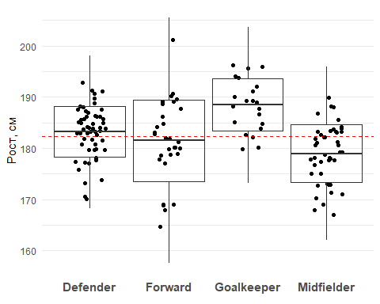
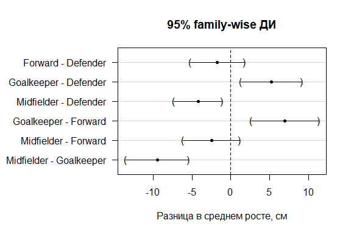
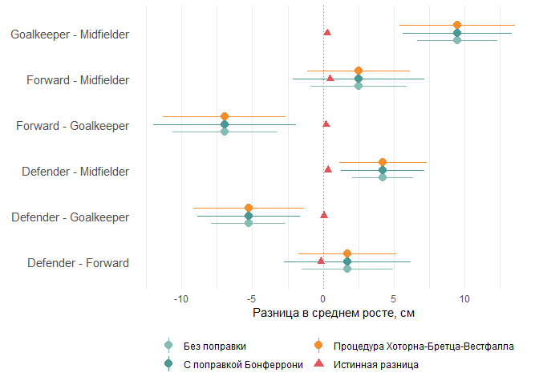
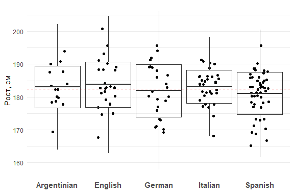
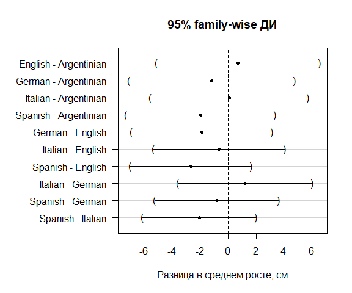

<style type="text/css">

.math {
font-size: small;
}
</style>


```r
library(tidyverse)
library(knitr)

opts_chunk$set(echo = TRUE, warning = FALSE, message = FALSE, error = FALSE)
options(knitr.kable.NA = "", scipen = 999)

# function for computing mean, standard deviation, mean+/- 3*sd

min.mean.sd.max <- function(x) {
  r <- c(mean(x) - 3*sd(x), mean(x) - sd(x), mean(x), mean(x) + sd(x), mean(x) + 3*sd(x))
  names(r) <- c("ymin", "lower", "middle", "upper", "ymax")
  r
}

# Данные
# Для своего удобства буду использовать df вместо soccer в названиях 
# датафреймов

df_gen <- soccer_general <- read.csv("soccer.csv", sep=";")[, 2:6] %>% 
  mutate(Position = as.factor(Position), 
         Nationality = as.factor(Nationality), 
         Age = as.numeric(Age), 
         Height = as.numeric(Height)
  ) %>% 
  filter(Nationality %in% c("Spanish", "Italian", "German", "English", "Argentinian")) 


set.seed(1) 

df <- soccer_wrk <- soccer_general[sample(1:nrow(soccer_general), 150), ] %>% 
  mutate(Nationality = factor(Nationality))
```

## **Дисперсионный анализ**

<br>

Графическая иллюстрация (боксплоты в формате $\{mean-3*sd, mean-sd,mean.mean+sd,mean+3*sd\}$, красный пунктир - средний рост по выборке):


```r
ggplot(df, aes(y = Height, x = Position)) +
  geom_jitter(position = position_jitter(width=.2)) +
  stat_summary(fun.data = min.mean.sd.max, geom = "boxplot", fill = NA) +
  geom_hline(yintercept = mean(df$Height), color = "red", 
             linetype = "dashed", size = 0.7) +
  labs(y = "Рост, см", x = element_blank()) +
  theme_minimal() +
  theme(legend.position = "bottom",
        panel.grid.major.x = element_blank(),
        panel.grid.minor.x = element_blank(),
        axis.text.x = element_text(size = 11, face = "bold"))
```

<!-- -->

ANOVA:


```r
lm(Height ~ Position, df) %>% anova()
```

```
## Analysis of Variance Table
## 
## Response: Height
##            Df Sum Sq Mean Sq F value       Pr(>F)    
## Position    3 1345.0  448.32   12.88 0.0000001635 ***
## Residuals 146 5082.1   34.81                         
## ---
## Signif. codes:  0 '***' 0.001 '**' 0.01 '*' 0.05 '.' 0.1 ' ' 1
```

На 5%-ном уровне значимости мы можем отвергнуть нулевую гипотезу об одновременном равенстве среднего роста для игроков на разных позициях на поле, т.е. можем считать, что рост игрока связан с его позицией на поле.

Аналогичный результат получим с помощью F-теста Уэлша, если предполагаем, что дисперсии в росте могут быть разными в зависимости от позиции игрока на поле:


```r
oneway.test(Height ~ Position, df)
```

```
## 
## 	One-way analysis of means (not assuming equal variances)
## 
## data:  Height and Position
## F = 15.44, num df = 3.00, denom df = 62.23, p-value = 0.0000001288
```

<br>

## **Post hoc анализ**

<br>

Будем использовать процедуру Хоторна-Бретца-Вестфалла для контроля FWER:

- скорректированные p-values:


```r
hbw_res <- lm(Height ~ Position, df) %>% 
  multcomp::glht(linfct = multcomp::mcp(Position = "Tukey"))

hbw_sum <- hbw_res %>% summary()
hbw_sum
```

```
## 
## 	 Simultaneous Tests for General Linear Hypotheses
## 
## Multiple Comparisons of Means: Tukey Contrasts
## 
## 
## Fit: lm(formula = Height ~ Position, data = df)
## 
## Linear Hypotheses:
##                              Estimate Std. Error t value Pr(>|t|)    
## Forward - Defender == 0        -1.718      1.339  -1.283  0.57141    
## Goalkeeper - Defender == 0      5.258      1.513   3.474  0.00357 ** 
## Midfielder - Defender == 0     -4.218      1.193  -3.535  0.00296 ** 
## Goalkeeper - Forward == 0       6.976      1.679   4.156  < 0.001 ***
## Midfielder - Forward == 0      -2.500      1.397  -1.790  0.27907    
## Midfielder - Goalkeeper == 0   -9.476      1.565  -6.056  < 0.001 ***
## ---
## Signif. codes:  0 '***' 0.001 '**' 0.01 '*' 0.05 '.' 0.1 ' ' 1
## (Adjusted p values reported -- single-step method)
```

<br>

- 95%-ные familiy-wise доверительные интервалы:


```r
hbw_ci <- hbw_res %>% confint()
hbw_ci
```

```
## 
## 	 Simultaneous Confidence Intervals
## 
## Multiple Comparisons of Means: Tukey Contrasts
## 
## 
## Fit: lm(formula = Height ~ Position, data = df)
## 
## Quantile = 2.5923
## 95% family-wise confidence level
##  
## 
## Linear Hypotheses:
##                              Estimate lwr      upr     
## Forward - Defender == 0       -1.7182  -5.1895   1.7532
## Goalkeeper - Defender == 0     5.2580   1.3347   9.1813
## Midfielder - Defender == 0    -4.2182  -7.3116  -1.1247
## Goalkeeper - Forward == 0      6.9762   2.6246  11.3278
## Midfielder - Forward == 0     -2.5000  -6.1213   1.1213
## Midfielder - Goalkeeper == 0  -9.4762 -13.5327  -5.4197
```


```r
par_old <- par()$mar
par(mar = c(5, 10, 4, 2)+0.1)
hbw_res %>% plot(xlab = "Разница в среднем росте, см", main = "95% family-wise ДИ")
```

<!-- -->

```r
par(mar = par_old)
```

Таким образом, ориентируясь на скорректированные значения p-values, мы можем отвергнуть гипотезы о равенстве среднего роста в четырёх парах сравниваемых позицийн а 5%-ном уровне значимости. Для них же полученные скорректированные 95%-ные доверительные интервалы для разницы в среднем росте не включают в себя 0. Для двух пар позиций мы не можем отвергнуть нулевую гипотезу - и соответствующие доверительные интервалы включают в себя 0.

<br>

## **Сравнение с результатами попарных t-тестов**

<br>


```r
# Парные t-тесты (повторим, чтобы изобразить всё на одном графике)

# Размер ошибки первого рода

alpha <- 0.05

# Датафрейм для результатов попарных сравнений

res_multcomp <- combn(levels(df$Position), 2) %>%
  t() %>%
  as_tibble() %>%
  setNames(c("group1", "group2"))

# Уровень значимости для попарных сравнений/ доверительных интервалов
# для контроля FWER с помощью коррекции Бонферрони

alpha_adj <- alpha/nrow(res_multcomp)

# Функция для оценки истинного и выборочного среднего и
# границ доверительных интервалов без и с поправкой

pwise_t <- function(data_gen, data, x, y, g1, g2) {
  mu_true <- mean(data_gen[[x]][data[[y]] == g1], na.rm = TRUE) -
      mean(data_gen[[x]][data[[y]] == g2], na.rm = TRUE)
  
  dt <- data %>% filter(.[[y]] %in% c(g1, g2))
  tt <- t.test(dt[[x]] ~ dt[[y]], conf.level = 1 - alpha)
  tt_adj <- t.test(dt[[x]] ~ dt[[y]], conf.level = 1 - alpha_adj)

  tibble(
    mu_true = mu_true,
    mu = tt$estimate[1] - tt$estimate[2],
    lb_init = tt$conf.int[[1]],
    ub_init = tt$conf.int[[2]],
    p_init = tt$p.value,
    lb_adj = tt_adj$conf.int[[1]],
    ub_adj = tt_adj$conf.int[[2]]
  )
}

res_multcomp <- res_multcomp %>%
  mutate(map2_dfr(group1, group2, 
         pwise_t, data_gen = df_gen, data = df, 
         x = "Height", y = "Position"),
         p_adj = pmin(1, p_init*nrow(res_multcomp)))


# Simultaneous Tests for General Linear Hypotheses
# (интервалы с минусами, т.к. порядок групп обратный тому, который
# использовали мы выше)

hbw_tab <- tibble(
  group = names(hbw_sum$test$coefficients),
  lb_hbw = -hbw_ci$confint[,"lwr"],
  ub_hbw = -hbw_ci$confint[,"upr"],
  p_hbw = hbw_sum$test$pvalues
) %>%
  separate(col = group, into = c("group2", "group1"), sep = " - ")

# Merge

plt_data <- res_multcomp %>%
  left_join(hbw_tab, by = c("group1", "group2")) %>%
  pivot_longer(c(lb_init, ub_init, p_init, lb_adj, ub_adj, p_adj, lb_hbw, ub_hbw, p_hbw), 
               names_to = c(".value", "adj"),
               names_pattern = "(lb|ub|p)_(init|adj|hbw)") %>%
  mutate(adj = factor(adj, c("init", "adj", "hbw"), 
                      c("Без поправки", "С поправкой Бонферрони", "Процедура Хоторна-Бретца-Вестфалла")),
         group = sprintf("%s - %s", group1, group2))

ggplot() +
  geom_vline(aes(xintercept = 0), linetype = "dotted", color = "grey50") +
  geom_pointrange(aes(y = group, x = mu, xmin = lb, xmax = ub, color = adj), 
                  plt_data, position = position_dodge(0.5), size = 0.7) +
  geom_point(aes(y = group, x = mu_true, color = "Истинная разница"), 
             plt_data %>% select(group, mu_true) %>% unique(),
             shape = 17, size = 2.5) +
  scale_color_manual(values = c("#86BCB6", "#499894", "#F28E2B", "#E15759"),
                     limits = c("Без поправки", "С поправкой Бонферрони", 
                                "Процедура Хоторна-Бретца-Вестфалла", "Истинная разница")) +
  guides(color = guide_legend(override.aes = list(linetype = c("solid", "solid", "solid", "blank"), 
                                                  shape = c(16, 16, 16, 17)),
                              nrow = 2)) +
  labs(x = "Разница в среднем росте, см", y = element_blank(),
       color = element_blank()) +
  theme_minimal() +
  theme(legend.position = "bottom",
        panel.grid.major.y = element_blank(),
        panel.grid.minor.y = element_blank(),
        axis.text.y = element_text(size = 11))
```

<!-- -->

Выводы относительно сравниваемых по среднему росту пар позиций, полученные с помощью оценки множественных попарных t-тестов с поправкой Бонферрони и с помощью процедуры Хоторна-Бретца-Вестфалла, совпадают. Для трёх пар ДИ, полученные вторым методом, чуть уже, чем ДИ, полученные первым, для трёх других - чуть шире.

<br>

## **Связь между средним ростом футболиста и страной**

<br>

Графическая иллюстрация (боксплоты в формате $\{mean-3*sd, mean-sd,mean.mean+sd,mean+3*sd\}$, красный пунктир - средний рост по выборке):


```r
ggplot(df, aes(y = Height, x = Nationality)) +
  geom_jitter(position = position_jitter(width=.2)) +
  stat_summary(fun.data = min.mean.sd.max, geom = "boxplot", fill = NA) +
  geom_hline(yintercept = mean(df$Height), color = "red", 
             linetype = "dashed", size = 0.7) +
  labs(y = "Рост, см", x = element_blank()) +
  theme_minimal() +
  theme(legend.position = "bottom",
        panel.grid.major.x = element_blank(),
        panel.grid.minor.x = element_blank(),
        axis.text.x = element_text(size = 11, face = "bold"))
```

<!-- -->

ANOVA:


```r
lm(Height ~ Nationality, df) %>% anova()
```

```
## Analysis of Variance Table
## 
## Response: Height
##              Df Sum Sq Mean Sq F value Pr(>F)
## Nationality   4  164.1  41.033    0.95 0.4371
## Residuals   145 6263.0  43.193
```

На 5%-ном уровне значимости мы не можем отвергнуть гипотезу о равенстве среднего роста футболистов каждой страны (отстутсвии взаимосвязи между ростом футболиста и страной, за которую он играет).

<br>

Post hoc процедура Хоторна-Бретца-Вестфалла:

- скорректированные p-values:


```r
hbw_res <- lm(Height ~ Nationality, df) %>% 
  multcomp::glht(linfct = multcomp::mcp(Nationality = "Tukey"))

hbw_sum <- hbw_res %>% summary()
hbw_sum
```

```
## 
## 	 Simultaneous Tests for General Linear Hypotheses
## 
## Multiple Comparisons of Means: Tukey Contrasts
## 
## 
## Fit: lm(formula = Height ~ Nationality, data = df)
## 
## Linear Hypotheses:
##                            Estimate Std. Error t value Pr(>|t|)
## English - Argentinian == 0  0.71111    2.11643   0.336    0.997
## German - Argentinian == 0  -1.14667    2.14645  -0.534    0.983
## Italian - Argentinian == 0  0.08485    2.04656   0.041    1.000
## Spanish - Argentinian == 0 -1.94667    1.93478  -1.006    0.849
## German - English == 0      -1.85778    1.82413  -1.018    0.844
## Italian - English == 0     -0.62626    1.70546  -0.367    0.996
## Spanish - English == 0     -2.65778    1.56958  -1.693    0.436
## Italian - German == 0       1.23152    1.74258   0.707    0.954
## Spanish - German == 0      -0.80000    1.60984  -0.497    0.987
## Spanish - Italian == 0     -2.03152    1.47402  -1.378    0.638
## (Adjusted p values reported -- single-step method)
```

<br>

- 95%-ные family-wise доверительные интервалы:


```r
hbw_ci <- hbw_res %>% confint()
hbw_ci
```

```
## 
## 	 Simultaneous Confidence Intervals
## 
## Multiple Comparisons of Means: Tukey Contrasts
## 
## 
## Fit: lm(formula = Height ~ Nationality, data = df)
## 
## Quantile = 2.7534
## 95% family-wise confidence level
##  
## 
## Linear Hypotheses:
##                            Estimate lwr      upr     
## English - Argentinian == 0  0.71111 -5.11632  6.53854
## German - Argentinian == 0  -1.14667 -7.05676  4.76342
## Italian - Argentinian == 0  0.08485 -5.55020  5.71990
## Spanish - Argentinian == 0 -1.94667 -7.27395  3.38062
## German - English == 0      -1.85778 -6.88039  3.16483
## Italian - English == 0     -0.62626 -5.32214  4.06961
## Spanish - English == 0     -2.65778 -6.97951  1.66396
## Italian - German == 0       1.23152 -3.56656  6.02959
## Spanish - German == 0      -0.80000 -5.23257  3.63257
## Spanish - Italian == 0     -2.03152 -6.09012  2.02709
```


```r
par_old <- par()$mar
par(mar = c(5, 10, 4, 2)+0.1)
hbw_res %>% plot(xlab = "Разница в среднем росте, см", main = "95% family-wise ДИ")
```

<!-- -->

```r
par(mar = par_old)
```

Таким образом, футболисты из разных стран не различаются по среднему росту и при попарном сравнении на 5%-ном уровне значимости, все скорректированные 95%-ные ДИ включают в себя ноль.
