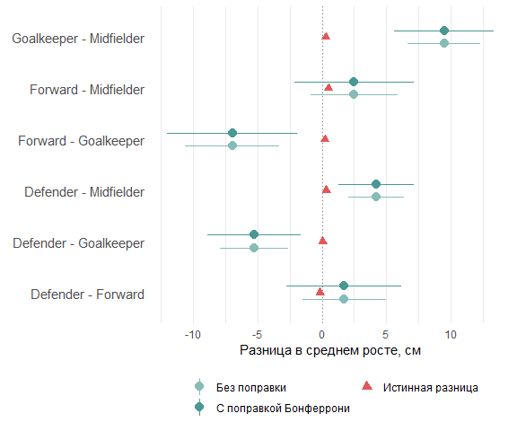

```r
library(tidyverse)

knitr::opts_chunk$set(echo = TRUE, warning = FALSE, message = FALSE, error = FALSE)

# Данные
# Для своего удобства буду использовать df вместо soccer в названиях 
# датафреймов

df_gen <- soccer_general <- read.csv("soccer.csv", sep=";")[, 2:6] %>% 
  mutate(Position = as.factor(Position), 
         Nationality = as.factor(Nationality), 
         Age = as.numeric(Age), 
         Height = as.numeric(Height)
  ) %>% 
  filter(Nationality %in% c("Spanish", "Italian", "German", "English", "Argentinian")) 


set.seed(1) 

df <- soccer_wrk <- soccer_general[sample(1:nrow(soccer_general), 150), ] %>% 
  mutate(Nationality = factor(Nationality))
```

## **Доверительные интервалы**

<br>


```r
# Размер ошибки первого рода

alpha <- 0.05

# Датафрейм для результатов попарных сравнений

res_multcomp <- combn(levels(df$Position), 2) %>%
  t() %>%
  as_tibble() %>%
  setNames(c("group1", "group2"))

# Уровень значимости для попарных сравнений/ доверительных интервалов
# для контроля FWER с помощью коррекции Бонферрони

alpha_adj <- alpha/nrow(res_multcomp)

# Функция для оценки истинного и выборочного среднего и
# границ доверительных интервалов без и с поправкой

pwise_t <- function(data_gen, data, x, y, g1, g2) {
  mu_true <- mean(data_gen[[x]][data[[y]] == g1], na.rm = TRUE) -
      mean(data_gen[[x]][data[[y]] == g2], na.rm = TRUE)
  
  dt <- data %>% filter(.[[y]] %in% c(g1, g2))
  tt <- t.test(dt[[x]] ~ dt[[y]], conf.level = 1 - alpha)
  tt_adj <- t.test(dt[[x]] ~ dt[[y]], conf.level = 1 - alpha_adj)

  tibble(
    mu_true = mu_true,
    mu = tt$estimate[1] - tt$estimate[2],
    lb_init = tt$conf.int[[1]],
    ub_init = tt$conf.int[[2]],
    p = tt$p.value,
    lb_adj = tt_adj$conf.int[[1]],
    ub_adj = tt_adj$conf.int[[2]]
  )
}

res_multcomp <- res_multcomp %>%
  mutate(map2_dfr(group1, group2, 
         pwise_t, data_gen = df_gen, data = df, 
         x = "Height", y = "Position"))
```

Приведём в таблице ниже результаты оценки истинного значения разницы в среднем росте для каждой пары позиций ($\mu_1 - \mu_2$), разницу в выборочных средних ($\hat{\mu_1} - \hat{\mu_2}$), а также два 95%-ных доверительных интервала для разницы в средних: без коррекции и с коррекцией Бонферрони, позволяющей контролировать FWER в случае множественных попарных сравнений.


```r
knitr::kable(res_multcomp %>% 
               mutate(ci = sprintf("[%.2f, %.2f]", lb_init, ub_init),
                      ci_adj = sprintf("[%.2f, %.2f]", lb_adj, ub_adj),
                      mu_true = round(mu_true, 2),
                      mu = round(mu, 2)) %>%
               select(-contains("lb"), -contains("ub"), -p),
             col.names = c("Позиция 1", "Позиция 2", 
                           "$\\mu_1 - \\mu_2$, см",
                           "$\\hat{\\mu_1} - \\hat{\\mu_2}$, см",
                           sprintf("%.0f%% ДИ<br>для $\\mu_1 - \\mu_2$", (1-alpha)*100),
                           sprintf("Скорр. %.0f%% ДИ<br>для $\\hat{\\mu_1} - \\hat{\\mu_2}$", 
                                   (1-alpha)*100)),
             align = "c", escape = FALSE) %>%
  kableExtra::kable_styling(full_width = FALSE, position = "left") %>%
  kableExtra::add_footnote("Для контроля FWER использовалась поправка Бонферрони")
```

<table class="table" style="width: auto !important; ">
 <thead>
  <tr>
   <th style="text-align:center;"> Позиция 1 </th>
   <th style="text-align:center;"> Позиция 2 </th>
   <th style="text-align:center;"> $\mu_1 - \mu_2$, см </th>
   <th style="text-align:center;"> $\hat{\mu_1} - \hat{\mu_2}$, см </th>
   <th style="text-align:center;"> 95% ДИ<br>для $\mu_1 - \mu_2$ </th>
   <th style="text-align:center;"> Скорр. 95% ДИ<br>для $\hat{\mu_1} - \hat{\mu_2}$ </th>
  </tr>
 </thead>
<tbody>
  <tr>
   <td style="text-align:center;"> Defender </td>
   <td style="text-align:center;"> Forward </td>
   <td style="text-align:center;"> -0.15 </td>
   <td style="text-align:center;"> 1.72 </td>
   <td style="text-align:center;"> [-1.53, 4.96] </td>
   <td style="text-align:center;"> [-2.73, 6.17] </td>
  </tr>
  <tr>
   <td style="text-align:center;"> Defender </td>
   <td style="text-align:center;"> Goalkeeper </td>
   <td style="text-align:center;"> 0.05 </td>
   <td style="text-align:center;"> -5.26 </td>
   <td style="text-align:center;"> [-7.89, -2.63] </td>
   <td style="text-align:center;"> [-8.88, -1.64] </td>
  </tr>
  <tr>
   <td style="text-align:center;"> Defender </td>
   <td style="text-align:center;"> Midfielder </td>
   <td style="text-align:center;"> 0.33 </td>
   <td style="text-align:center;"> 4.22 </td>
   <td style="text-align:center;"> [2.06, 6.37] </td>
   <td style="text-align:center;"> [1.29, 7.15] </td>
  </tr>
  <tr>
   <td style="text-align:center;"> Forward </td>
   <td style="text-align:center;"> Goalkeeper </td>
   <td style="text-align:center;"> 0.21 </td>
   <td style="text-align:center;"> -6.98 </td>
   <td style="text-align:center;"> [-10.66, -3.29] </td>
   <td style="text-align:center;"> [-12.02, -1.94] </td>
  </tr>
  <tr>
   <td style="text-align:center;"> Forward </td>
   <td style="text-align:center;"> Midfielder </td>
   <td style="text-align:center;"> 0.48 </td>
   <td style="text-align:center;"> 2.50 </td>
   <td style="text-align:center;"> [-0.90, 5.90] </td>
   <td style="text-align:center;"> [-2.15, 7.15] </td>
  </tr>
  <tr>
   <td style="text-align:center;"> Goalkeeper </td>
   <td style="text-align:center;"> Midfielder </td>
   <td style="text-align:center;"> 0.28 </td>
   <td style="text-align:center;"> 9.48 </td>
   <td style="text-align:center;"> [6.66, 12.29] </td>
   <td style="text-align:center;"> [5.61, 13.34] </td>
  </tr>
</tbody>
<tfoot>
<tr>
<td style = 'padding: 0; border:0;' colspan='100%'><sup>a</sup> Для контроля FWER использовалась поправка Бонферрони</td>
</tr>
</tfoot>
</table>

<br>

И графическая иллюстрация для истинных значений, точечных оценок и доверительных интервалов:


```r
plt_data <- res_multcomp %>%
  pivot_longer(c(lb_init, ub_init, lb_adj, ub_adj), 
               names_to = c(".value", "adj"),
               names_pattern = "(lb|ub)_(init|adj)") %>%
  mutate(adj = factor(adj, c("init", "adj"), c("Без поправки", "С поправкой Бонферрони")),
         group = sprintf("%s - %s", group1, group2))

ggplot() +
  geom_vline(aes(xintercept = 0), linetype = "dotted", color = "grey50") +
  geom_pointrange(aes(y = group, x = mu, xmin = lb, xmax = ub, color = adj), 
                  plt_data, position = position_dodge(0.5), size = 0.7) +
  geom_point(aes(y = group, x = mu_true, color = "Истинная разница"), 
             plt_data %>% select(group, mu_true) %>% unique(),
             shape = 17, size = 2.5) +
  scale_color_manual(values = c("#86BCB6", "#499894", "#E15759"),
                     limits = c("Без поправки", "С поправкой Бонферрони", "Истинная разница")) +
  guides(color = guide_legend(override.aes = list(linetype = c("solid", "solid", "blank"), 
                                                  shape = c(16, 16, 17)),
                              nrow = 2)) +
  labs(x = "Разница в среднем росте, см", y = element_blank(),
       color = element_blank()) +
  theme_minimal() +
  theme(legend.position = "bottom",
        panel.grid.major.y = element_blank(),
        panel.grid.minor.y = element_blank(),
        axis.text.y = element_text(size = 11))
```

<!-- -->

По графику наглядно видно, что только для двух попарных сравнений доверительный интервал покрывает истинное значение разницы в среднем росте (независимо от коррекции). Соответственно, если мы тестируем нулевую гипотезу о равенстве разницы в среднем росте истинной разнице, тогда для этих пар позиций мы её отвергнуть на уровне значимости 5% не можем, тогда как для остальных пар позиций можем.

Эти же интервалы - единственные, которые включают в себя 0. Соответственно, если мы тестируем нулевую гипотезу о равенстве среднего роста между игроками на разных позициях (что аналогично тестированию гипотезы о равенстве разницы в среднем росте нулю), тогда для этих двух пар позиций мы её на выбранном уровне значимости отвергнуть не можем, а для остальных можем. Поэтому, основываясь на данных сделанной выборки, мы бы, скорее, пришли к выводу о том, что разница между средним ростом футболистов, играющих на разных позициях, есть, по крайней мере, для четырёх попарных сравнений.

<br>

## **Попарные тесты**

<br>

В каждом из попарных тестов будем тестировать нулевую гипотезу о равенстве разницы в среднем росте футболистов нулю. Поскольку в данном случае истинные значения разниц нам известны и все они не равны 0, то любой случай отвержения нулевой гипотезы в пользу двусторонней альтернативы в виде неравенства разницы нулю следует рассматривать как корректное (неложное) открытие. Если бы мы округляли разницу до целых значений, то истинная разница в каждой паре составила бы 0 см, а значит, любое отвержение нулевой гипотезы в пользу какой бы то ни было альтернативы было бы ошибочным (ложным) открытием. Аналогично, если бы мы для каждой пары тестировали гипотезу о равенстве истинному значению разницы в соответствующей паре. Поэтому либо я неправильно поняла это задание, либо в здесь контроль FDR (или оценка % ложных открытий подобным образом) не имеет особого смысла.

Приведём результаты попарных t-тестов:

1. Без поправки на множественность сравнений:


```r
tt1 <- pairwise.t.test(df$Height, df$Position, p.adjust.method = "none", pool.sd = FALSE)
tt1
```

```
## 
## 	Pairwise comparisons using t tests with non-pooled SD 
## 
## data:  df$Height and df$Position 
## 
##            Defender Forward Goalkeeper
## Forward    0.29106  -       -         
## Goalkeeper 0.00026  0.00039 -         
## Midfielder 0.00020  0.14559 2.5e-08   
## 
## P value adjustment method: none
```

Получилось 4 открытия из 6 сравнений. Все они корректные, если мы считаем, что истинная разница в средних в каждой паре не равна нулю.

2. С поправкой Холма (контроль FWER):


```r
tt2 <- pairwise.t.test(df$Height, df$Position, p.adjust.method = "holm", pool.sd = FALSE)
tt2
```

```
## 
## 	Pairwise comparisons using t tests with non-pooled SD 
## 
## data:  df$Height and df$Position 
## 
##            Defender Forward Goalkeeper
## Forward    0.29118  -       -         
## Goalkeeper 0.00103  0.00118 -         
## Midfielder 0.00099  0.29118 1.5e-07   
## 
## P value adjustment method: holm
```

Аналогично (4 открытия).

3. С поправкой Бенджамини-Хохберга (контроль FDR):


```r
tt3 <- pairwise.t.test(df$Height, df$Position, p.adjust.method = "BH", pool.sd = FALSE)
tt3
```

```
## 
## 	Pairwise comparisons using t tests with non-pooled SD 
## 
## data:  df$Height and df$Position 
## 
##            Defender Forward Goalkeeper
## Forward    0.29106  -       -         
## Goalkeeper 0.00051  0.00059 -         
## Midfielder 0.00051  0.17471 1.5e-07   
## 
## P value adjustment method: BH
```

Аналогично (4 открытия).
