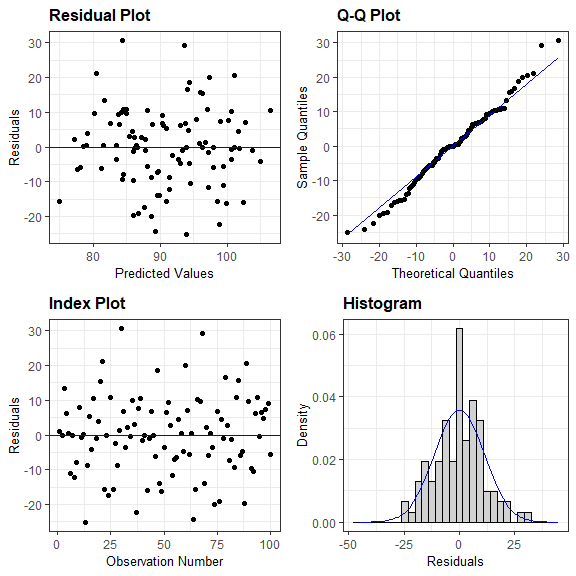

<style type="text/css">

.math {
font-size: small;
}
</style>


```r
library(tidyverse)
library(mvtnorm)
library(ggResidpanel)
library(glmnet)
library(broom)
library(knitr)
library(gtsummary)

options(knitr.kable.NA = '')
knitr::opts_chunk$set(echo = TRUE, warning = FALSE, message = FALSE, error = FALSE)
```

## **Задание 1**

<br>


```r
# Условия задачи

mu_k <- 88.5
sigma_k <- 13.25
mu_m <- 5.4
sigma_m <- 1.45
rho <- 0.6
```

Для моделирования двумерного нормального распределения необходимо задать ковариационную матрицу для величин $k$ (креатинин) и $m$ (мочевина). Это можно сделать следующим образом:

$$Cov(k,m) = \begin{pmatrix}
\sigma_k^2 & \rho_{k,m}*\sigma_k*\sigma_m\\
\rho_{k,m}*\sigma_k*\sigma_m & \sigma_m^2
\end{pmatrix}$$

На диагноали матрицы - дисперсии креатинина и мочевины, в правом и левом углах - ковариация между ними (равна произведению коэффициента линейной корреляции Пирсона и стандартных отклонений обеих величин).


```r
# Ковариационная матрица

sigma_km <- matrix(c(sigma_k^2, rho*sigma_k*sigma_m, 
                     rho*sigma_k*sigma_m, sigma_m^2),
                   2, 2)

# Выборка из многомерного нормального распределения 
# N(c(mu_k, mu_m), sigma_km)

set.seed(12345)
S <- rmvnorm(n = 100, mean = c(mu_k, mu_m), sigma = sigma_km)
```

**(a)** 

Модель линейной регрессии креатинина на мочевину: $k = \beta_0 + \beta_1*m + \epsilon$, 

где $\beta_0$, $\beta_1$ - коэффициенты линейной регрессии (включая константу), $\epsilon$ - остаток регрессионного уравнения.

<br>

Оценка коэффициентов линейной регрессии с помощью МНК (в столбце estimate представлены оценки $\beta_0$ и $\beta_1$, соответственно):


```r
S_df <- as_tibble(S) %>% setNames(c("k", "m"))
  
lmreg <- lm(k ~ m, S_df)
lmreg_res <- tidy(lmreg) %>%
  mutate(p.value = style_pvalue(p.value, 3))

lmreg_res %>% 
  kable(digits = c(0,2,2,2), align = "rcccc") %>%
  kableExtra::kable_styling(full_width = FALSE, position = "left")
```

<table class="table" style="width: auto !important; ">
 <thead>
  <tr>
   <th style="text-align:right;"> term </th>
   <th style="text-align:center;"> estimate </th>
   <th style="text-align:center;"> std.error </th>
   <th style="text-align:center;"> statistic </th>
   <th style="text-align:center;"> p.value </th>
  </tr>
 </thead>
<tbody>
  <tr>
   <td style="text-align:right;"> (Intercept) </td>
   <td style="text-align:center;"> 64.58 </td>
   <td style="text-align:center;"> 4.24 </td>
   <td style="text-align:center;"> 15.22 </td>
   <td style="text-align:center;"> &lt;0.001 </td>
  </tr>
  <tr>
   <td style="text-align:right;"> m </td>
   <td style="text-align:center;"> 4.65 </td>
   <td style="text-align:center;"> 0.72 </td>
   <td style="text-align:center;"> 6.45 </td>
   <td style="text-align:center;"> &lt;0.001 </td>
  </tr>
</tbody>
</table>

<br>

Оценка $\beta_1$ также может быть получена с помощью формулы $\hat{\beta_1} = \frac{\hat{Cov}_{k,m}}{\hat{Var}_m}=\hat{\rho}_{k,m}\frac{\hat{\sigma}_k}{\hat{\sigma}_m}$,
    
оценка $\beta_0$ - с помощью формулы $\hat{\beta_0} = \hat{\mu}_k - \hat{\beta}_1\hat{\mu}_m$, 

где $\hat{\mu}_k,\hat{\mu}_m,\hat{\sigma}_k,\hat{\sigma}_m,\hat{\rho}_{k,m}$ - выборочные оценки средних значений креатинина и мочевины, стандартных отклонений креатинина и мочевины и коэффициента линейной корреляции между ними, соответственно.

Таким образом, оценка коэффициента при мочевине в регрессии прямо поропорциональна коэффициенту линейной корреляции между креатинином и мочевиной и стандартному отклонениню мочевины и обратно пропорциональна стандартному отклонению креатинина в выборке, а оценка константы регрессионного уравнения может быть получена из уравнения линейной регрессии, если в него вместо зависимой и объясняющих переменных (креатинина и мочевины) подставить их средния значения, использовать полученную выше оценку коэффициента при мочевине и подставить 0 в качестве остатка регрессионного уравнения.

Проверим, совпадут ли результаты оценки по формулам с представленными в таблице выше:


```r
# Выборочные оценки параметров

mu_k_hat <- mean(S_df$k)
mu_m_hat <- mean(S_df$m)
sigma_k_hat <- sd(S_df$k)
sigma_m_hat <- sd(S_df$m)
rho_hat <- cor(S_df$k, S_df$m)

# Оценка коэффициентов регрессии по формулам

beta1_hat <- rho_hat * sigma_k_hat / sigma_m_hat
beta0_hat <- mu_k_hat - beta1_hat*mu_m_hat
  
kable(data.frame(term = c("$\\hat{\\beta}_0$", "$\\hat{\\beta}_1$"),
                 estimate = round(c(beta0_hat, beta1_hat), 2)),
      align = "c", escape = FALSE) %>%
  kableExtra::kable_styling(full_width = FALSE, position = "left")
```

<table class="table" style="width: auto !important; ">
 <thead>
  <tr>
   <th style="text-align:center;"> term </th>
   <th style="text-align:center;"> estimate </th>
  </tr>
 </thead>
<tbody>
  <tr>
   <td style="text-align:center;"> $\hat{\beta}_0$ </td>
   <td style="text-align:center;"> 64.58 </td>
  </tr>
  <tr>
   <td style="text-align:center;"> $\hat{\beta}_1$ </td>
   <td style="text-align:center;"> 4.65 </td>
  </tr>
</tbody>
</table>

Оценки совпали.

<br>

**(b)**

Формально проверить гипотезу о нормальном распределении остатков мы можем с помощью теста Шапиро-Уилка:


```r
shapiro.test(resid(lmreg)) %>% 
  tidy() %>%
  mutate_if(is.numeric, round, digits = 3) %>%
  kable(align = "c") %>%
  kableExtra::kable_styling(full_width = FALSE, position = "left")
```

<table class="table" style="width: auto !important; ">
 <thead>
  <tr>
   <th style="text-align:center;"> statistic </th>
   <th style="text-align:center;"> p.value </th>
   <th style="text-align:center;"> method </th>
  </tr>
 </thead>
<tbody>
  <tr>
   <td style="text-align:center;"> 0.989 </td>
   <td style="text-align:center;"> 0.595 </td>
   <td style="text-align:center;"> Shapiro-Wilk normality test </td>
  </tr>
</tbody>
</table>

или теста Колмогорова-Смирнова:


```r
ks.test(resid(lmreg), "pnorm", mean(resid(lmreg)), sd(resid(lmreg))) %>% 
  tidy() %>%
  mutate_if(is.numeric, round, digits = 3) %>%
  kable(align = "c") %>%
  kableExtra::kable_styling(full_width = FALSE, position = "left")
```

<table class="table" style="width: auto !important; ">
 <thead>
  <tr>
   <th style="text-align:center;"> statistic </th>
   <th style="text-align:center;"> p.value </th>
   <th style="text-align:center;"> method </th>
   <th style="text-align:center;"> alternative </th>
  </tr>
 </thead>
<tbody>
  <tr>
   <td style="text-align:center;"> 0.069 </td>
   <td style="text-align:center;"> 0.724 </td>
   <td style="text-align:center;"> One-sample Kolmogorov-Smirnov test </td>
   <td style="text-align:center;"> two-sided </td>
  </tr>
</tbody>
</table>

На 5%-ном уровне значимости мы не можем отвергнуть гипотезу о нормальном распределении остатков ни в одном из этих тестов.

<br>

Также мы можем посмотреть на диагностические графики для остатков - в частности, на Q-Q plot и гистограмму с графиком плотности.


```r
resid_panel(lmreg)
```

<!-- -->

По Q-Q plot я бы сказала, что заметных отклонений от нормального распределения нет.

<br>

**(с)**

Смоделируем случайный признак $w$ такого же размера, как $S$, и добавим его в качестве ещё одного объясняющего в регрессию для креатинина по мочевине. Попробуем следующие варианты распределений для моделирования признака $w$:

- Экспоненциальное с параметром 0.5,

- Равномерное на интервале [1,7],

- Нормальное со средним значением 5 и стандартным отклонением 5.

Поскольку по одной случайной выборке может быть сложно сделать окончательный вывод о том, как добавление показателя из такого распределения может повлиять на коэффициент детерминации (кроме того, что обычный, нескорректированный коэффициент детерминации точно не уменьшится), мы сделаем по 1000 выборок из каждого и вместо одного значения для обоих коэффициентов детерминации приведём 95%-ный интервал (от 0.025 до 0.975 квантилей) для их значений, полученных по всем выборкам. При этом инициальную выборку S для креатинина и мочевины мы менять никак не будем.

Коэффициенты детерминации для исходной регрессии кретинина по мочевине и с добавлением случайного признака из разных распределений:


```r
sim_res <- map_dfr(1:1000, function(x) {
  S_df$w_exp <- rexp(100, 0.5)
  S_df$w_uni <- runif(100, 1, 7)
  S_df$w_norm <- rnorm(100, 5, 5)
  
  lmreg_w_exp <- lm(k ~ m + w_exp, S_df)
  lmreg_w_uni <- lm(k ~ m + w_uni, S_df)
  lmreg_w_norm <- lm(k ~ m + w_norm, S_df)
  
  bind_rows(
    glance(lmreg_w_exp) %>% 
      transmute(sim = x, Model = "m + w (exp)", R2 = r.squared, `Adjusted R2` = adj.r.squared),
    glance(lmreg_w_uni) %>% 
      transmute(sim = x, Model = "m + w (unif)", R2 = r.squared, `Adjusted R2` = adj.r.squared),
    glance(lmreg_w_norm) %>% 
      transmute(sim = x, Model = "m + w (norm)", R2 = r.squared, `Adjusted R2` = adj.r.squared)
  ) 
})

sim_res <- sim_res %>%
  group_by(Model) %>%
  summarise(R2 = sprintf("%.3f-%.3f", quantile(R2, 0.025), quantile(R2, 0.975)),
            `Adjusted R2` = sprintf("%.3f-%.3f", quantile(`Adjusted R2`, 0.025), 
                                    quantile(`Adjusted R2`, 0.975)))

bind_rows(
  glance(lmreg) %>% 
    transmute(Model = "m", R2 = sprintf("%.3f", r.squared), 
              `Adjusted R2` = sprintf("%.3f", adj.r.squared)),
  sim_res
) %>%
  kable(align = "lcc") %>%
  kableExtra::kable_styling(full_width = FALSE, position = "left")
```

<table class="table" style="width: auto !important; ">
 <thead>
  <tr>
   <th style="text-align:left;"> Model </th>
   <th style="text-align:center;"> R2 </th>
   <th style="text-align:center;"> Adjusted R2 </th>
  </tr>
 </thead>
<tbody>
  <tr>
   <td style="text-align:left;"> m </td>
   <td style="text-align:center;"> 0.298 </td>
   <td style="text-align:center;"> 0.291 </td>
  </tr>
  <tr>
   <td style="text-align:left;"> m + w (exp) </td>
   <td style="text-align:center;"> 0.298-0.340 </td>
   <td style="text-align:center;"> 0.283-0.326 </td>
  </tr>
  <tr>
   <td style="text-align:left;"> m + w (norm) </td>
   <td style="text-align:center;"> 0.298-0.333 </td>
   <td style="text-align:center;"> 0.283-0.319 </td>
  </tr>
  <tr>
   <td style="text-align:left;"> m + w (unif) </td>
   <td style="text-align:center;"> 0.298-0.331 </td>
   <td style="text-align:center;"> 0.283-0.318 </td>
  </tr>
</tbody>
</table>

Коэффициент детерминации не уменьшается (как и ожидалось), а скорректированный коэффициент детерминации в некоторых симуляциях уменьшился, а в других - наоборот, вырос. 

<br>

## **Задание 2**

<br>


```r
# Симуляция экспреимента (зафиксируем сиды для воспроизводимости)
set.seed(123)
x1 <- rnorm(50, 5, 3)
set.seed(45)
x2 <- x1*(1 + runif(50, 0, 0.04))
set.seed(987)
x3 <- x1 + rnorm(50, 0, 0.025)
set.seed(224)
x4 <- x2*(1 + runif(50, 0, 0.1))
set.seed(4796)
x5 <- x3 + x4 + rnorm(50, 0, 0.02)
set.seed(901)
y <- 10 + x1 - 2*x2 + 3*x3 -4*x4 + 5*x5 + rnorm(50, 0, 1)
```

Результаты оценки линейной регрессии:


```r
lmreg <- lm(y ~ x1 + x2 + x3 + x4 + x5)

summary(lmreg) %>%
  tidy() %>%
  mutate_if(is.numeric, round, digits = 3) %>%
  kable(align = "c") %>%
  kableExtra::kable_styling(full_width = FALSE, position = "left")
```

<table class="table" style="width: auto !important; ">
 <thead>
  <tr>
   <th style="text-align:center;"> term </th>
   <th style="text-align:center;"> estimate </th>
   <th style="text-align:center;"> std.error </th>
   <th style="text-align:center;"> statistic </th>
   <th style="text-align:center;"> p.value </th>
  </tr>
 </thead>
<tbody>
  <tr>
   <td style="text-align:center;"> (Intercept) </td>
   <td style="text-align:center;"> 10.044 </td>
   <td style="text-align:center;"> 0.333 </td>
   <td style="text-align:center;"> 30.145 </td>
   <td style="text-align:center;"> 0.000 </td>
  </tr>
  <tr>
   <td style="text-align:center;"> x1 </td>
   <td style="text-align:center;"> 4.836 </td>
   <td style="text-align:center;"> 6.950 </td>
   <td style="text-align:center;"> 0.696 </td>
   <td style="text-align:center;"> 0.490 </td>
  </tr>
  <tr>
   <td style="text-align:center;"> x2 </td>
   <td style="text-align:center;"> -5.789 </td>
   <td style="text-align:center;"> 3.473 </td>
   <td style="text-align:center;"> -1.667 </td>
   <td style="text-align:center;"> 0.103 </td>
  </tr>
  <tr>
   <td style="text-align:center;"> x3 </td>
   <td style="text-align:center;"> -9.089 </td>
   <td style="text-align:center;"> 10.871 </td>
   <td style="text-align:center;"> -0.836 </td>
   <td style="text-align:center;"> 0.408 </td>
  </tr>
  <tr>
   <td style="text-align:center;"> x4 </td>
   <td style="text-align:center;"> -14.657 </td>
   <td style="text-align:center;"> 10.972 </td>
   <td style="text-align:center;"> -1.336 </td>
   <td style="text-align:center;"> 0.188 </td>
  </tr>
  <tr>
   <td style="text-align:center;"> x5 </td>
   <td style="text-align:center;"> 16.367 </td>
   <td style="text-align:center;"> 10.812 </td>
   <td style="text-align:center;"> 1.514 </td>
   <td style="text-align:center;"> 0.137 </td>
  </tr>
</tbody>
</table>

```r
summary(lmreg) %>% 
  glance() %>%
  mutate(p.value = style_pvalue(p.value, 3)) %>%
  mutate_if(is.numeric, round, digits = 3) %>%
  kable(align = "c") %>%
  kableExtra::kable_styling(full_width = FALSE, position = "left")
```

<table class="table" style="width: auto !important; ">
 <thead>
  <tr>
   <th style="text-align:center;"> r.squared </th>
   <th style="text-align:center;"> adj.r.squared </th>
   <th style="text-align:center;"> sigma </th>
   <th style="text-align:center;"> statistic </th>
   <th style="text-align:center;"> p.value </th>
   <th style="text-align:center;"> df </th>
   <th style="text-align:center;"> df.residual </th>
   <th style="text-align:center;"> nobs </th>
  </tr>
 </thead>
<tbody>
  <tr>
   <td style="text-align:center;"> 0.998 </td>
   <td style="text-align:center;"> 0.998 </td>
   <td style="text-align:center;"> 1.086 </td>
   <td style="text-align:center;"> 4187.443 </td>
   <td style="text-align:center;"> &lt;0.001 </td>
   <td style="text-align:center;"> 5 </td>
   <td style="text-align:center;"> 44 </td>
   <td style="text-align:center;"> 50 </td>
  </tr>
</tbody>
</table>

<br>

Результаты оценки LASSO-регрессии с параметром $r=0.2$:


```r
lassoreg <- glmnet(cbind(x1,x2,x3,x4,x5), y, family = "gaussian", alpha = 1)
coef(lassoreg, s = 0.2) %>%
  as.matrix() %>%   
  as_tibble(rownames = "term") %>%
  setNames(c("term","estimate")) %>%
  mutate(estimate = ifelse(estimate == 0, NA, round(estimate, 3))) %>%
  kable(align = "c") %>%
  kableExtra::kable_styling(full_width = FALSE, position = "left")
```

<table class="table" style="width: auto !important; ">
 <thead>
  <tr>
   <th style="text-align:center;"> term </th>
   <th style="text-align:center;"> estimate </th>
  </tr>
 </thead>
<tbody>
  <tr>
   <td style="text-align:center;"> (Intercept) </td>
   <td style="text-align:center;"> 10.258 </td>
  </tr>
  <tr>
   <td style="text-align:center;"> x1 </td>
   <td style="text-align:center;"> 7.119 </td>
  </tr>
  <tr>
   <td style="text-align:center;"> x2 </td>
   <td style="text-align:center;">  </td>
  </tr>
  <tr>
   <td style="text-align:center;"> x3 </td>
   <td style="text-align:center;"> 0.099 </td>
  </tr>
  <tr>
   <td style="text-align:center;"> x4 </td>
   <td style="text-align:center;"> 0.287 </td>
  </tr>
  <tr>
   <td style="text-align:center;"> x5 </td>
   <td style="text-align:center;"> 0.233 </td>
  </tr>
</tbody>
</table>

Остаётся высоким коэффициент только при одной переменной (если не считать константу) - х1: если посмотреть на то, как были смоделированы предикторы, то x2, x3, x4 и x5 прямо или опосредованно все зависели от x1, поэтому такой результат был ожидаемым. Коэффициенты при x3, x4, x5 стали небольшими по абсолютной величине, а при x2 коэффициент "обнулился". При других сидах были ситуации, когда обнулялись коэффициенты при бОльшем числе переменных, как и ситуации, когда некоторые из них в исходной модели линейной регрессии оказывались статистически значимыми на 5%-ном уровне значимости.

Пример сильно зависимых показателей, которые могут быть связаны регрессионным соотношением, из практики: размер заработной платы и продолжительность рабочего времени.

<br>

## **Задание 3**

<br>


```r
# Симуляция эксперимента
set.seed(123)
Ly <- rnorm(201, 20, 5)
Neu <- rnorm(201, 80, 5)
NLR <- Neu/Ly
pSepsis <- ifelse(NLR < 3, 0, ifelse(NLR > 9, 1, (NLR - 3)/6))
Sepsis <- rbinom(201, 1, pSepsis)
```

Результаты оценки логистической регрессии:


```r
logreg <- glm(Sepsis ~ Neu + Ly, family = "binomial")
logreg %>% 
  tidy() %>%
  mutate(p.value = style_pvalue(p.value, 3)) %>%
  mutate_if(is.numeric, round, digits = 3) %>%
  kable(align = "c") %>%
  kableExtra::kable_styling(full_width = FALSE, position = "left")
```

<table class="table" style="width: auto !important; ">
 <thead>
  <tr>
   <th style="text-align:center;"> term </th>
   <th style="text-align:center;"> estimate </th>
   <th style="text-align:center;"> std.error </th>
   <th style="text-align:center;"> statistic </th>
   <th style="text-align:center;"> p.value </th>
  </tr>
 </thead>
<tbody>
  <tr>
   <td style="text-align:center;"> (Intercept) </td>
   <td style="text-align:center;"> 1.051 </td>
   <td style="text-align:center;"> 3.290 </td>
   <td style="text-align:center;"> 0.319 </td>
   <td style="text-align:center;"> 0.749 </td>
  </tr>
  <tr>
   <td style="text-align:center;"> Neu </td>
   <td style="text-align:center;"> 0.026 </td>
   <td style="text-align:center;"> 0.040 </td>
   <td style="text-align:center;"> 0.667 </td>
   <td style="text-align:center;"> 0.504 </td>
  </tr>
  <tr>
   <td style="text-align:center;"> Ly </td>
   <td style="text-align:center;"> -0.248 </td>
   <td style="text-align:center;"> 0.053 </td>
   <td style="text-align:center;"> -4.717 </td>
   <td style="text-align:center;"> &lt;0.001 </td>
  </tr>
</tbody>
</table>

При Neu = 90 и Ly = 15 NLR составит 6 - в этом случае вероятность для случайной величины Sepsis быть равной 1 можно найти по формуле, данной в задаче, - она составит 0.5.

Предсказание по результатам оцененной выше модели:


```r
predict(logreg, data.frame(Neu = 90, Ly = 15), type = "response") %>%
  as.numeric() %>% round(2) %>% print()
```

```
## [1] 0.43
```

<br>

Результаты оценки LASSO-регрессии при значении $\lambda$, дающем мминимальное значение deviance в процессе кросс-валидации:


```r
lassolog_cv <- cv.glmnet(cbind(Neu, Ly), Sepsis, family = "binomial",
                         type.measure = "deviance")
coef(lassolog_cv, s = "lambda.min") %>%
  as.matrix() %>%   
  as_tibble(rownames = "term") %>%
  setNames(c("term","estimate")) %>%
  mutate(estimate = ifelse(estimate == 0, NA, round(estimate, 3))) %>%
  kable(align = "c") %>%
  kableExtra::kable_styling(full_width = FALSE, position = "left")
```

<table class="table" style="width: auto !important; ">
 <thead>
  <tr>
   <th style="text-align:center;"> term </th>
   <th style="text-align:center;"> estimate </th>
  </tr>
 </thead>
<tbody>
  <tr>
   <td style="text-align:center;"> (Intercept) </td>
   <td style="text-align:center;"> 1.248 </td>
  </tr>
  <tr>
   <td style="text-align:center;"> Neu </td>
   <td style="text-align:center;"> 0.023 </td>
  </tr>
  <tr>
   <td style="text-align:center;"> Ly </td>
   <td style="text-align:center;"> -0.242 </td>
  </tr>
</tbody>
</table>

Предсказанная вероятность сепсиса при Neu = 90 и Ly = 15 из LASSO-регрессии:


```r
predict(lassolog_cv, cbind(90, 15), type = "response", s = "lambda.min") %>%
  as.numeric() %>% round(2) %>% print()
```

```
## [1] 0.42
```
